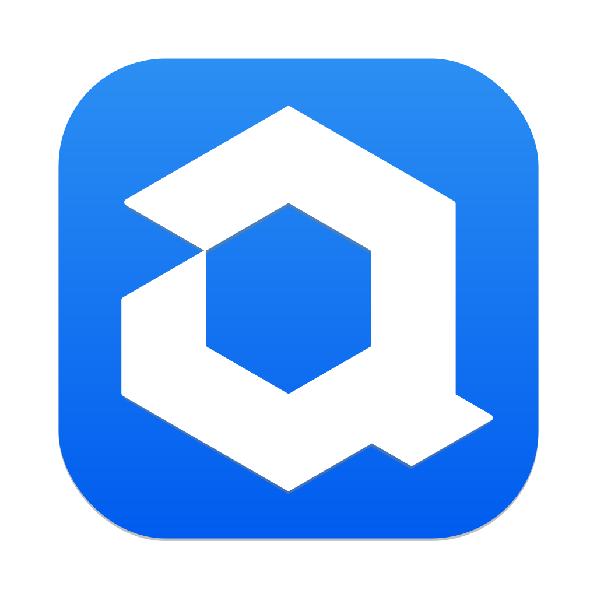

<div align="center">

[](https://discord.gg/262yJhc)
[](#licensing)

[](https://hub.docker.com/repository/docker/actyx/actyx)
[](https://crates.io/crates/actyx_sdk)
[](https://www.nuget.org/packages/Actyx.Sdk/)
[](https://www.npmjs.com/package/@actyx/sdk)
[](https://www.npmjs.com/package/@actyx/pond)


</div>

#  Actyx

Actyx is a **decentralized** event **database**, **streaming** and **processing** engine that allows you to easily build [local-first cooperative](https://www.local-first-cooperation.org/) apps.
For more information on how to use it, please refer to [developer.actyx.com](https://developer.actyx.com).
You’re also very welcome to drop us a line in [the forum](https://community.actyx.com/) and watch this space (or give it a ✩)!

## Features

- durable event stream storage in peer-to-peer network using [libp2p](https://github.com/libp2p/rust-libp2p) and [ipfs-embed](https://github.com/ipfs-rust/ipfs-embed)
- low-latency replication between nodes
- tag-based and time-based indexing of events
- full-fledged support for event-sourcing, guaranteeing eventual consistency
- [query language](https://developer.actyx.com/docs/reference/aql) for extracting and summarizing events (still growing)

## Quick demo

To try it out, clone the repo and start Actyx from within the `rust/actyx` directory (you’ll want to compile with `--release` for more serious testing):

```sh
cargo run --bin actyx-linux
# or, on Windows:
cargo run --bin actyx
```

In another terminal, also in `rust/actyx`, interact with the running Actyx process using the CLI:

```sh
# first create your keypair:
cargo run --bin ax users keygen

# then ask for all events:
cargo run --bin ax events query localhost 'FROM allEvents'
# or get the listen addresses from the discovery mechanism:
cargo run --bin ax events query localhost 'FROM "discovery" FILTER IsDefined(_.NewListenAddr) SELECT _.NewListenAddr[1]'
```

The last argument is an [AQL expression](https://developer.actyx.com/docs/reference/aql), you can play around a little bit with the `'discovery'` and (after some time) `'metrics'` events that Actyx emits by itself.
For emitting events and writing more complex logic, please take a look at [the Typescript SDK](js/sdk/README.md) (C# is on its way).
Our full-fledged event-sourcing support lives in [the Pond library](js/pond/README.md).

## How to get Actyx

For up-to-date binaries built for a variety of host systems please refer to [Actyx Releases](https://developer.actyx.com/releases).
If you want to build it yourself from source, you’ll need GNU make (version 4.2 or later), the current stable Rust toolchain, and language-specific development environments for building the respective SDKs.

Common commands are:

```sh
# compile Actyx and Actyx CLI for your current host system
make current

# build all Typescript and .Net libraries
make all-js all-dotnet
```

There are provisions in the Makefile for cross-building, but those currently only work for Actyx employees — we’ll fix that soon.

## Contributing

We welcome all kinds of contributions, whether they are in the form of bug reports, feature requests, or code.
Just open an issue or pull request and we’ll guide you through the process where needed — we look forward to hearing from you!

Please be respectful when interacting with others on this repository.
We reserve the right to ban you from participating in discussions or development in case of repeated or severe cases of uncivilised conduct.

### Structure of the codebase

This is a monorepo, containing all parts that make up the Actyx suite.
We have structured the parts by programming language:

- `dotnet/Actyx-SDK` contains the [.Net SDK](https://www.nuget.org/packages/Actyx.Sdk/), written in C#
- `js/sdk` and `js/pond` contain the Typescript/Javascript [SDK](https://www.npmjs.com/package/@actyx/sdk) and [event-sourcing libraries](https://www.npmjs.com/package/@actyx/pond)
- `js/node-manager` holds the Electron app _Actyx Node Manager_, a graphical version of the Actyx CLI
- `jvm/os-android` hosts the Android-specific part of Actyx (written in Kotlin) and the build definition for the APK
- `rust/actyx` is the **main codebase** containing the native code for Actyx and Actyx CLI
- `rust/sdk` and `rust/sdk_macros` are the crates that make up the [Rust SDK](https://crates.io/crates/actyx_sdk)
- `rust/release` is a tool for automatically generating [version numbers](versions) and changelog

In addition to these main parts there are folders for github workflows, Azure pipelines, some design documents, JSON schema definitions, and the Windows installer.
The `integration` directory holds our AWS-based integration test suite that ensures the interoperability of the various parts listed above.
The [website](https://developer.actyx.com) sources are in the `web` folder, accompanied by the documentation samples in `third-party` from which code snippets are extracted.

## Licensing

Actyx, Actyx CLI, Actyx Node Manager, and the SDKs (for Typescript/Javascript, C#, Rust) are available under the [Apache 2.0](LICENSE.Apache_2.0) open-source license. This license and the accompanying [NOTICE](NOTICE) applies to all files in the `dotnet`, `integration`, `js`, `jvm`, `rust`, `third-party`, `wix` directories except where specified otherwise.

For commercial licensing please contact [Actyx Support](https://www.actyx.com/enterprise).
