# Releasing Guide

AX releasing workflow is semi-guided by the CI logic comprised of [GitHub actions scripts](.github/workflows/), [makefile](./Makefile), and [cosmos-release tool](./rust/release/).

## General Release Steps

> - Note: Explanations for the text in bold can be found in the [glossary section](#glossary).

1. A release starts when a **changelog commit** is created.
1. The previous step triggers the creation of a **Release PR**. This PR will initially fail because the version validation detects that a version bump is required.
1. _[Manually]_ With a developer's assistance, each impacted **product's** version is bumped correctly. These product's version can be found in each of the corresponding cargo.toml or package.json file.
1. _[Manually]_ the **Release PR** is merged when its build and validation chain is successful.
1. After **Release PR** is merged to the `master` branch, a publication process will run; it publishes all **products** listed on the previously merged release.
1. _[Manually]_ A developer publishes `rust` crates that have been changed.

## Glossary:

- **`Actyx` Product**: or simply product, refers to publishable artifacts from this repository (`ax`, `ax-core`, `node-manager`, etc).
- **changelog commit**: a conventional commit with a valid product designation that will trigger a release process and will be included in the release changelog.
- **versions file**: is a special file that lists supposedly released versions of **`Actyx` products**. This file is located [here](./versions).
- **Release PR**: An automatically generated Pull Request for release purposes. It contains a changelog and the appending of the **version file**.
- **Databank**: refers to the set of storage rules and the communication protocol inside `ax-core`. Previously this was a standalone binary simply called `Actyx`. A **Databank** has a version number to co-identify whether it has a compatible communication protocol with a peer **Databank**.

## Versioning and Development Policy Regarding Version Interdependency

`ax`, `ax-core`, and **Databank** have version interdependency, namely, a major and minor bump in `ax` results in the **Databank** version bump. Because of this, some rules are needed.

- **Databank** version reflects the protocol inside while `ax-core` version reflects its API.
- **Databank** version inside `ax-core` that is being included in `ax` must be the `ax`'s `major.minor` version format.
- `ax` new features and patches bump the patch version, not the minor version.
- `ax`'s specification must not break unless a breakage happens in **Databank** at the same time. This is done to avoid major bump in the databank.
- `ax`, `ax-core`, and Databank version resolution must be fixed before merging a **Release PR** so that the website version of `ax` matches with the `cargo-install` version of ax, without necessary revision after the merge. (Currently, there is no fallback mechanism to yank versions of `ax` in the website and replace it with a new one that matches, and to also totally prevent this version discrepancy from happening)

## Current CI Processes

