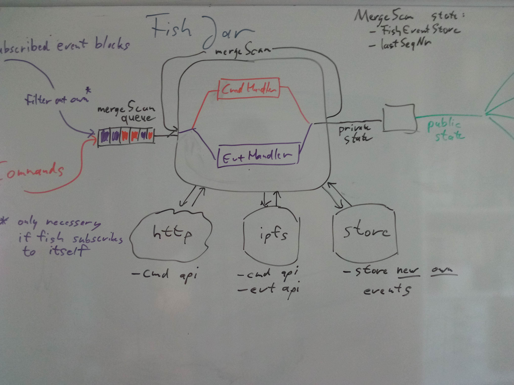
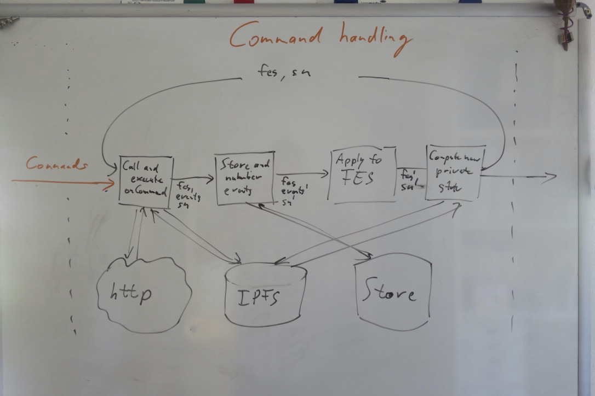

/*
 * Actyx Pond: A TypeScript framework for writing distributed apps
 * deployed on peer-to-peer networks, without any servers.
 * 
 * Copyright (C) 2020 Actyx AG
 */
# FishJar

The fishJar is the state container for the fish logic of a hydrated fish. It computes the current state and handles state subscriptions.

It is the responsibility of the FishJar to assign sequence numbers to events emitted by the fish. The fish jar *owns* the sequence number of the fish.

The central part of the fishJar is implemented as a mergeScan that sequences any changes to the FishJar as well as the underlying FishEventStore.

Storage of events, states and computation of a new state according to the currently available events is in principle owned by the FishJar, but delegated to the FishEventStore (=FES), which is a part of the mergeScan state.

## Hydration

During hydration, the initial state of the fish is computed based on all events that are in the store at the time of hydration. During hydration, no states are emitted, and no state subscriptions are active. So the main work is to

- compute the last sequence number for the fish to be hydrated
- gather all events and sort them according to the event order
  (events will be sorted by psn for each source, but if there are multiple sources they will have to be sorted according to the event order)
- compute the state by piping all events through the onEvent method
  During this there can be costly async interactions with IPFS, but no observable nondeterminism provided this works at all.
- compute the maximum psn for each source. This is needed to seamlessly switch to
  realtime event playback once the fish is alive

## Live fish

Once a fish is live, it publishes state and allows subscribing to states of other fishes. It can also emit events now, so the sequence number has to be tracked.

## The view from the pond

As far as the pond is concerned, a fish is just a thing that consumes commands and emits states. All other interactions with the store, ipfs and http are handled within the FishJar.

### Inputs

Things that can happen to a fish are basically just events and commands.

#### Events

The FishJar requests realtime events for its subscription set from the store, starting from the psn map that was computed during hydration (exclusive). The stream of events from the store to the FishJar is handled within the fishjar itself. The pond is just a container of fishjars and is not responsible for feeding events to fishes.

Events are delivered to the FishJar in chunks. Chunks can either correspond to blocks in the store, or blocks of events received via pubsub in realtime. A FishJar will only ever see events that match its subscription set.

Blocks will always be from a single source and will be sorted by psn.

Once a fish is live, it does not handle incoming own events. So for fishes that subscribe to their own events, they are filtered out.

All other subscribed events are handled in a branch of the central mergeScan.

#### Commands

Commands are handled in a different branch of the central mergeScan.

Events emitted by commands are sent to the store and then immediately applied to the FishEventStore. This is to guarantee that the events have been considered when the next command is processed. The internal sequence number is increased as soon as the call to store the emitted events returns.

### Outputs

#### Public state updates

Whenever a command or an external event leads to a private state change, this state change can produce a new public state. The public state is the only *explicit* output of the FishJar pipeline and can be observed by other fishes.

#### Own events

During processing of commands, a fish can emit events. These are stored in the store from inside the onCommand branch of the mergeScan.

#### Interactions with http

During the processing of commands, the FishJar can interact with both http and ipfs. This is done inside the mergeScan when executing the DSL returned by the onCommand method for the command.

#### Interactions with ipfs

During the processing of events, the FishJar can interact with ipfs. This is done inside the mergeScan when executing the DSL returned by the onEvent method for the event.

#### Interactions with the event store

##### During hydration

- The last event for the fish (semantics, name, sourceId) must be read
  to determine the last sequence number. We apply an optimization here
  by traversing the events in reverse using `IpfsStore.getChunksInReverseWhile`.

- All events for the subscription of the fish must be read from the
  store to determine the initial state and the initial PsnMap.
  
- For certain types of fish, hydrating is optimized via snapshots. The
  basic idea is that if a notion of a 'reset' event exists for this
  fish, all events before the latest such event do not have to be
  processed. [Detailed doc lives
  here](https:// github.com/Actyx/Internal-Cosmos/pull/663) 
  <!-- TODO add link to proper doc when it exists -->

##### Live fish

- Events matching the subscription set of the fish are read from the store from the initial PsnMap
- Own events are written to the store
