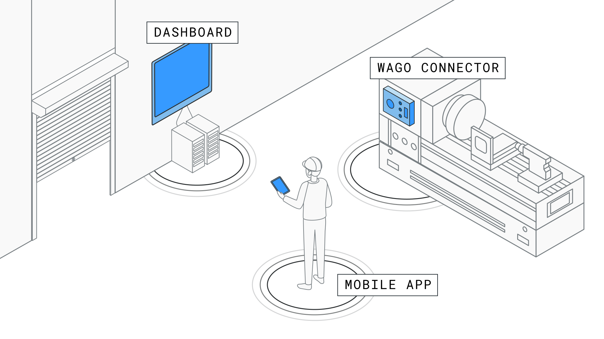

Test

# Actyx Advanced Tutorial Example App

This repository contains the example code for the Advanced Tutorial, which you can find on the [Actyx Developer Website](https://developer.actyx.com/docs/learn-actyx/advanced-tutorial/introduction).

It consists of three applications:

**Order Management App**

Runs on a mobile phone or tablet and lets the user create and manage production orders.

The code can be found in `src/order-management`.

**Wago Connector App**

Runs on a machine gateway to start and finish production orders and collect machine data.

The code can be found in `src/wago-connector`.

**Dashboard App**

Runs on a mobile phone or tablet showing a dashboard displaying relevant production data.

The code can be found in `src/dashboard`.

These three apps together form an imaginary, yet realistic, factory solution on the Actyx platform.

