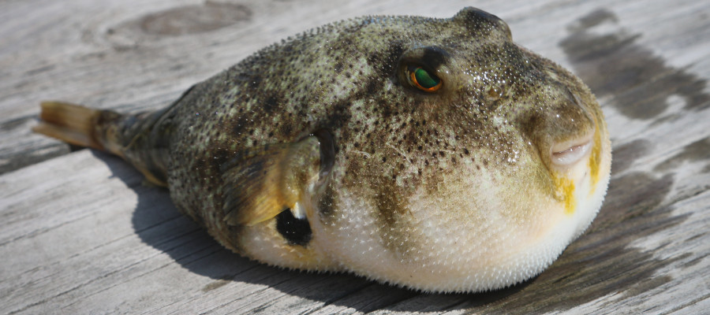

In event-sourced systems, state snapshots are used to alleviate the costs of computing state from event streams. Snapshots are essential to keep processing overhead and latency in check when working with long-lived and/or high traffic models.

The Actyx Pond ships with reasonable defaults for creating and retaining snapshots. However, in certain cases, snapshots may grow too large. This post outlines how to segment state and compress snapshots to avoid this.

<!-- truncate -->



## Recap: Events, State and Snapshots

The state of any given entity in an event-sourced system (a `Fish` in the `Pond`, in our case) at any point in time is defined by the stream of events relevant to this entity up to this time. The state is computed by applying these events one by one in chronological order. This means, the larger the number of events to apply, the more computational resources are required to reach the resulting state.

To prevent having to apply _all_ relevant events each time we want to look at the state, we employ [snapshots](https://developer.actyx.com/docs/pond/guides/snapshots). A snapshot is the persisted result of computing the state for a given point in time. Now, when we look at the state, we don't have to apply all events but only those that happened after the time the snapshot was taken.

The Actyx Pond transparently manages snapshot creation, persistence and application for you. About every 1000 events, a snapshot is persisted, if the base event is older than one hour. Additionally, the Pond retains snapshots from the past to aid with [longer time travel distances](https://developer.actyx.com/docs/pond/guides/time-travel).
If an event leads to the state being completely replaced, you can let the Pond know by returning `true` from the fish's `isReset` function. This prevents the Pond from unnecessarily going back further in time to compute the state. You can find an example in [Semantic Snapshots](https://developer.actyx.com/docs/pond/guides/snapshots).

So, while the Pond already takes care of a lot of things for you, there still are cases in which you have or want to influence the default behavior.

## Fish state size considerations

One case that requires special care is if the size of a snapshot exceeds `128MB`. If it does happen, the Pond will let you know by throwing the message `Cxn error: Max payload size exceeded` at you. Now it is up to you to review your state management, implement mitigation measures and increase the `FishId`'s version field afterwards.
While it is uncommon for fish to grow that large, there are cases in which it might be required. In any case, you should consider the state's estimated size over time in your designs as not to be caught off guard.

In development, you can easily review the sizes of existing snapshots by hooking into the `deserializeState` function and logging it. Just don't leave it enabled in production. State deserialization happens _a lot_.

```ts
const snapshotSize = (snapshot: unknown) =>
  (Buffer.byteLength(JSON.stringify(snapshot)) / 1024 / 1024).toPrecision(4) + 'MB'

export const SomeFish = {
  of: (): Fish<S, E> => ({
    // fish details omitted
    deserializeState: (snapshot: unknown) => {
      console.debug('Deserializing snapshot of size ' + snapshotSize(snapshot))
      return snapshot as S
    },
  }),
}
```

When designing your system, you'll want to model one physical object, process or concept from your problem domain as one fish. This helps you reason and talk about your business domain without having to mentally map additional abstractions. Oftentimes, this quite naturally leads to reasonable sized fish states. With the next version of Actyx, we're moving to the concept of `local twins` which communicates this 1:1 relationship more explicitly.

### Fat fish

Two scenarios that tend to lead to large fish states are a) time series data and b) exports of aggregated data to external systems like databases for analytics, especially if the target systems are unavailable periodically.

Regarding a), one use case is to visualize sensor logging data.
We'd recommend not to keep time series data around in your state for longer periods of time but to push them to external data sinks and flush them from your state once they have been committed. From the external sink, these data can be visualized using Grafana or similar. Delegate the visualization for time series to specialized systems and don't implement it yourself in an Actyx application. Not only does this circumvent the size limitation. It also provides you with specialized tooling for visualization instead of leaving you on your own to implement this with chart.js, highcharts or even vanilla JavaScript + SVG. I've seen this pay off over and over again once changes in charts have been requested.

While exporting to external systems is common, the other pattern that can lead to largish fish states relates to exactly that. _If_ data from events map more or less directly to rows in database relations in a 1:1 fashion and _if_ the database is available most of the time, there should be no issues in terms of state size.
But if the state you're looking to export is computed from a larger number of different event types over a larger period of time it may be required to keep more data around to figure out which parts of the database to update. This challenge and solution patterns are discussed in more detail in [Real-time dashboards and reports made efficient and resilient](https://www.actyx.com/news/2020/6/24/real-time_dashboards_and_reports_made_efficient_and_resilient).

In this case, compressing the fish state's snapshots helps to avoid running into the `128MB` limitation.

## Compressing snapshots

The Pond [documentation](https://developer.actyx.com/docs/pond/guides/snapshots) mentions the possibility of compressing snapshots. Let's walk through implementing it together.

### Evaluating compression

First, we need a suitable compression library. Our own [Benjamin Sieffert](https://github.com/benjamin-actyx) recommends [Pako](https://github.com/nodeca/pako), so we'll stick to that for now. However, there [are](https://github.com/rotemdan/lzutf8.js/) [others](https://pieroxy.net/blog/pages/lz-string/index.html) as well. If you do decide to evaluate them, it would be great if you could share the results.

The following sample explores how to use Pako in isolation and how much it compresses some sample data. To generate a reasonable amount of random data, we use the popular [faker library](https://github.com/marak/Faker.js/). We'll compress and decompress a string and an array of objects, look at the compression ratio and make sure the roundtrip does not mess with our data.
To install the required packages, run `npm install pako faker` and `npm install @types/pako @types/faker --save-dev` for the corresponding type definitions.

```ts
import * as Pako from 'pako' // compression library
import faker from 'faker' // test data generator

const toMb = (size: number) => (size / 1024 / 1024).toFixed(3)

const raw = faker.lorem.paragraphs(50000) // 50k paragraphs of lorem ipsum
const compressed = Pako.deflate(raw) // compress data
const decompressed = Pako.inflate(compressed, { to: 'string' }) // decompress data

const rawO = Array.from({ length: 10000 }, () => faker.helpers.createCard()) // 10k user data objects
const compressedO = Pako.deflate(JSON.stringify(rawO)) // we need to convert our JS to a JSON string for compression ...
const decompressedO = JSON.parse(Pako.inflate(compressedO, { to: 'string' })) // ... and back again
console.table([
  {
    type: 'string',
    rawSizeMB: toMb(Buffer.byteLength(raw)),
    compressedSizeMB: toMb(compressed.byteLength),
    ratio: (Buffer.byteLength(raw) / compressed.byteLength).toFixed(3),
    roundtripOk: raw === decompressed,
  },
  {
    type: 'object',
    rawSizeMB: toMb(Buffer.byteLength(JSON.stringify(rawO))),
    compressedSizeMB: toMb(compressedO.byteLength),
    ratio: (Buffer.byteLength(JSON.stringify(rawO)) / compressedO.byteLength).toFixed(3),
    roundtripOk: JSON.stringify(rawO) === JSON.stringify(decompressedO),
  },
])
```

This should give us something akin to the following results. We can see that our data is compressed roughly by the factor 3.5. The achievable compression ratio obviously depends on your input data, so I encourage you to run the example on sample data from your application.

| type   | rawSizeMB | compressedSizeMB | ratio | roundtripOk |
| ------ | --------- | ---------------- | ----- | ----------- |
| string | 9.739     | 2.624            | 3.711 | true        |
| object | 24.077    | 6.885            | 3.497 | true        |

### Tying it all together

Now that we know how to use the compression library and what to expect from it, let's integrate it into our fish.

As a test scenario, we'll emit an event with the current datetime every few milliseconds and subscribe to it once with and once without compressing the snapshots. After we keep that running for a few hours, we compare the snapshot sizes as described above.

```ts
import { Pond } from '@actyx/pond'
import { CompressingFish, BoringFish } from '../fish'

export type PushEvent = { content: string }
export const pushEventTag = Tag<PushEvent>('pushed')

Pond.default()
  .then((pond) => {
    setInterval(() => pond.emit(pushEventTag, { content: Date() }), 150)
    pond.observe(BoringFish.of(), (state) =>
      console.log(`BoringFish has ${state.data.length} items`),
    )
    pond.observe(CompressingFish.of(), (state) =>
      console.log(`CompressedFish has ${state.data.length} items`),
    )
  })
  .catch(console.error)
```

The `BoringFish` just aggregates stores all events it receives. We'll keep `deserializeState` from above to track the state's size.

```ts
type State = { data: string[] }

export const BoringFish = {
  of: (): Fish<State, PushEvent> => ({
    fishId: FishId.of('BoringFish', 'Carp', 0),
    initialState: { data: [] },
    where: pushEventTag,
    onEvent: (state, event) => {
      return { data: [...state.data, event.content] }
    },
    deserializeState: (snapshot: unknown) => {
      console.debug('Deserializing RAW snapshot of size ' + snapshotSize(snapshot))
      return snapshot as State
    },
  }),
}
```

In contrast, the `CompressingFish` implements compression using Pako by implementing `deserializeState()` in the fish and `toJSON()` in the state. `toJSON()` will return the compressed data, which might be counter-intuitive. You can think of `toJSON()` as "serialize".

```ts
const pack = (data: any): string => Pako.deflate(JSON.stringify(data), { to: 'string' })
const unpack: any = (zipped: string) => Pako.inflate(zipped as string, { to: 'string' })

type CompressedState = {
  data: string[]
  toJSON: (data: string[]) => {}
}

const INITIAL_STATE = {
  data: [],
  toJSON: () => pack([]),
}

export const CompressingFish = {
  of: (): Fish<CompressedState, PushEvent> => ({
    fishId: FishId.of('CompressingFish', 'Fugu', 0),
    initialState: INITIAL_STATE,
    where: pushEventTag,
    onEvent: (state, event) => {
      let data = [...state.data, event.content]
      return {
        data,
        toJSON: () => pack(data),
      }
    },
    deserializeState: (zipped: unknown) => {
      console.debug('Deserializing COMPRESSED snapshot of size ' + snapshotSize(zipped))
      return { data: JSON.parse(unpack(zipped)) } as CompressedState
    },
  }),
}
```

When we keep this running for some time, we should see that ...

- ... both fish have the same number of items in their state
- ... the size of the compressed snapshot should be significantly smaller than the uncompressed one (well, duh!)

And indeed, the logs confirm both assumptions.

```sh
CompressedFish has 92138 items
Deserializing RAW snapshot of size 6.063MB
BoringFish has 92138 items
Deserializing COMPRESSED snapshot of size 1.002MB
CompressedFish has 92138 items
...
Deserializing COMPRESSED snapshot of size 1.025MB
CompressedFish has  92781 items
Deserializing RAW snapshot of size 6.105MB
BoringFish has 92781 items
```

### Cleaning up

Now that we got it working, let's look at the code we've produced. Wrangling `toJSON` into our state in multiple locations is pretty ugly and could get out of hand quickly with growing numbers of fish. We mixed up our business code (the state) with technical concerns (serialization). Let's see whether we can do better. Wouldn't it be nice to have a way to make existing fish compress their state without us having to modify them?

To do so, we can implement a wrapper for existing fish, providing the functions required for (de-)compression as decoration. This requires the following parts:

- A generic wrapper for `State` types adding the `toJSON` function
- A function accepting a fish and returning the decorated one

The decoration consists of the `toJSON` and `deserializeState` functions we discussed above. Additionally, we need to allow the system to discriminate between compressed and raw snapshots. Every other part is just delegated to the original fish.

```ts
type CompressingStateWrapper<S> = S & { toJSON: () => string } // base state type + toJSON

export const asCompressingFish = <S, E>(fish: Fish<S, E>): Fish<CompressingStateWrapper<S>, E> => ({
  fishId: FishId.of(
    `${fish.fishId.entityType}.zip`, // discriminate between raw and compressed snapshots
    fish.fishId.name,
    fish.fishId.version,
  ),
  where: fish.where,
  initialState: {
    ...fish.initialState,
    toJSON: function () {
      return Pako.deflate(JSON.stringify(fish.initialState), { to: 'string' })
    },
  },
  deserializeState: (zipped: unknown) => {
    console.debug('Deserializing WRAPPED snapshot of size ' + snapshotSize(zipped))
    return {
      ...JSON.parse(Pako.inflate(zipped as string, { to: 'string' })),
      toJSON: function () {
        const { toJSON: _, ...rest } = this
        return Pako.deflate(JSON.stringify(rest), { to: 'string' })
      },
    } as CompressingStateWrapper<S>
  },

  isReset: fish.isReset,
  onEvent: (state, event, metadata) => {
    return {
      ...fish.onEvent(state, event, metadata),
      toJSON: function () {
        const { toJSON: _, ...rest } = this
        return Pako.deflate(JSON.stringify(rest), { to: 'string' })
      },
    }
  },
})
```

Note that, if you observe the original fish alongside the wrapped instance, you will still get uncompressed snapshots as well.

Kudos to [Alex](https://github.com/Alexander89) for coming up with this pattern.

To see it in action, we just add a wrapped fish to our Pond from the test scenario.

```ts
pond.observe(asCompressingFish(BoringFish.of()), (state) =>
  console.log(`Wrapped BoringFish has ${state.data.length} items`),
)
```

When looking at the logs now, we see that the size of the wrapped fish's state corresponds to the one we manually added compression to.

```sh
Deserializing WRAPPED snapshot of size 0.1725MB
Wrapped BoringFish has 18094 items
Deserializing COMPRESSED snapshot of size 0.1725MB
CompressedFish has 18094 items
Deserializing RAW snapshot of size 1.191MB
BoringFish has 18094 items
```

## Wrapping up

We looked at some ways to reason about the size of fish states and how to influence the way snapshots are persisted.

If you assume you'll be running into the `128MB` snapshot size limitation, your first impulse should be to validate whether this _really_ is required. Check whether it is possible to segment and/or clean up state as part of its segmentation. Besides the size limitation, carrying around a lot of large state snapshots can have a negative impact on the system's performance. Also verify that, if you're pushing state to an external system, that it is not unavailable for longer periods of time.
In case this does not mitigate the issue, you can use the compression wrapper to compress it.

You can use the code above to create similar scenarios using your own data to validate it. Also, do not hesitate to get in touch. We're always curious to learn how you're using Actyx, what works for you and where your pain points are.

---

Credits: pufferfish photo by [Brian Yurasits](https://unsplash.com/@brian_yuri?utm_source=unsplash&utm_medium=referral&utm_content=creditCopyText)
