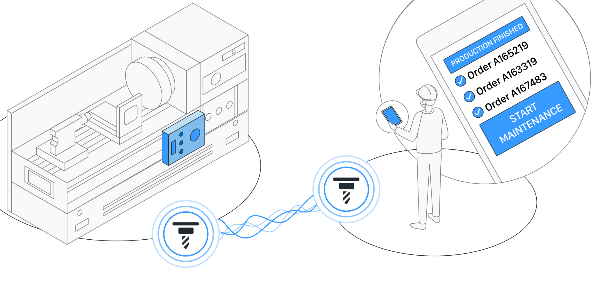

Actyx builds on the [_local-first cooperation_](https://www.local-first-cooperation.org) paradigm, where the autonomy of individual computing devices is of high importance:
this is the foundation for creating a system that always works — as long as you have a running computer in your hand, that computer remains maximally useful.

Striving for this autonomy also poses some interesting questions: how do I know that someone else has received the information I just logged? Or the decision I just made?
Working together requires two-way communication in many cases, which we explore in this article.

<!-- truncate -->

## Illustrative examples

We’ll use the following two example scenarios from the factory shop floor to illuminate the problem space:
human and machine working together at the same place, and different parties working together on a single workflow throughout the whole factory.

### Local Twins

We describe the examples in terms of _local twins_, which are the basic idea behind the [programming model offered by Actyx](https://www.actyx.com/platform).
More precisely:

:::info Definition
A **local twin** is the **active shared virtual** representation of a physical object or concept on a set of edge devices.
:::

You can picture a local twin as a piece of code, a program that you can summon on any computer where you need it — this is why it is called _local_.
On your local computer the local twin reflects the state of something, for example a machine or a manufacturing order, it is like a digital _twin_ of that thing.

The knowledge or state of the local twin is derived from the events that are available on the local computer where it is summoned.
Events flow between all computers running Actyx in the network, which is how local twins learn of things that happened on other computers.
The same local twin can be summoned on different computers at the same time and show possibly different states, depending on whether all events have already been disseminated between those computers.

For local twins representing a physical object, there is usually one computer with special significance: the local twin of a machine has the special power of interacting with that machine (like reading sensors or switching it on and off) when it is summoned on the computer that is attached to that machine.

Let’s stretch our legs (or rather: minds) with this model by looking at a simple example:

- the local twin of a machine, summoned on the machine controller, records its operational state; let us assume that it is currently producing according to some hypothetical order with number 4711
- the local twin of that machine, summoned on a mobile phone, shows that state as well
- on the controller, the local twin records that production is finished because enough pieces were made
- eventually, the recorded event propagates and the local twin on the phone will show this, too
- the human operator tells the local twin on their phone to stop the machine
- again eventually, the local twin on the controller learns of this request (also via an Actyx event)
- soon thereafter, the local twin on the controller has switched off the machine and records an event that says “machine has stopped”

When I think about local twins, my mental image is a mixture of Doctor Manhatten and Alfred, Batman’s devoted butler.
A local twin is like an assistant and middleman who can run across computer networks to make things happen — and split himself into many copies to be in many places at once (albeit but without magical communication; one copy needs to “run to” another copy to tell them about new developments).

:::tip A word on naming
Local twins are implemented by writing Fishes in ActyxOS version 1 and Actyx Pond version 1 or 2.
We will phase out the term “fish” in the next major versions.
:::

### Scenario A: local cooperation

The first example is a technician with a mobile phone app for performing maintenance on an injection moulding machine.
The app uses Actyx to communicate with the machine’s local twin, also built on Actyx and connected to the machine by an app running on the machine PLC’s non-realtime core.

In this scenario picture Sara, the technician, walking up to the machine based on her maintenance schedule.
She has checked the machine’s status and sensor readings on the app already, and after a quick visual confirmation concludes that maintenance can begin.
So she taps the button that brings the machine controller into maintenance mode.
This button press changes the state of the machine’s local twin into maintenance mode, but Sara needs more than that: the physical machine also needs to change its operational mode.

Assuming that the app designer’s requirement was a holistic and consistent user experience, Sara will check on her phone whether the real-world machine controller has actually changed its mode.
She could also check that by looking at the machine’s control panel (which she might well do out of professional diligence), but including this aspect in the app allows further in-app guidance for subsequent activities — like enabling some machine commands only when they are safe to execute.

In summary, scenario A illustrates the close collaboration of a human and a machine at the same location.

How do we implement this in software?
Without knowing anything about how Actyx — or any other technology — works, it is obvious that Sara has sent a command to some other computer and is now waiting for that other computer to respond.
Sara has merely told the local twin on her phone what she wants, but the local twin has not yet done it, the machine is still in normal operating mode.

This tiny workflow step can be completed by the local twin changing into a state that says “the machine controller is now in maintenance mode, as requested.”
In order to do so, the machine connector app — which also has that local twin running — must send a command to the PLC to change mode and then update the local twin’s state with subsequent updates from the PLC.
Eventually, maintenance mode will be active and that fact will also be synchronised to Sara’s phone.

Usually, this only takes a few milliseconds, so Sara will see the changed operational mode immediately after having tapped the button in the UI.
But sometimes there may be a network hiccup or some other issue.
Since we want to build a system that always works, we need to foresee such cases and handle them at all layers, from the local twin up to the mobile app’s UX design.

Since Sara is a technician, she’s familiar and comfortable with knowing all the details of her interaction with the machine controller.
Therefore, it would be best to foresee keeping her informed about all the intermediate states of the above workflow, just in case it gets stuck somewhere:

- local twin has been told to go to maintenance mode
- machine controller has confirmed reception of this command
- machine controller is going through the programmed steps to switch to maintenance mode
- machine is now in maintenance mode

These state changes need to be modeled as events, the states need to be reflected in the local twin, and they need to be foreseen in the mobile app’s UX design.
Doing it this way gives Sara all the information she needs to get her job done.

### Scenario B: cooperation over a distance

The second example is the transport of pallets of finished goods from a production line to the shipping area.

Eva, the line supervisor, has just registered in the production data acquisition (PDA) app that one more pallet has been produced.
The Actyx system is used to make this information available on the tablet of intralogistics worker Michael.
The tablet is running an app that uses the local twins of transport orders that Michael shall carry out.
Eva’s action of logging finished goods has led to the creation of one such new order, which pops up on Michael’s screen with all relevant information.

Michael is currently busy and will finish his current transport order, thereby informing the local twin of that previous order that it has been done.
He will then drive the forklift to Eva’s line to pick up the pallet and perform his new order.

When Michael arrives in the shipping area, he’ll deliver the pallet to Oleg, who is responsible for the quality assurance checks that need to be done before shipping the goods to the customer.
Oleg will need a bunch of information to perform these checks and record all the required results:
the QA system’s checklist, the precise product and packaging description from the ERP system, shipping instructions, etc.

In summary, scenario B illustrates how information from many places needs to flow together at one time and place, so that the factory workflow can proceed correctly.
This is especially interesting when parts of the information need to be retrieved from non-Actyx systems that don’t have local twins (yet).

:::info How could this look in the future?
Depending on the degree of workflow automation in the factory we look at, there are several ways in which we can implement the above process.
In the future we may have outfitted every person, machine, and piece of material with some tiny computer that can store or run local twins.
In that case, the preferred solution is to transport all required data with the pallet, so that the produced goods “know” everything that is needed to properly finish the manufacturing order.
Eva’s PDA terminal would already have the full workflow description and pass that along to an RFID chip on the pallet, so that Oleg’s logistics scanner would just read the information from that chip and display it on his augmented reality glasses.
:::

But alas, we have not yet reached such a high degree of digital integration, we are just getting started on this journey.
A typical case today is that all information about the production process and its individual workflow steps is stored in the central ERP system.
The location and further details of any piece of material are tracked in the ERP’s warehouse management module.

In this world — the real world — Oleg will scan the barcode on the pallet that was just delivered by Michael, which leads to a database query being made against the ERP system to find out all the required details.
Therefore, Eva’s production data and Michael’s material movement need to be registered in that database when Oleg’s scanner asks about them.

Taking Eva’s PDA terminal as an example, this means that the booking of finished goods needs to have found its way from the terminal to the ERP connector app and into the ERP database.
Since Oleg will depend on the information, the ERP system is in this case the point of collaboration between Eva and Oleg.
There are many ways to implement this, but we need to keep in mind that Eva has other priorities as well, so we need to find a solution that minimises her effort spent on information transfer.

The easiest and most intuitive solution is to make sure that the information has reached the ERP system before Michael picks up the pallet;
in fact, Eva could forget about this whole duty even earlier if the information was transferred before she created the transport order.
So from Eva’s perspective the desired workflow is as follows:

- notice that a new pallet is full according to the packaging schema
- log finished goods using the PDA terminal
- confirm that the booking was successful in the ERP system
- create transport order to send the pallet on its way to the shipping area

We can optimize all of the above into a single button tap on the PDA terminal in the usual case, when everything works.
Logging the finished goods changes the local twin of the manufacturing order (illustrated again below), this change is detected by the ERP connector app, the booking is made, the local twin is updated again that the booking was successful, at which point the PDA app can go ahead and create the local twin of a new transport order and thereby send the pallet on its way.
All this could be shown on the PDA terminal with a small status icon next to the manufacturing order, though usually Eva will not keep looking because she has other work to do.

But what if the PDA terminal is currently unable to talk to the central IT systems where the ERP connector app runs?
(e.g. because the PDA terminal is out of network coverage, or the ERP connector is not running)
The PDA app will need to wait for the manufacturing order’s local twin to change state, saying that the booking was successful (or rejected, in which case Eva will call her shift leader).
As long as this state change hasn’t arrived at Eva’s terminal, she still needs to care about the pallet shipping workflow, she needs to keep it in mind.

UX-wise this could be implemented by having the PDA terminal beep when the answer has not arrived after a set timeout interval, interrupting Eva’s normal flow and basically asking her for help.
She’ll probably look at the screen for a few seconds to see if the booking goes through, but if it doesn’t she’ll either need to call a supervisor or technician, or do something about the situation herself.
The choice at this point depends on the factory in question and how you want to organise its processes.
Eva could for example check the ERP system on a different computer to see whether the booking actually made it, in which case the PDA app might allow her to manually confirm the creation of the transport order.
Or she could defer the transport until later if there is some buffer space at her workstation where the pallet can stay for a few minutes longer.

The important thing to note here is that the PDA terminal needs to work together with Eva like a good assistant:
it needs to silently do its job as long as there are no issues and keep her informed of everything she needs to know.
And in case of trouble it needs to assist her as best it can.
The latter usually includes telling Eva when the PDA terminal itself is not connected to the rest of the network, e.g. using the [Actyx Pond’s](/docs/how-to/actyx-pond/introduction) connectivity status information.

## Implementation

As we have seen, working together requires two-way communication.
Someone else sees that I have done something, so they start doing something in response and make their progress visible to me, so that I can follow the effects of my actions.
The first example illustrates a close and highly detailed collaboration between a human and a machine, with UX fitted to a person who needs to understand the workflow at a fine granularity.
The second example shows a higher-level form of collaboration, mediated for example via an ERP system as the middleman.
In that case, the details still need to be recorded on the level of local twins, but only to present a suitably boiled down view to a person whose primary concern is a different workflow — the communication is merely a detail of one small workflow step that usually requires no attention at all.

The key takeaway is that the progress information that needs to be shared between collaborating parties is specific to the process that these parties work together on.
All progress of a digitised process needs to be reflected in that process’ local twin, for example by writing events that record ERP bookings.
You can use the event tagging capabilities of Actyx, which have been designed specifically to allow such fine-grained usage:
some local twin may process and represent more detailed information about a workflow than another, and you can use either one in an app based on necessity.

For scenario A, we might have the following events:

- **MaintenanceModeRequested** tagged with `['machine', 'machine:IM310']`
- **ModeChangeStarted** tagged with `['machine', 'machine:IM310']`
- **ModeChangeCompleted** tagged with `['machine', 'machine:IM310']`

In this case collaboration is so close that all parties are interested in the same events, Sara and the machine interact with the very same local twin.
Therefore, all events have the same set of tags; asking for `'machine' & 'machine:IM310'` will retrieve all events pertaining to this machine’s local twin.

In scenario B, we might want to have more choice in terms of which events to look at:

- **FinishedGoodsLogged** tagged with `['order', 'order:4711', 'material', 'material:0515343']`
- **FinishedGoodsBooked** tagged with `['booking', 'order:4711', 'material', 'material:0515343']`

Michael’s intralogistics app might only be interested in the first one (to check batch numbers for example) using the query `'order' & 'order:4711`.
Eva’s PDA terminal on the other hand needs both events and may use the query `('order' | 'booking') & 'order:4711`, which in plain English roughly translates to “give me order state or booking events pertaining to order 4711”.
Tags express the _meaning_ of an event, the code of the local twin (or Fish) implements that meaning; you are free to use tags in any way you like, but you should keep tags and code in sync.

It is also noteworthy that the second event is written by the ERP connector app which may or may not actually wake up the manufacturing order’s local twin — it could also just subscribe to all `'order' & 'material'` events and treat those as a queue or stream of bookings to perform.

## Conclusion

In summary, working together based on local twins requires that these twins mediate the whole workflow, in both directions.
This way your app has all the needed information to help its users even when network connectivity is temporarily impaired.
You should view local twins as assistants rather than as a postal service.
And nothing is cooler than writing a program that assists people on the factory shop floor just like Alfred assists Batman.
