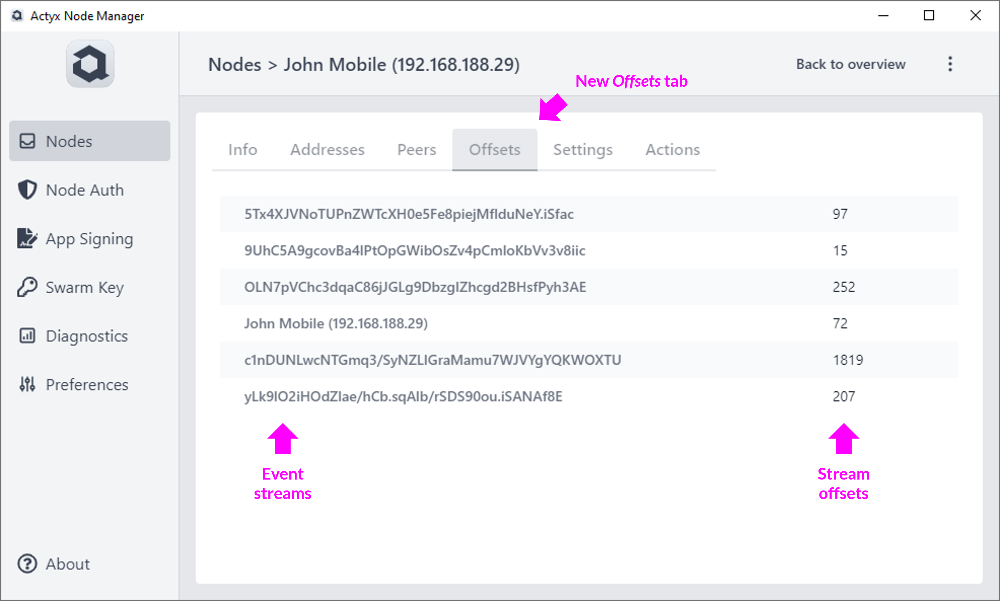
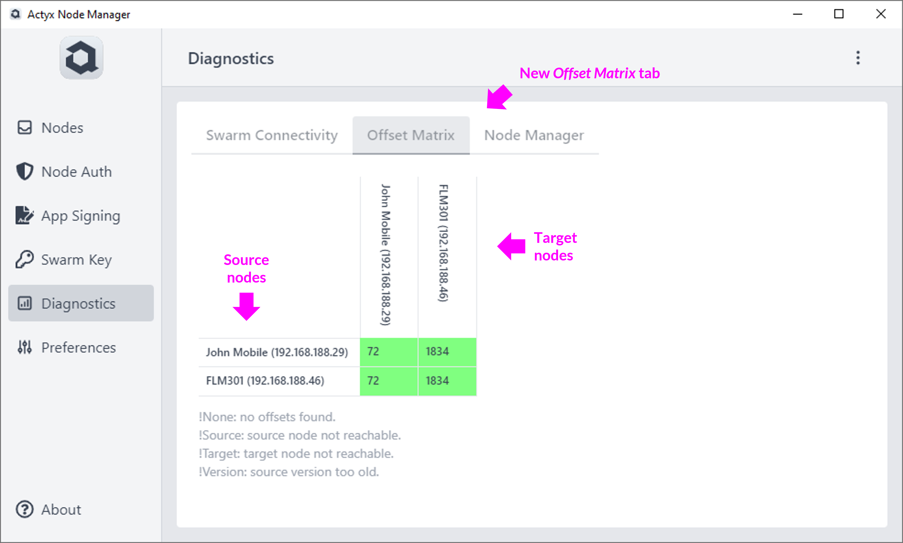
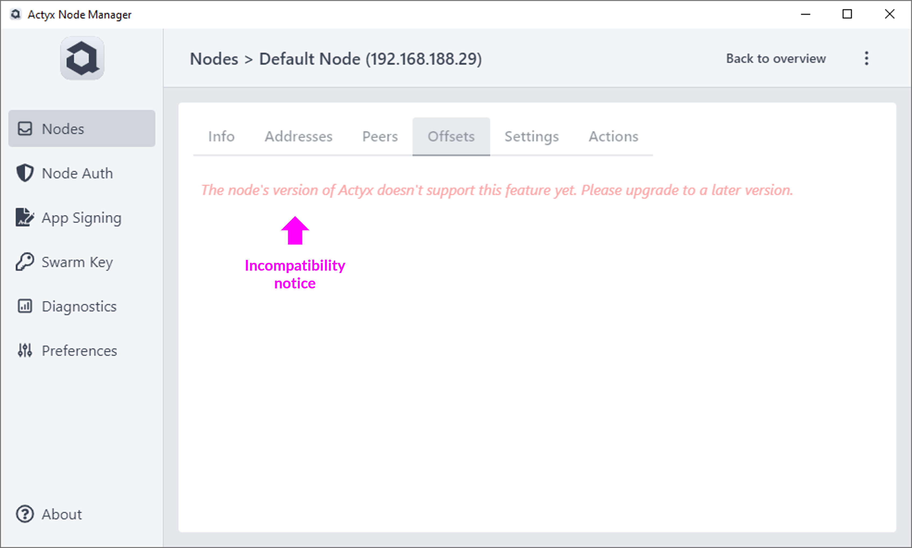

Local-first software is magical in that it almost always works — at least locally. With Actyx this is possible because Actyx is partition tolerant, i.e. a network issue does not immediately take everything down.

This also means that twins and applications aren't always in sync. And sometimes it can get a little tricky understanding where nodes stand with regard to synchronizing with each other.

That is why we are now releasing **Offset Diagnostics** in the Actyx Node Manager.

 

[Actyx Node Manager 2.4.0](/releases/node-manager/latest) introduces two new features to help you better understand what is happening:

- Find out which event streams a node has synchronized, and up to where.
- Easily see how event synchronization is progressing in a swarm of nodes.

<!-- truncate -->
:::info Offsets... what do you mean?
If you aren't familiar with event streams or offsets, have a look at the [Event Streams Guide](/docs/conceptual/event-streams).
:::

## Which event streams does my node know?

A new tab called _Offsets_ is now available on the _Node Details_ screen. This shows all event streams known by the node as well as the current offsets:

 

Additionally, the number of events the node knows it must get, but hasn't gotten yet is also shown where applicable.

## How about the swarm as a whole?

Under the _Diagnostics_ screen a new tab called _Offset Matrix_ is now available. This shows a matrix of all nodes configured in the Node Manager:

 

Each row of the matrix shows how many events a node holds from all other connected nodes.

The color of the cells reflects the level of synchronization. A red cell would imply a large number of missing events, whereas a green cell means the node is completely up to date.

## Requires Actyx 2.1.0

This functionality is only available from nodes running Actyx 2.1.0 and above. If you connect to a node running an older version, you will see the following notice:

 

## Questions or suggestions

We developed this feature based on user feedback. If you have questions or further suggestions, please don't hesitate to post in our [Community Forum](https://community.actyx.com/).
