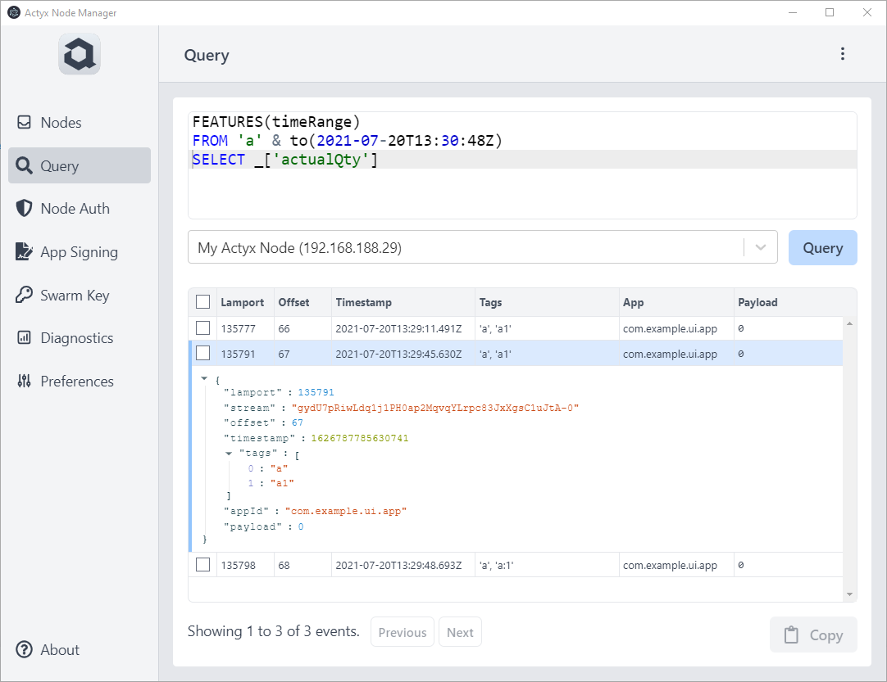
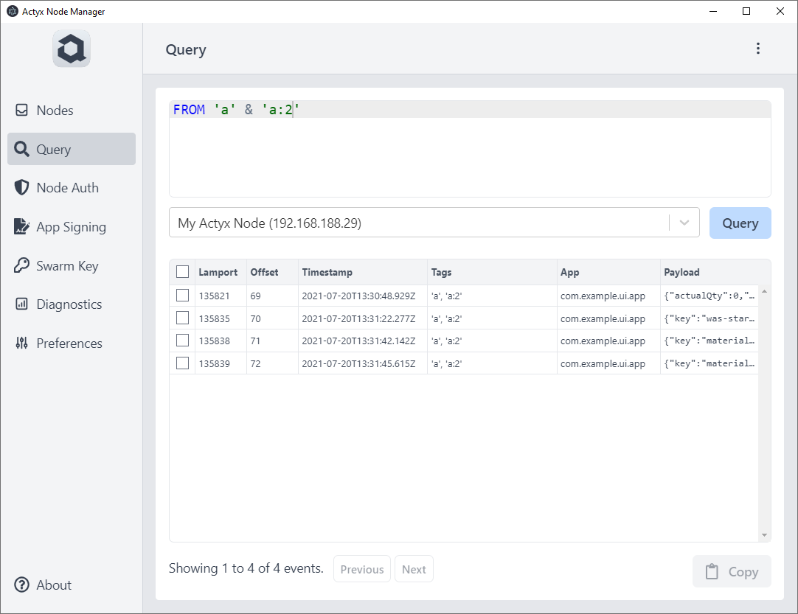
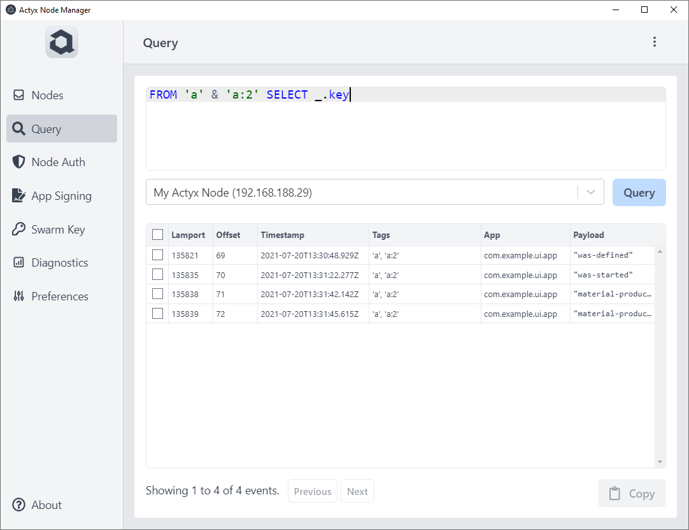
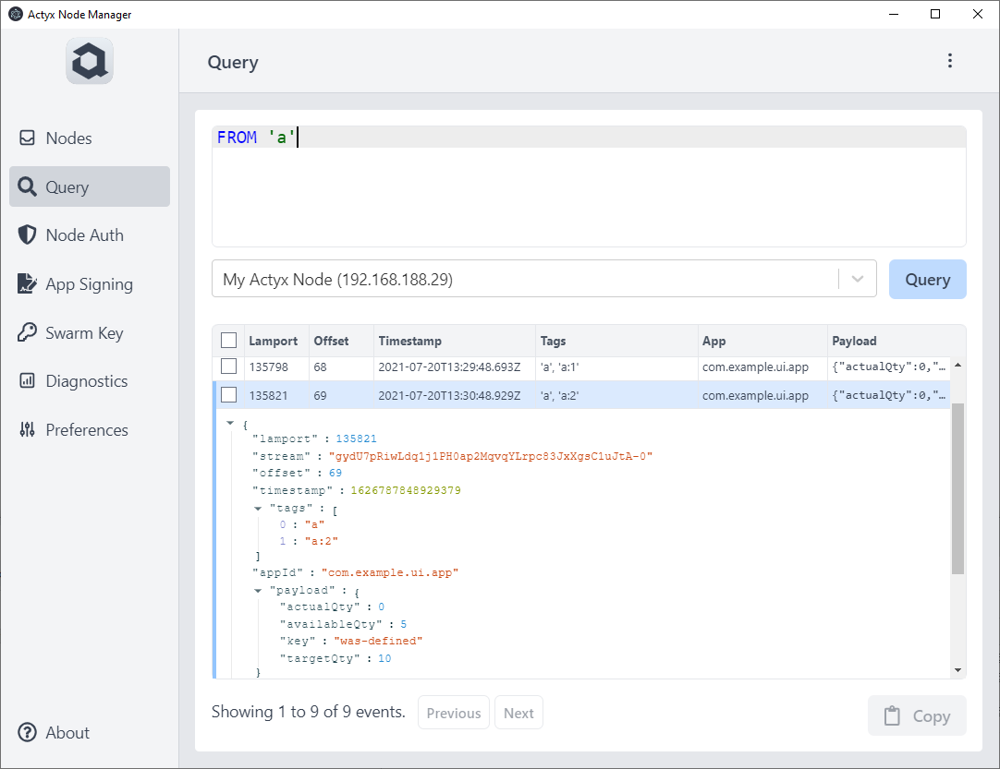
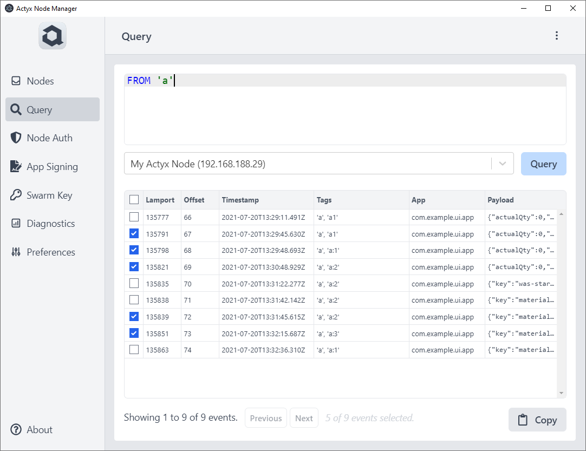

Have you ever wanted to quickly find out what events have been created, and what they contain?
Or would you like to easily transform and copy a set of events?

With the new Query feature of [Actyx Node Manager 2.5.0](/releases/node-manager/2.5.0/) you can now do so easily. 

 

Read on to learn more.

<!-- truncate -->

## Query events using the Actyx Query Language (AQL)

AQL allows you to select, filter, and transform event streams. Here are a couple of examples.

### All events

```sql
FROM allEvents
```

 


### Filter by tags

```sql
FROM 'a' & 'a:2'
```

 


### Transform payloads

```sql
FROM 'a' & 'a:2' SELECT _.key
```

 

### Learn more about AQL

To learn more about AQL check out the [AQL Reference](/docs/reference/aql)

## View event details and payload

You can click on an event to view all its details in an easy to navigate tree.

 

## Export events

If you want to perform further analysis of events, or just use some of them somewhere else, simply select the events you are interested it and copy them to your clipboard.
Then paste them — it's an array of JSON objects — anywhere else.

 

## Errors and warnings

If you query tries to access unknown properties, or performs illegal transformations (e.g. divide by zero), a warning or error message will be shown for each affected result:

 


## Questions or suggestions

We developed this feature based on user feedback. If you have questions or further suggestions, please don't hesitate to post in our [Community Forum](https://community.actyx.com/).
