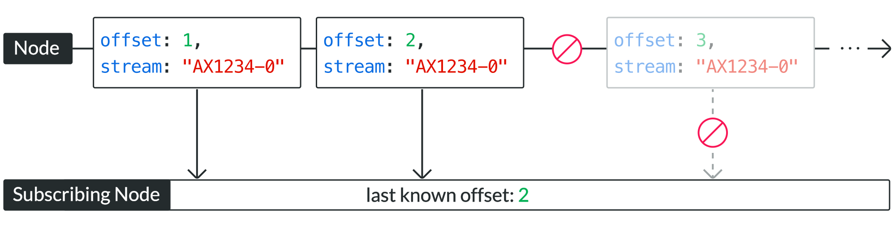

Actyx is designed to facilitate the building of multi-node applications.
As such it offers a powerful method for communication between nodes called event streams.
In this conceptual guide, we will go through the basics of event streams and how event streams are modeled in Actyx.

## Background

Events are facts from the past that can represent anything you would like them to: a robot arriving at a location, a person signing off from work, or a button click.
Event streams are ordered lists of events.
They are very valuable because they allow you to keep track of what is happening and make decisions accordingly—especially in other parts of the system.

Technically, event streaming is a message-driven publish and subscribe mechanism that enables asynchronous communication between several components, as upstream components transfer processing to downstream components by publishing domain events that are then consumed downstream.
Event streaming enables event dissemination throughout the entire system.

With Actyx, event streams are persistent.
This means interested consumers can access any past event at any time since all events are automatically stored indefinitely by default (to disk, for example).

## Overview

Actyx is designed as a decentralized event log and has been engineered for availability, partition tolerance, and eventual consistency.
It offers low latency and high throughput with a small footprint allowing for use on mobile and embedded devices.
It allows events published by apps to be streamed in real-time to other subscribed apps.
Every subscribed app on any device will eventually receive published events (_at least once_ delivery).

Communication between the apps and the Events API is done with a simple, high-performance, language-agnostic HTTP API or dedicated, language-specific SDKs.

## Events and streams

The following image shows simple event streams generated by a device running Actyx.


As can be seen, the device is uniquely identified by its _node ID_.
Each event generated by that device will contain a specific stream ID and a specific and unique _offset_.

- The stream ID consists of the Node ID and a stream number, separated by a dash.
- The offset denotes at which point in the stream the specific event is located.

These properties are encoded in the event metadata next to your user-defined payload.
Here is an example:

```json {4,5}
{
  "type": "event",
  "lamport": 92,
  "stream": "1g1UOqdpvBB1KHsGWGZiK3Vi8MYGDZZ1oylpOajUk.s-0",
  "offset": 42,
  "timestamp": 1622108806233884,
  "tags": ["tag-01", "tag-02"],
  "payload": {
    "value": 42,
    "foo": "bar"
  }
}
```

In the above example, the event

- was generated on a node with ID `1g1UOqdpvBB1KHsGWGZiK3Vi8MYGDZZ1oylpOajUk.s`,
- is part of stream number `0` from that node
- and finds itself at offset `42` of that stream

## Offsets and partitions

_Offsets_ play a very important role in Actyx, similar to stream cursors or offsets in message queues (like Kafka).
As it is designed for high availability, Actyx continues to work, even in the face of network partitions.
This means, however, that events generated by a device in a different network partition, will arrive only once the partition has been _healed_.



Offsets allow apps to keep track of their progress in reading a stream as a subscriber.
To know if new information may be available, you can use the `offsets` endpoint of the Events API.
An HTTP request to that endpoint will return what the API believes to be the latest offset for each stream.
It further returns a map in `toReplicate`, which describes the number of events that are available on all streams in the swarm and are not yet synchronized on this local node.
A high number for a stream in `toReplicate` indicates that a partition has recently been healed and the node is catching up on events that were published during the partition.

### Managing internal state with offsets

All events within one event stream have their unique position, also called its _offset_, that is part of the event metadata.
When consuming event streams, the events of one stream are always delivered in contiguously ascending offset order (strictly monotonic and gapless).
Thus, the highest event offset seen from each node within a swarm serves as a cursor for identifying the replay position within that stream of events.
When an app is restarted, it may want to resume consuming event streams from the last known position.
Therefore, offsets can be passed into the event `query` and `subscribe` endpoints of the [Events API](../reference/events-api.mdx), either as a starting point, declaring the lower bound offset for each stream, or as a termination condition, specifying the upper bound offset for each stream.

To make it more descriptive, consider a stream containing 100 events and say you are interested in the 50 most recent events (events 51-100).
With a lower bound of `50` you define the number of events you have already seen and are not interested in.
With an upper bound of `100` you specify the last event you want to see.
This also makes it more obvious why the former is exclusive and the latter is inclusive.

## Event ordering

Event ordering in distributed systems is essential.
Consider a workflow that spans multiple participants where each action performed by one of the parties has a logical consequence for other participants within the same workflow.
The events written in such a flow have a causal relationship, the second one can only have been emitted because the first event has been processed.
Since in that scenario, at any time there may be partitions between the parties and events could still be emitted by offline parties, these events need to be correctly merged after the partition has been healed.
The device's wall clock can not be used for this since clock skew may have changed sufficiently since the previous observation.
Therefore, events need to be ordered according to their causal relationship, irrespective of wall clocks.
In Actyx this causal ordering of events is achieved by using a logical clock;
concretely, we employ[Lamport timestamp](https://lamport.azurewebsites.net/pubs/time-clocks.pdf).
This algorithm is designed to preserve causal order even when wall clocks on devices are sufficiently skewed or off entirely.

:::info
Note that lamport ordering only guarantees correct event ordering for events that stem from the same logical workflow.
Once events are combined that have no causal relationship, you need to consider a slightly more elaborate approach.
If you want to know more about event ordering in detail, please read our [blog post about negative time spans](https://developer.actyx.com/blog/2021/05/31/avoiding-negative-timespans)!
:::
