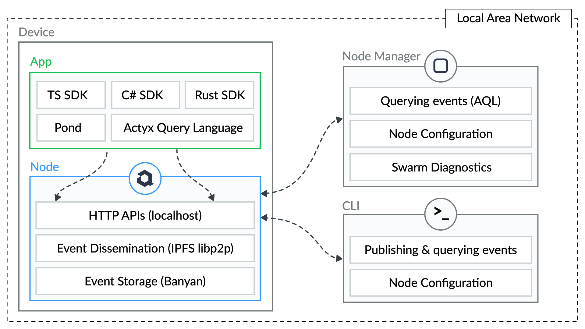

## What is Actyx?

At a high level Actyx is a decentralized event database, streaming and processing toolkit for developers.
It allows you to build local-first cooperative applications which cooperate without any back end systems.

Practically speaking, Actyx is two things.
First, it's a piece of software — written in Rust — that you run on one or more computers for event persistence and streaming.
Second, it's a Typescript framework which provides an opinionated programming model for implementing distributed, but eventually consistent state-machines.

As a developer your write your application using the SDKs or the Pond Framework.
You then run it alongside Actyx on one or more devices.
The SDKs and the Pond Framework then continuously communicate with the local Actyx process to perform their work.

From an architectural stand-point, Actyx allows you to build decentralized applications using events and event-sourcing.
Events are persisted in and streamed across the swarm of inter-connected Actyx devices — normally in the local-area network.
Your application, or rather the Pond framework, uses these events to compute state which your code observes and reacts to.

Actyx itself is built using [libp2p](https://github.com/libp2p), [ipfs-embed](https://github.com/ipfs-rust/ipfs-embed), 
[Banyan trees](https://github.com/Actyx/banyan), and other technologies.
The Actyx nodes discover each other in the network and use different protocols (gossip, bitswap) to quickly and safely 
keep a totally-ordered, append-only event log in sync across all devices.
The events in the log, as well as re-orderings thereof after partitions, feed into the APIs, SDKs and the Actyx Pond framework.

In order to operate and monitor Actyx nodes, you can use either the CLI or the Node Manager, an Electron-app.

## Architecture and components

As shown in the following figure, the Actyx toolkit contains the Actyx process (_Node_), components you use in your apps (_SDKs_, _Pond_), as 
well as the two monitoring and administration tools.



Let's go through each of the components in detail.

### The Actyx node

The Actyx node is the program which discovers other Actyx processes, stores and disseminates events, 
and maintains the append-only event log. It also provides APIs for consumers (usually apps).

You can find the implementation of this at in [`rust/actyx`](https://github.com/Actyx/Actyx/tree/master/rust/actyx) 
on GitHub.
It's written in rust and uses [libp2p](https://github.com/libp2p), [ipfs-embed](https://github.com/ipfs-rust/ipfs-embed), 
[Banyan trees](https://github.com/Actyx/banyan), and other libraries under the hood.

The append-only event log is maintained as a chain of events. Each event is uniquely identified
by its stream ID and a [Lamport timestamp](https://en.wikipedia.org/wiki/Lamport_timestamp). The combination
of these two also allow the event log to be totally ordered across all nodes. After a network partition — or on 
first startup — Actyx will automatically build, or complete its event log and order it accordingly.

Beside this the node offers a HTTP API bound to localhost for [accessing the node ID](../reference/node-api.mdx), 
[authenticating as an app](../reference/auth-api.mdx), and, especially, for 
[interacting with the event log](../reference/events-api.mdx). You can publish events, query events (using AQL), 
and subscribe to event streams. These APIs are by default accessible at `http://localhost:4454/api/v2`.

### Your app(s)

You use whatever technology you would like to build you applications. To interact with the local 
Actyx process's API you can use the Typescript, C#/.NET, or Rust SDKs. These SDKs are thick wrappers 
around the node APIs and take care of authentication for you.

Alternatively, you can — most people do — build your application using the Actyx Pond framework. Instead 
of thinking just in terms of events and event streams, the Actyx Pond provides a programming model for 
implementing and observing eventually consistent state machines across a swarm of nodes. We will look at the 
Actyx Pond framework in more detail below.

In either case, you benefit from the fact that the SDKs and the Actyx Pond only communicate with the local 
Actyx process. As long as that process is running, your apps will work — that's local-first!

### Admin tools

To monitor and administer your nodes and your swarm, you can use either

- the [Actyx CLI](../reference/cli/overview.md), a hopefully ergonomic CLI written in Rust; or,
- the [Actyx Node Manager](../reference/node-manager.mdx), an Electron-based GUI.

These tools allow you to:

- view and set node settings
- generate user and swarm keys,
- view stream offsets,
- run AQL queries; and,
- view swarm diagnostics (Node Manager only).


## Actyx Pond framework

Actyx is a useful tool on its own, but it's magical with the Actyx Pond framework. If you want to build 
local-first cooperative apps the Actyx Pond takes care of most of the heavy lifting for you. Let's have a 
look at an example (the Pond uses Typescript):

```ts
import { Fish, FishId, Tags } from '@actyx/pond'

interface Todo {
    id: string,
    description: string,
    done: boolean,
}

// Event emitted when todo added
interface TodoAdded {
    type: 'added'
    id: string,
    description: string,
}

// Event emitted when todo changed
interface TodoChanged {
    type: 'changed'
    id: string,
    description?: string,
    done?: boolean,
}

// Event emitted when todo removed
interface TodoRemoved {
    type: 'removed',
    id: string,
}

type State = Todo[]
type Event = TodoAdded | TodoChanged | TodoRemoved

// Our state machine — called a fish
const TodoFish: Fish<State, Event> = {
    fishId: FishId.of('todo', 'my-todo-fish', 0),
    initialState: [], // Initially we have no todos
    where: Tags('todo'), // Get only events tagged with 'todo'
    onEvent: (state, event) => { // Our event reducer
        switch (event.type) {
            case 'added': {
                state.push({ ...event, done: false })
                return state
            }
            case 'removed': {
                return state.filter(todo => todo.id !== event.id)
            }
            case 'changed': {
                const currentTodo = state.find(todo => todo.id === event.id)
                if (!currentTodo) {
                    return state
                }
                return [
                    ...state.filter(todo => todo.id !== event.id),
                    {
                        ...currentTodo,
                        description: event.description !== undefined
                            ? event.description
                            : currentTodo.description,
                        done: event.done !== undefined
                            ? event.done
                            : currentTodo.done
                    }
                ]
            }
        }
    }
}
```

What you can see in this example is the basis for implementing a distributed, local-first todo 
app. The Pond allows you to implement state machines called fishes. These state machines are fed by
events emitted from anywhere in the swarm. The state of the machine is re-computed for every event
according to an event reducer (called `onEvent`) — this is so-called
[event-sourcing](https://martinfowler.com/eaaDev/EventSourcing.html).

The magic of the Actyx Pond is that it will automatically time-travel your state machines if new 
events are received from the swarm. This means that if your state machine has missed some events 
— maybe the device was offline — it will automatically re-run through the re-ordered event log when 
those events turn up. This time-travel is what guarantees eventual consistency of all states machines 
in the swarm.

Check out the [Pond how-to guide](../how-to/actyx-pond/introduction.mdx) to learn more and dive deeper.

### App packaging and deployment

Actyx does not offer any app packaging or deployment facilities — there are better tools for that. 
For some pointers and ideas check out the tool suggestions for packaging [mobile apps](../how-to/packaging/mobile-apps.mdx),
[desktop apps](../how-to/packaging/desktop-apps.mdx), and [headless apps](../how-to/packaging/headless-apps.mdx).

### Further resources

- Check out the [quickstart](../tutorials/quickstart.mdx), [beginner tutorial](../tutorials/chat.mdx), 
  [to-do app example](https://github.com/actyx-contrib/todo-react) or a 
  [complete factory use-case](../tutorials/advanced-tutorial/introduction.mdx)
- Get started yourself by [installing Actyx](../how-to/local-development/install-actyx.mdx) 
  and the [CLI or Node Manager](../how-to/local-development/install-cli-node-manager.mdx)
- Dive into [the code](https://github.com/actyx/actyx) on GitHub, join the [discussion](https://community.actyx.com/) 
  or [chat with Actyx developers](https://discord.gg/262yJhc)

