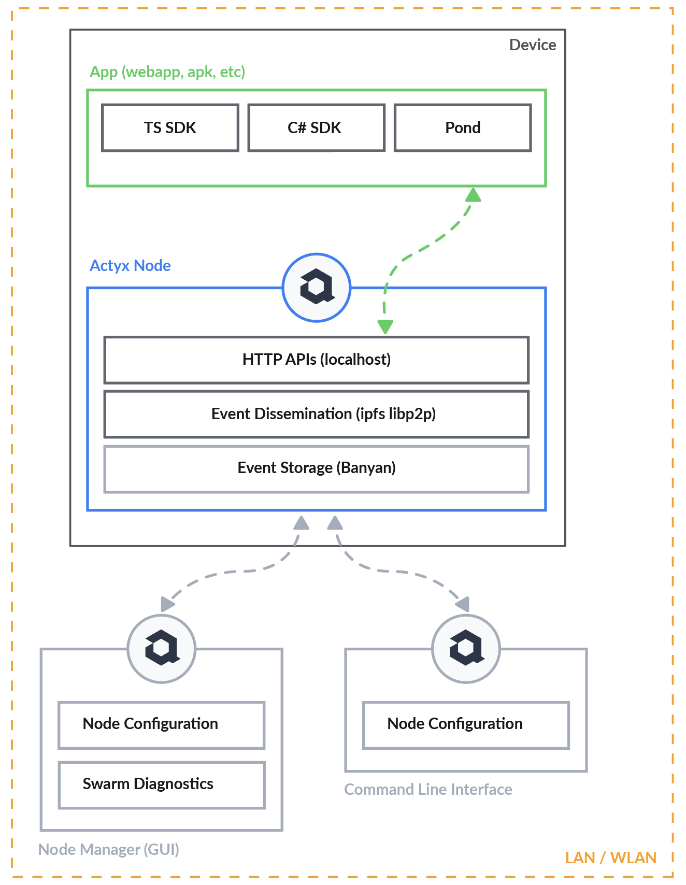

## What is Actyx?

At a high-level Actyx is a decentralized event database, streaming and processing toolkit for developers.
It allows you to build local-first cooperative applications which cooperate without any backend systems.

Practically speaking, Actyx is two things.
First, it's a piece of software — written in Rust — that you run on one or more computers for event persistence and streaming.
Second, it's a Typescript framework which provides an opinionated programming model for implementing distributed, but eventually consistent state-machines.

As a developer your write your application using the SDKs or the Pond Framework.
You then run it alongside Actyx on one or more devices.
The SDKs and the Pond Framework then continuously communicate with the local Actyx process to perform their work.

From an architectural stand-point, Actyx allows you to build decentralized applications using events and event-sourcing.
Events are persisted in and streamed across the swarm of inter-connected Actyx devices — normally in the local-area network.
Your application, or rather the Pond framework, uses these events to compute state which your code observes and reacts to.

Actyx itself is built using [libp2p](https://github.com/libp2p), [ipfs-embed](https://github.com/ipfs-rust/ipfs-embed), 
[Banyan trees](https://github.com/Actyx/banyan), and other technologies.
The Actyx nodes discover each other in the network and use different protocols (gossip, bitswap) to quickly and safely 
keep a totally-ordered, append-only event log in sync across all devices.
The events in the log, as well as re-orderings thereof after partitions, feed into the APIs, SDKs and the Actyx Pond framework.

In order to operate and monitor Actyx nodes, you can use either the CLI or the Node Manager, an Electron-app.

## Actyx architecture

*Explain core components of a node and how CLI, NM or apps interact with a node*



Todo NKI: make graphic nicer

### Node

- core of the node: event store for event dissemination and event storage
    - storage: banyan [https://crates.io/crates/banyan/0.1.3/dependencies](https://crates.io/crates/banyan/0.1.3/dependencies)
    - dissemination: libp2p [https://crates.io/crates/libp2p](https://crates.io/crates/libp2p)
- HTTP APIs **on [localhost](http://localhost)** to interact with core (publish / query events)

### CLI / Node Manager

- CLI: ergonomic command line interface for managing and configuring nodes
- Node Manager: offers same functionality as CLI + offers diagnostics tooling to monitor swarm connectivity

### Apps

- Actyx offers developer tooling to build local-first applications
    - SDKs: wrapper for more ergonomic use of HTTP APIs (Typescript and C#, Rust)
    - AQL: Retrieve, filter, transform, and aggregate with SQL-like structured queries
    - Pond:  programming model that allows you to easily build event-driven state machines that are automatically synchronised in your device swarm.
- Apps always work since they are only ever communicating locally with [localhost](http://localhost)

## Programming Model

- Build always-available apps that synchronise automatically
- Pond uses event sourcing: architectural pattern in which state is not stored directly, but rather computed as-needed from events stored in an event log.
- Pond guarantees eventual consistency: [https://developer.actyx.com/docs/how-to/actyx-pond/in-depth/eventual-consistency](https://developer.actyx.com/docs/how-to/actyx-pond/in-depth/eventual-consistency)

### Example

*Explain simple scenario and write one example fish (e.g. todo app)*

```jsx
interface Todo {
		id: string,
		description: string,
		done: boolean,
 }

interface TodoListState {
	todos: Todo[]
}

interface TodoChanged {
  type: 'todo-added' | 'todo-removed' | 'todo-changed',
	id: string,
	description?: string,
	done?: boolean
}

const TodoListFish : Fish<TodoListState, TodoChanged> = {
    fishId: FishId.of('todo-list', 'my-todo-fish', 0),
    initialState: [],
    where: Tag('todo-list'),
    onEvent: (state, event) => {
        switch (event.type) {
            case 'todo-added':
                state.push({
                  type: event.type,
                  id: event.id, 
                  description: event.description,
                  done: false
                })
                break
            case 'todo-removed':
                const pos = state.indexOf(event.id)
                if (pos !== -1) { state.splice(pos, 1) }
                break
            case 'todo-changed':
                state[event.id].done = !event.done
            default:
        }
        return state
    }
}
```

### Deployment

- One paragraph about general edge deployments (Kubernetes, Docker, APK, UDM)
- Links to relevant docs

### Resources

- link to tutorials
- link to releases