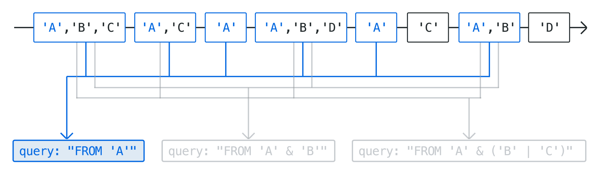

Events that are disseminated by Actyx can be tagged with an arbitrary number of tags.
They work as labels to describe the events' relation to different entities or event streams.
This conceptual guide explains the concept of tagging and querying events.

## Tagging

A tag is an arbitrary non-empty Unicode string, such as `dog`, `🅳🅾🅶`, or 🐶.
This means that there are no reserved tags, apps are free to use the tag space in any way they see fit — even by ignoring it completely (emitting without tags and reading back all events visible to their app ID).
By being arbitrary strings, tags are modular and versatile and can thus be used to specifically characterize an event, creating a clear structure within the events of a swarm.

## Queries

Queries are used to express interest in a specific subset of events within a swarm.
They always start with the keyword `FROM` followed by a combination of boolean expressions.
Note that with all queries, the usual associativity and parentheses rules are supported, e.g. `A & ( B | C) == A & B | A & C`.

By combining tags with boolean expressions, any subgroup of events can be queried.
Consider a node that is interested in all events that have the tag `A`, and either tag `B` or tag `C`.
The corresponding tag query that this node needs to perform is `FROM 'A' & ('B' | 'C')`.

The image below illustrates how different queries lead to different subsets of events.

