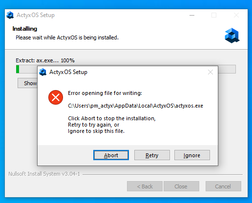
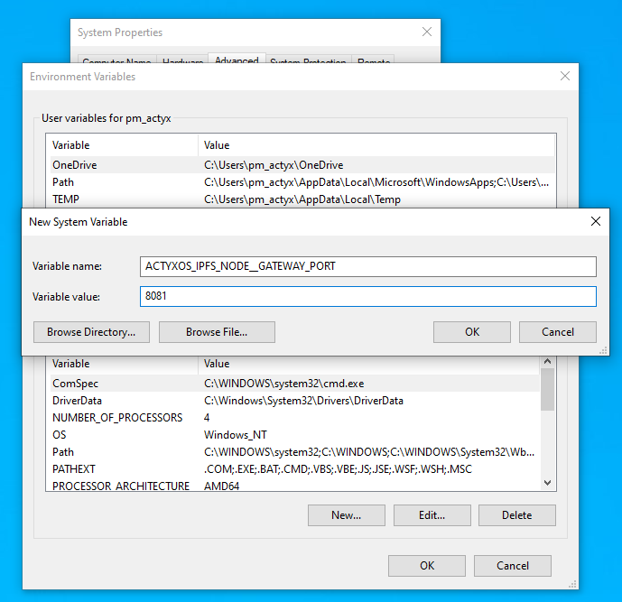

In this section, we try to help you fix some of the most common errors that can happen when setting up and working with ActyxOS.
To quickly find answers to your problem, navigate to the specific section on your development platform in the table of contents to the right.
In addition, we hope we can give a few tipps and tricks along the way that make working with ActyxOS even better.

## General

### Blocked ports

ActyxOS uses a few IP ports for node communication and internal services.
In order for ActyxOS to run flawlessly, please make sure that the following ports are free:

1. `4001`: Used for inter-node communication

2. `4243`: Exposes a Websocket endpoint for Actyx Pond (only on localhost)

3. `4454`: Exposes the [Event Service](../../reference/actyx-api.mdx) (only on localhost)

4. `4457`: Exposes the [Console Service](../../reference/actyx-api.mdx) (only on localhost)

5. `8080`: Exposes an [IPFS Gateway](https://docs.ipfs.io/concepts/ipfs-gateway/) (only on localhost)

### ActyxOS not responding

First, check that you entered the right IP in the ax command.
If you still cannot connect, the output of ax nodes ls returns one of the two possible reasons (if you are using the ActyxOS Node Manager, you can find this info in the Status tab):

- **ActyxOS is not reachable**: This means that ActyxOS is not running on your node.
  Please start ActyxOS described in [this guide](../local-development/install-actyx.mdx).

- **Host is not reachable**: This means that your development machine cannot connect to your node.
  Please check that your development machine and your node are in the same network, and your firewall(s) allows them to connect via port `4457`.

## ActyxOS on Android

### Issues with your ActyxOS Bootstrap Node

ActyxOS on Android is currently not able to resolve DNS names inside [`MultiAddrs`](https://multiformats.io/multiaddr/) fields and only supports `ip4` or `ip6` MultiAddrs.
For example, if you want to connect to the public ActyxOS Bootstrap Node, you have to set the value

`/ip4/3.125.108.42/tcp/4001/ipfs/QmUD1mA3Y8qSQB34HmgSNcxDss72UHW2kzQy7RdVstN2hH`

instead of

`/dns4/demo-bootstrap.actyx.net/tcp/4001/ipfs/QmUD1mA3Y8qSQB34HmgSNcxDss72UHW2kzQy7RdVstN2hH`

We are currently working on a fix for this.
Check out our [blog](https://developer.actyx.com/blog) or [release notes](https://developer.actyx.com/releases) section for information on our new releases.

## ActyxOS on Windows

### Error during Installation

If you receive the following error during installation, please close the Windows Event Viewer and press **Retry**:



### Port collision on `8080`

As port `8080` is sometimes already in use by other programs, you can change it by setting the `ACTYXOS_IPFS_NODE__GATEWAY_PORT` environment variable to a different port.
You can do this by following these few steps:

1. [Open the Windows Control Panel](https://support.microsoft.com/en-us/help/13764/windows-where-is-control-panel)
2. Go to System and Security
3. Go to System
4. Go to Advanced System Settings
5. Click on Environment Variables on the bottom right
6. Add a new environment variable:



## ActyxOS on Docker

### Environment variables

<!-- this can probably go -->

#### `AX_DEV_MODE`

If you set this environment variable to 1, you can interact with all ActyxOS services from your Host machine.
If you are running ActyxOS on Docker on Mac or Windows, which means you are not using `network=host`, you need to also pass the following options to forward the relevant ports:

- `-p 4243:4243` for the Actyx Pond WebSocket endpoint
- `-p 4454:4454` for the Event Service

#### `ENABLE_DEBUG_LOGS`

If you set this environment variable to 1, you will see debug logs from ActyxOS in your shell.

### ActyxOS nodes not connecting to each other

Your ActyxOS nodes running on Docker are not able connect to each other if

- you are running ActyxOS without `network=host`; and
- your ActyxOS Bootstrap Node is not running in the same local network as your ActyxOS nodes

This is inherent in Docker, as a container has no access to the IP address of its host unless it is running with `network=host`. Therefore, you have to manually configure the address that your nodes are announcing via the `announceAddress` property in the node settings:

```yml
announceAddress: # Manually configured addresses to announce
  - /ip4/192.168.1.101/tcp/4001
  # These must be multiaddresses without peer id,
  # i.e. ip4/<YOUR_IP>/tcp/4001
```

## Did not find what you were looking for?

If you couldn't a solution to your problem, please don't hesitate us.
You can either open a support ticket in our [community forum](https://community.actyx.com), visit our [Discord server](https://discord.gg/262yJhc) and post your question there.
Alernatively, you can always write us an [e-mail](mailto:developer@actyx.io).
We'll do our best to get back to you with answers as fast as possible.
