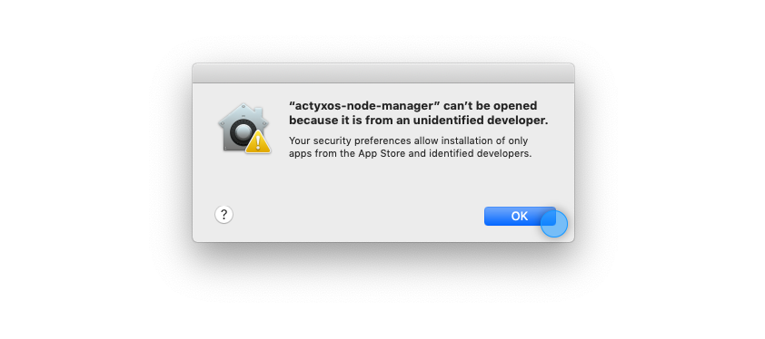
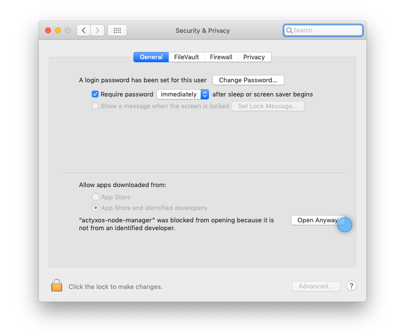
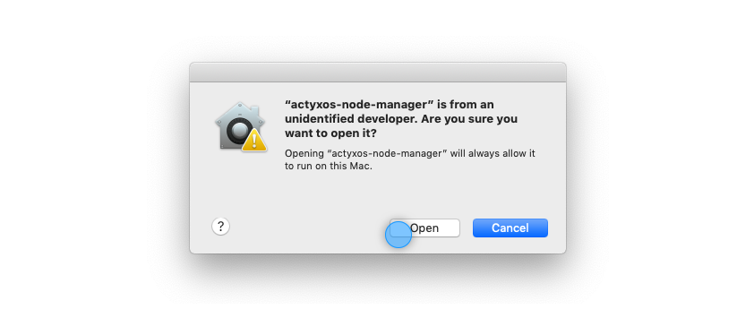

import Tabs from '@theme/Tabs'
import TabItem from '@theme/TabItem'

Actyx Node Manager and the Actyx Command Line Interface (CLI) are tools to manage your ActyxOS nodes and apps.
While the Node Manager is an application that allows you to interact with the nodes in an easy-to-use user interface,
with the CLI you can interact with your ActyxOS environment by running commands in your favourite terminal program:

- Unix based operating systems: Use common shell programs such as bash, zsh or tcsh to run commands in linux shells
- Windows: On Windows, run commands with the Windows command prompt or in PowerShell

Please choose your development platform in the tabs below and follow the instructions.

<Tabs
  groupId="os"
  defaultValue="windows"
  values={[
    { label: 'Windows', value: 'windows' },
    { label: 'Linux', value: 'linux' },
    { label: 'macOS', value: 'mac' },
  ]}
>
<TabItem value="windows">


## Actyx CLI

To run Actyx CLI on Windows you need to have the following prerequisites:

- x64 version of Windows
- Admin rights to run the Windows installer

To install Actyx CLI, please follow these steps:

1. Download the Actyx CLI installer for Windows from our [downloads page](https://downloads.actyx.com/).

2. Run the downloaded installer and follow the onscreen instructions. By default, the Actyx CLI installs to `C:\Program Files\Actyx\Actyx CLI X.X.X\`

3. To confirm the installation, use the `ax --version` command in PowerShell or a command prompt (open the Start menu and search for PowerShell or cmd to start them). You should see something like this:

```
C:\> ax --version
Actyx CLI 1.5.0
```

Congratulations, you have successfully installed Actyx CLI! 🎉

## Node Manager

Before downloading and installing Actyx Node Manager, please make sure you haven't already installed it together with ActyxOS.
If not, please follow these steps:

1. Download the Actyx Node Manager installer for Windows from our [downloads page](https://downloads.actyx.com/).

2. Run the downloaded installer and follow the onscreen instructions.

3. Double-click on the icon and wait until the application is opened. To confirm that you have installed the correct version, please navigate to the **Abouts** tab inside the Node Manager UI and check the version.

</TabItem>
<TabItem value="linux">


<h2>Actyx CLI</h2>

To run Actyx CLI on Linux you need to have the following prerequisites:

- x64, arm64, armhf or arm version of Linux

To install Actyx CLI, please follow these steps:

1. Download the Actyx CLI binary file from our [downloads page](https://downloads.actyx.com/)

2. Run the following command to move the Actyx CLI binary file:

```text
mv ~/Downloads/ax /usr/local/bin
```

3. Make the Actyx CLI binary file exectuable:

```text
sudo chmod +x /usr/local/bin/ax
```

4. To confirm the installation, use the `ax --version` command. You should see something like this:

```text
ax --version
Actyx CLI 1.5.0
```

Congratulations, you have successfully installed Actyx CLI! 🎉

<h2>Actyx Node Manager</h2>

To install Actyx Node Manager, please follow these few steps:

1. Download the right binary (e.g. `actyxos-node-manager_amd64.deb`) from our [downloads page](https://downloads.actyx.com/)

2. With your command line, navigate to the directory where you saved the binary.

3. Execute `sudo apt install ./actyxos-node-manager_amd64.deb`

4. When asked for, type the required password and hit **enter**.

Congratulations, you have successfully installed Actyx Node Manager! 🎉

</TabItem>
<TabItem value="mac">


<h2>Actyx CLI</h2>

To run Actyx CLI on macOS you need to have the following prerequisites:

- x64 version of macOS

To install Actyx CLI, please follow these steps:

1. Download the Actyx CLI binary file from our [downloads page](https://downloads.actyx.com/)

2. Run the following command to move the Actyx CLI binary file:

```text
mv ~/Downloads/ax /usr/local/bin
```

3. Make the Actyx CLI binary file exectuable:

```text
chmod +x /usr/local/bin/ax
```

Now, you only have to allow the Actyx CLI in two steps.
First, go to **Settings** and then to **Security &amp; Privacy**.
In the **General** tab, you should see a prompt at the bottom that asks you to allow Actyx CLI.
Second, the first time you run an `ax` command, you will be prompted again to allow the Actyx CLI.

4. To confirm the installation, use the `ax --version` command. You should see something like this:

```text
 ax --version
Actyx CLI 1.5.0
```

Congratulations, you have successfully installed Actyx CLI! 🎉

<h2>Actyx Node Manager</h2>

Since Actyx is not yet listed as an App developer, you need to make a few changes in your security settings when installing Node Manager.

1. Download the zipped Node Manager from our [downloads page](https://downloads.actyx.com/).

2. Double-click the Node Manager icon

3. Click **OK** on the initial prompt after opening Node Manager for the first time.



4. Navigate to the system preferences, then to **Security &amp; Privacy** and click on **Open Anyway**.



5. Finally, open the app again and click **Open** when prompted with yet another dialogue.



Congratulations, you have successfully installed Actyx Node Manager! 🎉

</TabItem>
</Tabs>

