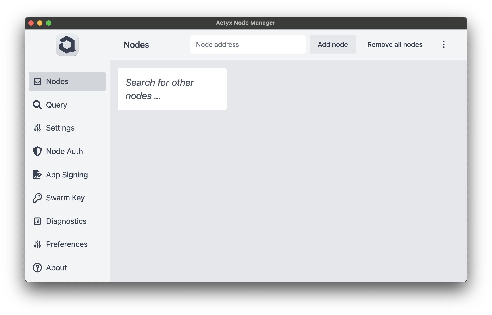
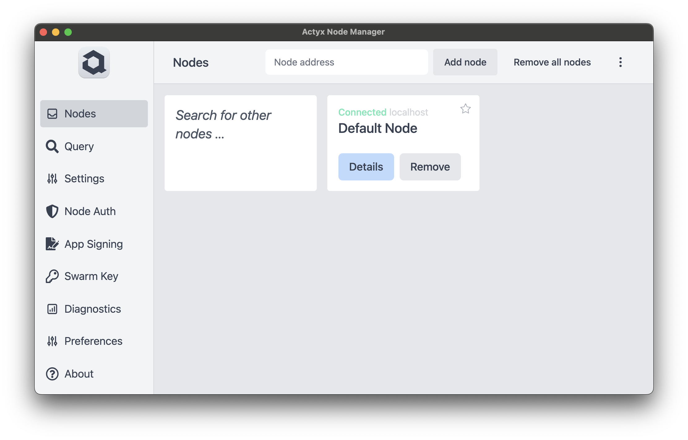

This how-to guide assumes that you have read through the guides on [how to install and start Actyx](./install-actyx) and the [Node Mananger](./install-cli-node-manager).

## Add a node to the Node Manager

You have a node up and running on your local machine and you want to add it to the Node Manager.

When you open the Node Manager, you are greeted with the "Nodes" window;
that is precisely where our journey begins!

At the top, on the text box, add your node's address (in this case, it is `localhost`) and click "Add Node".

:::info
To add a non-local node to the Node Manager, use the node's IP address
(and port if you're using a port other than the default) instead of `localhost` as suggested in this guide.
:::

And voilá! 🎉 You have added your node!

:::caution
If your node does not show up as "Connected" you should double check if Actyx is running!
:::
