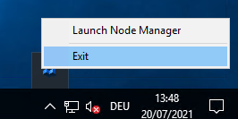
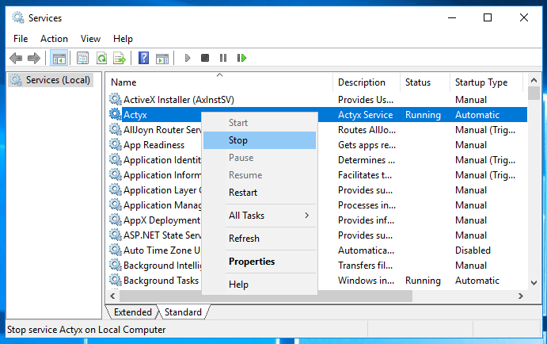
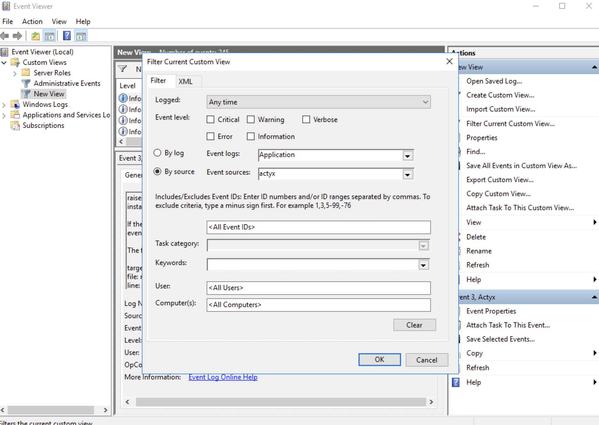
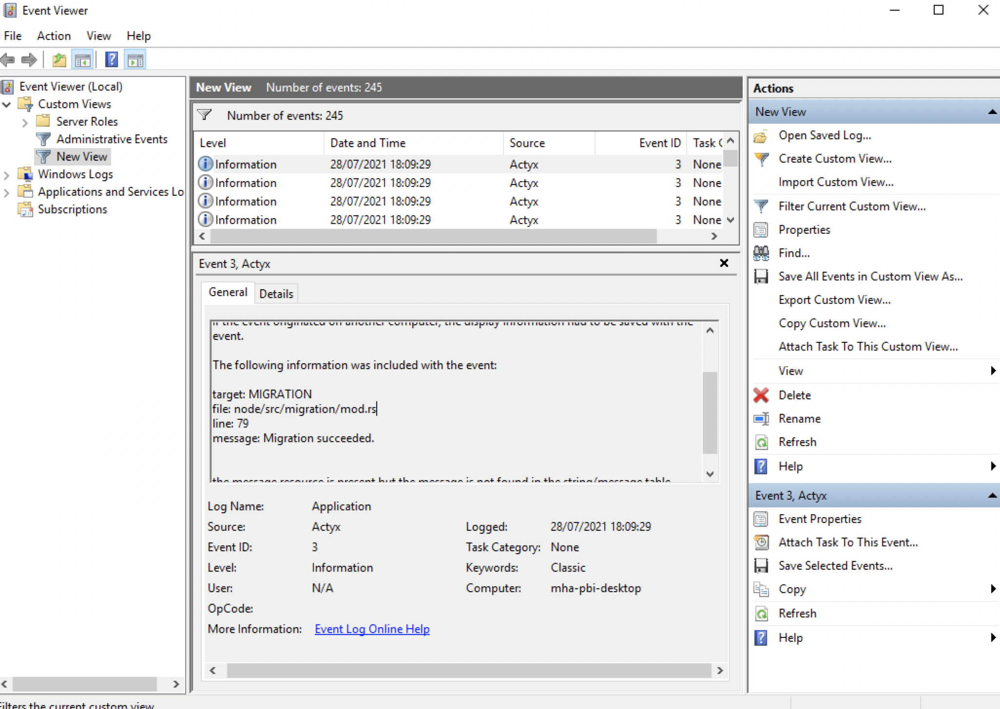
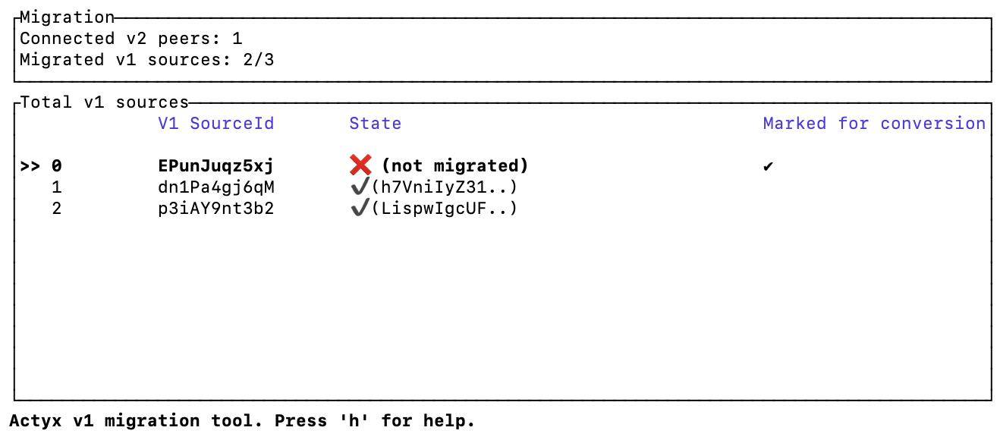
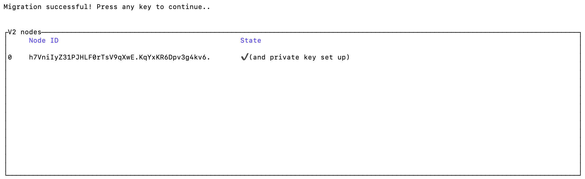

This guide explains how to migrate Actyx production nodes from ActyxOS (v1).

## Before you start the migration

### Prepare your PC

Make sure that you have the latest version of the [Node Manager or CLI installed](../local-development/install-cli-node-manager.mdx) on a computer with which you can access all nodes via the local network.
If you have not interacted with nodes before, please also [create user keys](../user-auth/set-up-user-keys.mdx). 

### Prepare your deployment

For a successful migration, no v1 nodes must emit events during and after the migration.
This means that you have to stop all apps before you start migrating any node.
After all nodes have been migrated, you can start the v2-compatible apps again.


## Procedure

For the migration, it is important to distinguish two types of nodes:

- **Live nodes**: These are nodes that have emitted events and still exist, i.e. they are currently running in your v1 deployment
- **Deleted nodes**: These are nodes that have emitted events and do not exist anymore, e.g. because hardware was exchanged or Actyx was deleted and re-installed

Before you start with the migration, make a copy of the data directory of a node and move it onto your PC.
You will need it later to check if you migrated all nodes and also to migrate any deleted nodes.

:::caution
Make sure that the node you are copying the directory from is synchronized with other nodes, i.e. it contains all events from all deleted nodes.
You can verify that by checking the offset map of the node you pull the data from.
:::

After you have made the copy, you can proceed to migrating all live nodes.

### Migrate live nodes

In order for your apps to keep working as intended after the migration, every live node must rewrite its own events.
This means you have to migrate your deployment node-by-node.
Additionally to rewriting its own events, your node takes over the following settings:

- Display name
- Swarm key
- Topic
- Announce addresses
- initial Peers

Additionally, the node's identity is also preserved.

If you set up a new discovery helper node (previously called _bootstrap node_) in the previous step, you need to manually change the `initialPeers` setting of each node to connect to it.
If you want to use the same production node as a discovery helper node than before, you do not need to do anything as the setting is automatically migrated and the address is still the same after migration.

The migration procedure depends on the platform your node runs on–it does not matter in which order you migrate your nodes:

:::tip
We advise that you first make a list of all nodes that should be migrated and update it along the way. Otherwise it will be difficult for you to assess at the end if you actually have deleted nodes that should be migrated, if you just forgot one or more node(s), or if any node is isolated from the rest of the swarm.
:::

:::caution
Only the events of the currently configured topic are migrated. If you need to migrate events of different topics, please contact us in our [community forum](https://community.actyx.com) or on our [Discord server](https://discord.gg/262yJhc).
:::

import Tabs from '@theme/Tabs'
import TabItem from '@theme/TabItem'

<Tabs
  groupId="OS"
  defaultValue={"windows"}
  values={[
    { label: 'Windows', value: 'windows' },
    { label: 'Android', value: 'android' },
    { label: 'Docker', value: 'docker' },
    { label: 'Linux/macOS', value: 'linux' },
  ]}
>

<TabItem value="windows">

Migrating a Windows node works as follows:

1. Stop your v1 node
2. Download and install the latest Actyx 2.x release (only works after 2.3)
3. Stop your v2 node
4. Copy your v1 data directory
5. Start your v2 node and migrate
6. Check if the migration worked

<h4>1. Stop your v1 node</h4>

Stop your Actyx v1 node by clicking on the tray icon and `exit`:



<h4>2. Download and install the latest Actyx 2.x release</h4>

You can find installation instructions [here](../local-development/install-actyx.mdx).

<h4>3. Stop your v2 node</h4>

After installation, Actyx automatically starts.
In order to stop it, open the Windows Services Manager, and right click on Actyx to stop it:



<h4>4. Copy your v1 data directory</h4>

1. Open the file explorer and go to the v1 directory under `C:\Users\<username>\AppData\Local\ActyxOS`, and copy the `actyxos-data` directory:


2. Navigate to your v2 directory `C:\Program Files\Actyx\Node` and paste the `actyxos-data` directory you copied before

3. Delete the `actyx-data` directory

4. Rename the `actyxos-data` directory to `actyx-data`:

<h4>5. Start your v2 node and migrate</h4>

Go back to the Windows Service Manager and start the Actyx Service:


<h4>5. Ensure that the migration worked</h4>

Open the Windows Event Viewer and filter to see the Actyx logs:



If you see this log, the migration was successful:



You can now uninstall Actyx v1.

</TabItem>
<TabItem value="android">

Migrating an Android node works as follows:

1. Install and run the v1 migration app
2. Download and install the latest Actyx 2.x release (only works after 2.3)
3. Start your v2 node and migrate
4. Clean up your v1 installation

<h4>Install and run the v1 migration app</h4>

On Android, different apps cannot access each others directories.
You therefore need to update your v1 app with a dedicated migration app first.
The migration app does not contain any functionality other than copying your v1 data directory to a public directory so that your v2 app can access it.
As the migration app does not start the Actyx process anymore, you can safely install and start both apps side-by-side.

<h4>1. Install and run the v1 migration app</h4>

You can download the apk here:

import { DownloadLink } from '../../../src/components/DownloadLink.tsx'

<DownloadLink cta="Download" link="https://axartifacts.blob.core.windows.net/artifacts/715f11fa80d02f115eed76b7c2ea67308eb9327a/android-binaries/actyxos.apk" />

When starting the app, you are prompted to give Actyx permissions to access the external storage so that it can place a backup of its data there. After accepting the permissions, you should see the following message:


<h4>2. Download and install the latest Actyx 2.x release</h4>

You can download the latest release from our [releases page](https://developer.actyx.com/releases).

<h4>3. Start your v2 node and migrate</h4>

When starting the app, you are again prompted to give Actyx permissions so that it can access the backup made by your v1 migration app.

If you see the following message, the migration was successful:


<h4>4. Clean up your v1 installation</h4>

Here is a short video of the workflow:


</TabItem>
<TabItem value="docker">

Migrating a Docker node works as follows:

1. Stop your v1 node
2. Change the permissions of the mounted v1 volume
2. Start your v2 node

<h4>Stop your v1 node</h4>

For stopping your v1 Docker node, just stop the Actyx v1 docker container.

<h4>Change the permissions of the mounted v1 volume</h4>

Actyx was running as the `root` user within the v1 docker image.
This is not the case in the v2 docker image anymore and therefore you need to change the permissions of the files inside the mounted volume.
Assuming your v1 volume was called `actyxos-data`, execute the following command:

```text
docker run --rm -v actyxos-data:/data -u root actyx/actyx chown -R 1000:1000 /data
```

<h4>Start your v2 node</h4>

As Actyx v2 is published on DockerHub, you can just download and run the latest version with the previous v1 volume:

```text
docker run --name actyx -it --rm -v actyxos-data:/data -p 4001:4001 -p 4458:4458 -p 127.0.0.1:4454:4454 actyx/actyx
Jul 20 15:21:34.053  INFO MIGRATION: Migrating from an earlier version (1 to 2) ..
Jul 20 15:21:34.126  INFO MIGRATION: Created backup of v1 files at /data/actyx-data/1626855481_v1_data_files.tar.gz
Jul 20 15:21:34.127  INFO MIGRATION: Migration succeeded.
Jul 20 15:21:34.163  INFO NODE_STARTED_BY_HOST: Actyx 2.1.0_dev-4fe5eec475e1188561b476703ddff61d988843db-macos-x86_64-release is running.
```

After you see the above logs, the migration was successful.
Your Actyx v2 node is now running and successfully migrated events and settings.

Here is a short video of the workflow:


</TabItem>
<TabItem value="linux">

Migrating a Linux or macOS node works as follows:

1. Stop your v1 node
2. Download the latest Actyx 2.x release (only works from 2.3 onwards)
3. Start your v2 node

<h4>Stop your v1 node</h4>

For stopping your v1 node, just stop the Actyx v1 binary.

<h4>Download the latest Actyx 2.x release</h4>

Download the latest Actyx 2.x release [here](https://developer.actyx.com/releases/).

<h4>Start your v2 node and migrate</h4>

Start your Actyx v2 node and declare the previous v1 directory as a working directory.
Assuming your v1 directory was `my-actyx-data`, execute the following command:

```text
./actyx-linux --working-dir my-actyx-data
using data directory `/Users/actyx/my-actyxos-data`
Jul 20 15:21:34.053  INFO MIGRATION: Migrating from an earlier version (1 to 2) ..
Jul 20 15:21:34.126  INFO MIGRATION: Created backup of v1 files at /Users/actyx/my-actyx-data/1626787294_v1_data_files.tar.gz
Jul 20 15:21:34.127  INFO MIGRATION: Migration succeeded.
Jul 20 15:21:34.163  INFO NODE_STARTED_BY_HOST: Actyx 2.1.0_dev-4fe5eec475e1188561b476703ddff61d988843db-macos-x86_64-release is running.
```

After you see the above logs, the migration was successful.
Your Actyx v2 node is now running and successfully migrated events and settings.

</TabItem>
</Tabs>

After a successful migration, each node publishes an event containing meta data of the migration. 

:::tip Want to check if you migrated all nodes?
Even if you are sure that you do not have deleted any nodes, we still advise you to perform the next step as it will make you aware of any nodes that you might have forgotten to migrate.
Additionally, it will make sure that all v2 nodes are set up to be managed via their admin channel.
:::

### Migrate deleted nodes

As each node only rewrites its own events, events published by deleted nodes are not rewritten yet.
Therefore, after you have migrated all live nodes, you can now check for any deleted nodes and migrate them.

In the following example, the v1 deployment consisted of three nodes.
One of these nodes was a previously deleted node which is migrated in the example.
The other two nodes have already been migrated to v2.

There are a few additional steps you will see below, but in general the migration program works as follows:

1. Check which nodes of the v1 swarm have already been migrated
2. Migrate events of nodes that are not migrated yet
3. Make sure that the migrated events have been distributed to the new v2 swarm

You can download the program for migrating deleted nodes here:

<Tabs
  groupId="os"
  defaultValue={"windows"}
  values={[
    { label: 'Windows', value: 'windows' },
    { label: 'macOS', value: 'mac' },
    { label: 'Linux', value: 'linux' },
  ]}
>

<TabItem value="windows">

<DownloadLink cta="Download" link="https://axartifacts.blob.core.windows.net/releases/actyx-v1-migration-windows-x86.zip" />

</TabItem>
<TabItem value="mac">

Intel:

<DownloadLink cta="Download" link="https://axartifacts.blob.core.windows.net/releases/actyx-v1-migration-macos-intel.zip" />

Arm:

<DownloadLink cta="Download" link="https://axartifacts.blob.core.windows.net/releases/actyx-v1-migration-macos-arm.zip" />

</TabItem>
<TabItem value="linux">

<DownloadLink cta="Download" link="https://axartifacts.blob.core.windows.net/releases/actyx-v1-migration-linux-amd64.tar.gz" />

</TabItem>
</Tabs>
This program needs to be started on the v1 data directory that you copied onto your PC before you started the migration (in this example `actyxos-data-copy`):

```
./actyx-v1-migration --working-dir actyxos-data-copy
```

After starting the program, you are prompted with the following information:



It shows you the following things:
- Connected v2 peers: Number of migrated v2 nodes that your PC is connected to
- Migrated v1 sources: Number of migration events that are in the v2 swarm compared to the number of nodes that were in your v1 swarm (this information is taken from the working directory of the migration program)

Note that, while being connected to only one v2 node, the program shows that two v2 nodes have already been migrated.
This is because the v2 node that we are connected already contains the migration information from the other node.
One from itself, and the other one from a node that it was previously connected to but the migration program can currently not connect to (e.g. because the tablet is turned off).

In the table, you can see the source ID of the two nodes that were migrated already, and of the node that was not migrated yet.
You can navigate (using the arrow keys) and select (using the space key) the deleted nodes that should be migrated.

:::caution
It is critical to the migration that you now assess if this overview is correct.
The problematic scenario is that the overview shows less nodes than you already migrated; In this case, you need to make sure that all nodes you migrated are online and appear as migrated.
Otherwise, you might migrate the events of the same nodes and therefore duplicate them!
:::

After selecting the deleted node that should be migrated, you need to enter the private key of your Actyx user keys.
This enables the migration program to connect to all nodes of the v2 swarm to make sure that the migrated events of deleted nodes are distributed.

This is using the nodes' Admin channel. The migration program assumes that the nodes listen on port 4458 on the same interface as their swarm port (4001).

After the migrated events were successfully distributed, you see the following table:



In the last step, you get an overview of all nodes that you have migrated from v1 to v2 and a mapping between the source ID and stream ID. You can store this information directly, but is it also always accessible by querying the migration events as described in the next guide.


Here is a short video of the workflow (note that the v1_migration program is placed inside the data directory, therefore it does not need to be explicitly specified):


:::tip What to do if you find live v1 nodes after finishing the migration
It can happen that you migrated all deleted nodes and later find out that one of them was actually just e.g. tablet you forgot. In this case, just treat it as if it would have been deleted before the migration, i.e. delete Actyx v1 and data from that node. If you would migrate this node again, you would duplicate its events.
:::

If your apps did not use any externally stored offset maps (for e.g. exporting data into other systems), you are finished now and can start your v2-compatible apps on all nodes.
Otherwise, continue with our [guide on migrating externally stored offset maps](./migrate-externally-stored-offset-maps).

:::tip Problems migrating?
If you have any problems with migrating your apps, please don't hesitate to contact us in our [community forum](https://community.actyx.com) or on our [Discord server](https://discord.gg/262yJhc).
We'll do our best to get back to you with answers as fast as possible.
:::
