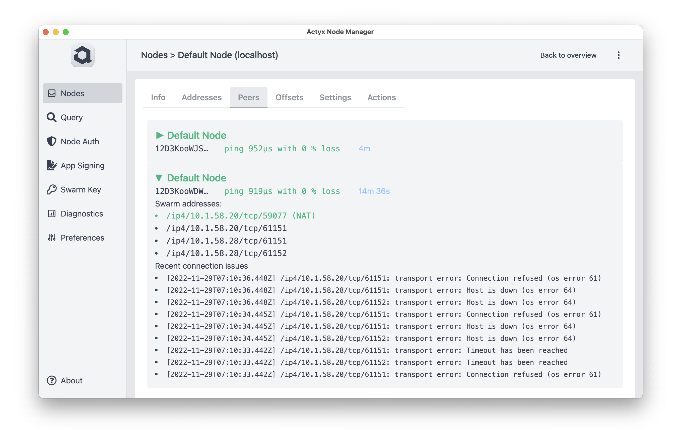

You can get a list of all connected nodes by running [`ax nodes inspect`](../../reference/cli/nodes/inspect) or selecting the `Peers` tab in the Node Manager.

import Tabs from '@theme/Tabs'
import TabItem from '@theme/TabItem'

<Tabs
  groupId="tool"
  defaultValue={"node-manager"}
  values={[
    { label: 'Node Manager', value: 'node-manager' },
    { label: 'CLI', value: 'cli' },
  ]}
>


<TabItem value="node-manager">



The _Peers_ view displays all peers of the selected node.

</TabItem>
<TabItem value="cli">

```text title="Example Usage"
ax nodes inspect --local 192.168.1.219
PeerId: 12D3KooWSgvc3hzrsuExYazNDB1BU3gevUPTzaumnwHWv5yFBNzH
ListenAddrs:
    /ip4/192.168.1.219/tcp/4001
    /ip4/127.0.0.1/tcp/4001
    /ip6/::1/tcp/4001
AnnounceAddrs:
    /ip4/192.168.1.219/tcp/4001/p2p/12D3KooWSgvc3hzrsuExYazNDB1BU3gevUPTzaumnwHWv5yFBNzH
Connections:
+------------------------------------------------------+--------------------------------------------------------------------------------------+
| PEERID                                               | ADDRESS                                                                              |
+------------------------------------------------------+--------------------------------------------------------------------------------------+
| 12D3KooWSVZEwAqdcJEG2T3wR8CZZoneWFyPqpRsxSzVB3WLwtVt | /ip4/192.168.1.165/tcp/4001/p2p/12D3KooWSVZEwAqdcJEG2T3wR8CZZoneWFyPqpRsxSzVB3WLwtVt |
+------------------------------------------------------+--------------------------------------------------------------------------------------+

Addresses:
+------------------------------------------------------+--------------------------------------------------------------------------------------+
| PEERID                                               | ADDRESS                                                                              |
+------------------------------------------------------+--------------------------------------------------------------------------------------+
| 12D3KooWSVZEwAqdcJEG2T3wR8CZZoneWFyPqpRsxSzVB3WLwtVt | /ip6/::1/tcp/4001/p2p/12D3KooWSVZEwAqdcJEG2T3wR8CZZoneWFyPqpRsxSzVB3WLwtVt           |
|                                                      | /ip4/192.168.1.165/tcp/4001/p2p/12D3KooWSVZEwAqdcJEG2T3wR8CZZoneWFyPqpRsxSzVB3WLwtVt |
|                                                      | /ip4/127.0.0.1/tcp/4001/p2p/12D3KooWSVZEwAqdcJEG2T3wR8CZZoneWFyPqpRsxSzVB3WLwtVt     |
+------------------------------------------------------+--------------------------------------------------------------------------------------+
```

The output above shows you:

- `PeerId`: Peer ID of your node
- `ListenAddrs`: Addresses that the Swarm API bound to
- `AnnounceAddrs`: Addresses that your node is announcing to other nodes for connecting to it
- `Connections`: List of active connections to peers, identified by peer ID and address
- `knownPeers`: List of all peers, identified by peer ID and address, that your node knows

</TabItem>
</Tabs>
