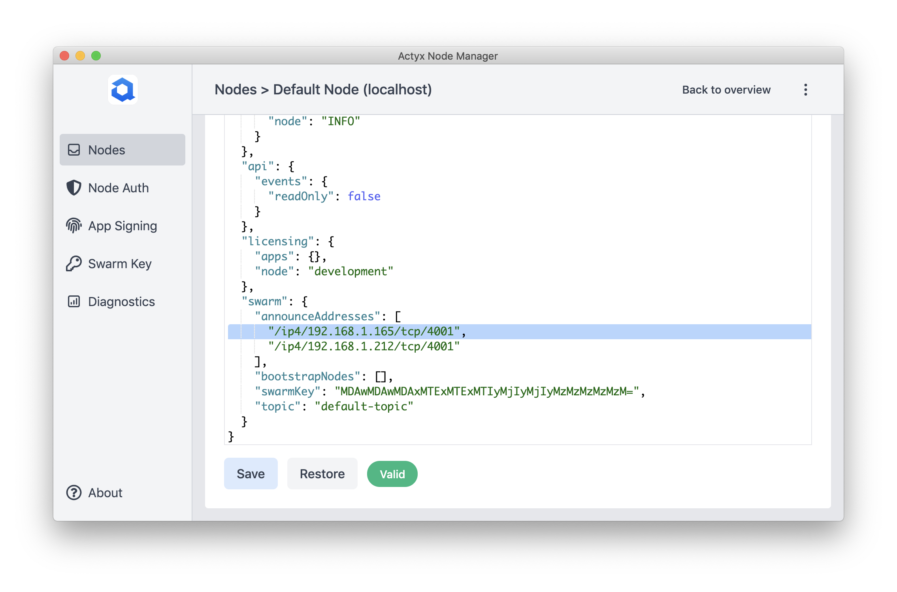

import Tabs from '@theme/Tabs'
import TabItem from '@theme/TabItem'

You need to configure the `announceAddresses` settings if you are running Actyx on Docker **without** `network=host` and your bootstrap node is **not** running in the same local network as your other nodes.

This is inherent in Docker, as a container has no access to the IP address of its host unless it is running with `network=host`. Therefore, you have to manually configure the address that your nodes are announcing via the `announceAddress` property in the node settings:

```yml
announceAddress: # Manually configured addresses to announce
  - /ip4/192.168.1.101/tcp/4001
  # These must be multiaddresses, i.e. ip4/<YOUR_IP>/tcp/4001
```

You can configure it by using the Actyx CLI or the Node Manager. The following examples assume that the IP address of your Docker node is 192.168.2.10:

<Tabs
  groupId="os"
  defaultValue={"cli"}
  values={[
    { label: 'Actyx CLI', value: 'cli' },
    { label: 'Node Manager', value: 'manager' },
  ]}
>


<TabItem value="cli">


You can use the output from above and `ax settings set` to configure it:

```text
ax settings set --local com.actyx/swarm/announceAddresses [/ip4/192.168.2.10/tcp/4001] localhost
```

</TabItem>
<TabItem value="manager">


Go to the settings tab change the `announceAddresses` property and press save:



</TabItem>
</Tabs>

