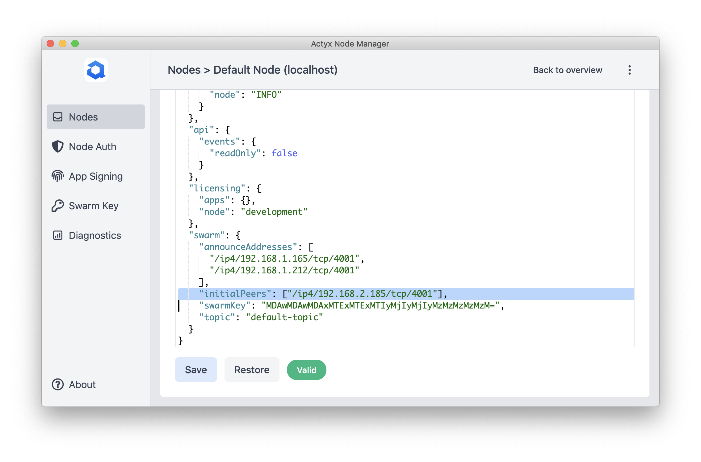

You need to manually configure the initial peers of nodes within the same swarm if mDNS is disabled on your devices or network, or if you are running Actyx on Docker.

import Tabs from '@theme/Tabs'
import TabItem from '@theme/TabItem'

Instead of automatically discovering other nodes via mDNS, your node will additionally try to reach other node(s) under the address(es) you configured after it starts.

:::tip Set up a discovery helper node
If you are not using fixed IP addresses, or your swarm consists of more than a few nodes, manually configuring all connections between nodes gets very complex and needs to be frequently updated. Therefore, we recommend setting up a central discovery helper node for production deployments. Check out [this guide](../operations/discovery-helper-node.mdx) for more information.
:::

### Manually configure your nodes' initial peers

You can configure nodes in your swarm with each other's address as follows:

<Tabs
  groupId="os"
  defaultValue={"cli"}
  values={[
    { label: 'Actyx CLI', value: 'cli' },
    { label: 'Node Manager', value: 'manager' },
  ]}
>


<TabItem value="cli">


In this example, the node that should initiate the connection after startup has the IP address `192.168.1.220`, the node that it should connect to has `192.168.1.219`.

<!-- markdownlint-disable MD036 -->

**1. Get the peer ID of the node you want to connect to by running [`ax nodes inspect`](../../reference/cli/nodes/inspect):**

```text
ax nodes inspect 192.168.1.219
PeerId: 12D3KooWSgvc3hzrsuExYazNDB1BU3gevUPTzaumnwHWv5yFBNzH
ListenAddrs:
    /ip4/127.0.0.1/tcp/4001
    /ip4/192.168.1.219/tcp/4001
    /ip6/::1/tcp/4001
AnnounceAddrs:
    /ip4/192.168.1.219/tcp/4001/p2p/12D3KooWSgvc3hzrsuExYazNDB1BU3gevUPTzaumnwHWv5yFBNzH
Peers:
+------------------------------------------------------+--------------------------------------------------------------------------------------+
| PEERID                                               | ADDRESS                                                                              |
+------------------------------------------------------+--------------------------------------------------------------------------------------+
| 12D3KooWNHvaVdcqoYCRTWURzC4gaZQBA7XjtSeSsWqcpErL5daL | /ip4/192.168.1.193/tcp/4001/p2p/12D3KooWNHvaVdcqoYCRTWURzC4gaZQBA7XjtSeSsWqcpErL5daL |
+------------------------------------------------------+--------------------------------------------------------------------------------------+

```

In the above example output, you can see that the peer ID with IP address `192.168.2.219` is `12D3KooWSgvc3hzrsuExYazNDB1BU3gevUPTzaumnwHWv5yFBNzH`.

**2. Configure the `initialPeers`setting**

You configure initialPeers in the following format: `/ip4/<IP address>/tcp/<swarm port>/p2p/<peer ID>`; the IP address of the node that you want to connect to, the swarm port (4001 [unless configured differently](../troubleshooting/installation-and-startup#err_port_collision)), and the peer ID that you found out above.

You can configure the `initialPeers` by running `[ax settings set`](../../reference/cli/settings/set):

```text
ax settings set /swarm/initialPeers [/ip4/192.168.1.219/tcp/4001/p2p/12D3KooWSgvc3hzrsuExYazNDB1BU3gevUPTzaumnwHWv5yFBNzH] 192.168.2.220
```

</TabItem>
<TabItem value="manager">


**1. Get the peer ID of the node you want to connect to**

TODO

**2. Configure the `initialPeers`setting**

You configure initialPeers in the following format: `/ip4/<IP address>/tcp/<swarm port>/p2p/<peer ID>`; the IP address of the node that you want to connect to, the swarm port (4001 [unless configured differently](../troubleshooting/installation-and-startup#err_port_collision)), and the peer ID that you found out above.

In this case, we would configure `/ip4/192.168.1.219/tcp/4001/p2p/12D3KooWSgvc3hzrsuExYazNDB1BU3gevUPTzaumnwHWv5yFBNzH`.

Go to the settings tab in the node details, change the `initialPeers` property and press save:



<!-- markdownlint-enable MD036 -->

</TabItem>
</Tabs>


For more information on how nodes discover and connect to each other, please check out our [conceptual guide on discovery](../../conceptual/discovery.mdx).
