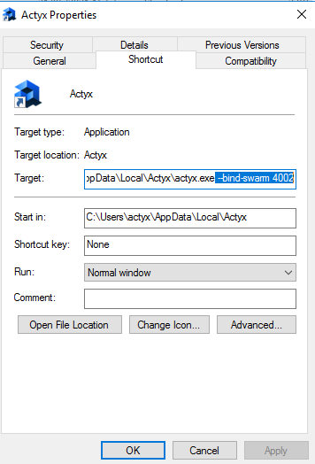
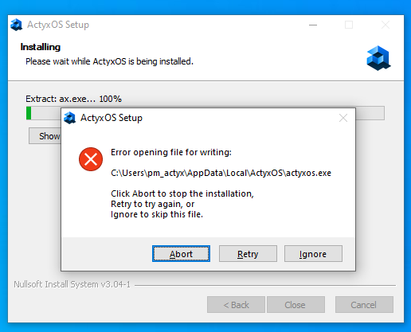

This page lists common installation and startup errors and solutions for them. If you face different issues, please contact us in our [Discord chat](https://discord.gg/262yJhc) or open an issue in our [community forum](https://community.actyx.com/).

### Startup errors

#### ERR_PORT_COLLISION

`ERR_PORT_COLLISION` is a fatal error that occurs if one of the ports that Actyx binds by default is already in use:

1. `4001`: Swarm (used for inter-node communication)

3. `4454`: API (exposes the [Events](../../reference/events-api) and [Auth](../../reference/auth-api) API; only on localhost)

4. `4458`: Admin (used for communication with the CLI or Node Manager)

The error message states which port could not be bound.
Besides stopping the process that is currently using the port, you can also change the port on which Actyx is running with the command line option `--bind-swarm`, `--bind-api` or `--bind-admin`.
This works as follows:

:::caution
Depending on the default port you change, please also consider the following:
- Swarm (4001): If you configure this node as an `initialPeer` in another node's settings, or if you configure this node's `announceAddress` setting, you have to use the port you specified instead of 4001.
- Admin (4458): When using the CLI or Node Manager, you have to add the specified port (instead of e.g. `192.168.2.1`, your command would use `192.168.2.1:4460` as the node argument).
- API (4454): Make sure to set the right environment variable if you are using Actyx Pond, or specify the correct port if you are doing a direct HTTP API request.
:::

import Tabs from '@theme/Tabs'
import TabItem from '@theme/TabItem'

<Tabs
  groupId="os"
  defaultValue={"cli"}
  values={[
    { label: 'Windows', value: 'windows' },
    { label: 'Android', value: 'android' },
    { label: 'macOS/Linux', value: 'macos' },
    { label: 'Docker', value: 'docker' }
  ]}
>


<TabItem value="windows">

1. Right-click on Actyx, and select `Properties`
2. Go to the `Shortcut` tab, and add the command line option in the `Target` input field:



The next time you start Actyx, it will bind to the specified port.

</TabItem>
<TabItem value="android">

On Android, you cannot change the ports used by Actyx. Please make sure that the required ports are not in use.

</TabItem>
<TabItem value="macos">

On macOS or Linux, you can specify the ports when starting Actyx:

```text
./actyx-linux --bind-swarm 4002 --bind-api 4457 --bind-admin 4460
```

</TabItem>
<TabItem value="docker">

On Docker, you can use the [-p option of the docker run command](https://docs.docker.com/engine/reference/run/#expose-incoming-ports). For example, this command would expose the standard ports and 4002 on your host instead of 4001:

```text
docker run --name actyx -it --rm -v actyx-data:/data -p 4002:4001 -p 4458:4458 -p 127.0.0.1:4454:4454 actyx/actyx
```

</TabItem>
</Tabs>

### Installation errors on Windows

If you receive the following error during installation, please close the Windows Event Viewer and press **Retry**:



## Did not find what you were looking for?

If you couldn't a solution to your problem, please don't hesitate to contact us in our [community forum](https://community.actyx.com) or on our [Discord server](https://discord.gg/262yJhc). We'll do our best to get back to you with answers as fast as possible.
