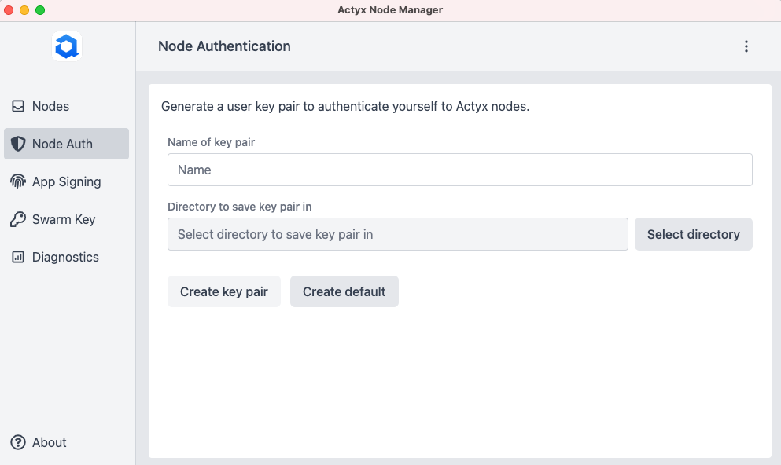

You need user keys (i.e. a key pair consisting of a public and private key) for interacting with a node.

You can use the CLI or Node Manager to generate your keys:

import Tabs from '@theme/Tabs'
import TabItem from '@theme/TabItem'

<Tabs
  groupId="tool"
  defaultValue={"cli"}
  values={[
    { label: 'Actyx CLI', value: 'cli' },
    { label: 'Node Manager', value: 'node-manager' },
  ]}
>

<TabItem value="node-manager">



</TabItem>
<TabItem value="cli">

```text
ax users keygen
Generating public/private key pair ..
Enter path in which to save the key (/Users/user/Library/Application Support/actyx/keys/users/id): 
Your private key has been saved at /Users/user/Library/Application Support/actyx/keys/users/id
Your public key has been saved at /Users/user/Library/Application Support/actyx/keys/users/id.pub
The key's fingerprint is: 0WBOOWqi2Ub5SPi5btKN5H5BzFPcjyULwUKUN2dWVsMI=
```

Note that the default directory in which the keys are saved depends on your operating system.
You can also specify a path for saving them, please refer to the [reference documentation](../../reference/cli/users/keygen) for more details.

The CLI or Node Manager automatically try to authenticate with user keys in the default path.
If you are not storing your keys in the default path, you need to use the `-i` or `--identity` option each time you execute a CLI command that targets a node.

</TabItem>
</Tabs>

If a node has no authorized users yet, **the first user to interact with a node is automatically added to its authorized users**.
If you want to manage which users are authorized to manage a node, [you can do so by adding the user's public key to the node's settings](./manage-authorized-users.mdx).

## Where next?

- [Manage authorized users](./manage-authorized-users.mdx)
- [Get a developer certificate](./get-developer-certificate.mdx)
- [Quickstart Guide](../../tutorials/quickstart.mdx)
