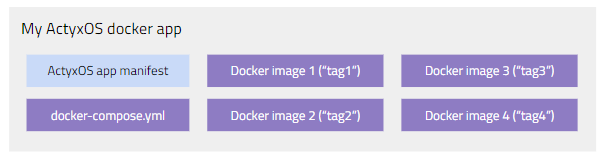

With the **Docker Runtime** you can run arbitrary apps packaged as docker images.

:::info Beta
The Docker Runtime is currently in **beta**.
:::

### Docker apps

A docker app is a type of ActyxOS app where the business logic is implemented in one or more docker images. At runtime, ActyxOS launches a docker container for each image, thus running your logic.



Technically, and as shown in the above image, a docker app is composed of

1. an ActyxOS app manifest (a YAML file),
1. a `docker-compose.yml` file specifying how to run your containers; and,
1. one or more docker images (identified by their tag).

## Usage

### Building docker apps

Through the development process of your app, you may use any tools you would like to implement your business logic and build your docker images. You can also use any existing images you want to build on.

:::info Docker documentation
Please refer to the [Docker Documentation](https://docs.docker.com/) for more information about how to build and compose docker images.
:::

### Packaging docker apps

Once you are finished with the development, you can use the Actyx CLI to package your app for deployment to an edge device running ActyxOS.

The Actyx CLI provides the `ax apps package` command for packaging your app for deployment. The command will read the app manifest, validate the docker-compose file, save all necessary images and generate a tarball for deployment.

For docker, the manifest should have the following structure. For a complete schema check out the [App Manifest Schema](/os/docs/app-manifest-schema.html).

```yaml
manifest-version: "1.0" # The version of the manifest
type: docker # The type of app this is (web or docker)
id: com.example.app1 # A unique app id
version: 1.0.3 # The version (semantic versioning)
display-name: App 1 # A human-friendly display name
description: "A great first app" # A short description
docker-compose: ./docker-compose.yml # Path to the docker-compose file
settings-schema: ./settings-schema.json # Path to the app's settings schema
```

:::note
There is no need to specify necessary images in the manifest since the Actyx CLI will automatically analyze the docker-compose file to figure out which images need to be deployed.
:::

How this works is shown in the following short example.

```bash
# Go to project directory
$ cd app1/
# Package the app
$ ax apps package ax-manifest.yml
> Packaging docker app...
> com.example.app1 (1.0.3) successfully packaged: com.example.app1-1.0.3.tar.gz
```

### Deploying docker apps

The Actyx CLI provides the `ax apps deploy` command for deploying apps to nodes. In the background, the CLI will automatically read the mainfest file, inform the node about the deployment and perform any necessary data transfers.

:::info Local mode only
Currently, the [Actyx CLI](/os/docs/actyx-cli.html) only supports local interaction with devices (using the `--local` flag). We plan to release remote deployment functionality in 2020. Please check out our [blog](https://www.actyx.com/news) for release updates.
:::

See this example for how to use the `ax apps deploy` command: 

```bash
# Go to project directory
$ cd app1/
# Deploy the app
$ ax apps deploy --local com.example.app1-1.0.3.tar.gz 10.7.0.32
> Deploying docker app...
> com.example.app1 (1.0.3) (com.example.app1-1.0.3.tar.gz) successfully deployed to 10.7.0.32.
```

Once an app has been deployed to a node, the ActyxOS Docker Runtime will automatically start and run it. Unless your app's containers stop themselves, they will run indefinitely. If the node is restarted, your app will also automatically be restarted.

### Monitoring docker apps

Since you cannot access your app's containers directly, monitoring means accessing logs they generate. The AcytxOS Docker Runtime automatically persists any text sent to any containers stdout or stderr. Preferably, your app generates logs using the [Console Service](/os/docs/console-service.html).

You can access and tail these logs using the `ax logs tail` command.

:::info Local mode only
Currently, the [Actyx CLI](/os/docs/actyx-cli.html) only supports local interaction with devices (using the `--local` flag). We plan to release remote deployment functionality in 2020. Please check out our [blog](https://www.actyx.com/news) for release updates.
:::


See the following example for how this currently works.

```bash
$ # run `ax logs tail --help` for more information on the command
$ ax logs tail --local 10.7.0.32
> com.example.app1-1.0.3::opcservice::stdout | 2019-09-11T21:46:12.106Z [info] Starting server...
> com.example.app1-1.0.3::opcservice::stdout | 2019-09-11T21:46:12.113Z [debug] Signals:
> com.example.app1-1.0.3::opcservice::stdout | 2019-09-11T21:46:12.113Z [debug]   - tempSensor1
> com.example.app1-1.0.3::opcservice::stdout | 2019-09-11T21:46:12.113Z [debug]   - tempSensor2
> com.example.app1-1.0.3::opcservice::stdout | 2019-09-11T21:46:12.114Z [debug]   - tempSensor3
> com.example.app1-1.0.3::opcservice::stdout | 2019-09-11T21:46:12.114Z [debug]   - tempSensor3
> com.example.app1-1.0.3::cassandra1::stdout | 2019-09-11T21:46:13.009Z [info] Cassandra listening on 0.0.0.0:3919
```

### Undeploying docker apps

Undeploying an app means deleting it from the device. This can be done with the `ax apps undeploy` command.

:::info Local mode only
Currently, the [Actyx CLI](/os/docs/actyx-cli.html) only supports local interaction with devices (using the `--local` flag). We plan to release remote deployment functionality in 2020. Please check out our [blog](https://www.actyx.com/news) for release updates.
:::

Example:

```bash
# Undeploy an app
$ ax apps undeploy --local com.example.app1 10.7.0.32
> Undeploying app `com.example.app1`...
> App 'com.example.app1' (1.0.3) successfully undeployed from 10.7.0.32
```
