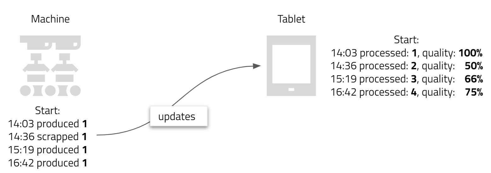
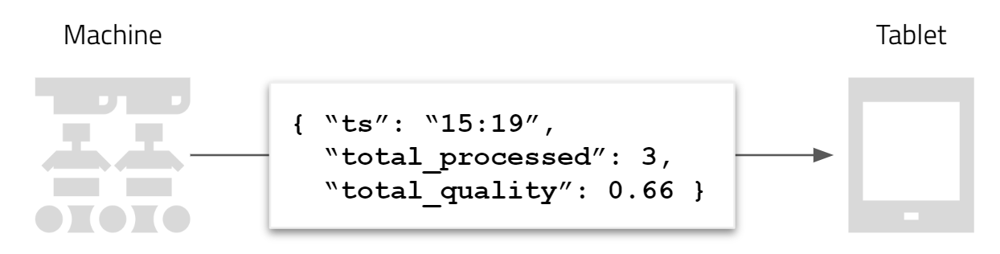
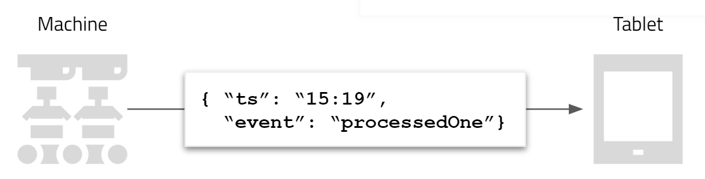

Building graphical user interfaces for your ActyxOS app.

Many collaborative systems require interaction with human end-users. Graphical user interfaces are the means to do so. In this section, we will look at how user-interfaces fit into ActyxOS and how you combine them with other services such as the [Event Service](/os/docs/event-service.html) or the [Blob Service](/os/docs/blob-service.html).

## Contents

- [Basics](#basics)
    - [Web-based user-interfaces](#web-based-user-interfaces)
    - [Computing state using event sourcing](#computing-state-using-event-sourcing)
- [Building ActyxOS apps with user-interfaces](#building-actyxos-apps-with-user-interfaces)
    - [Single-page applications for the WebView Runtime](#single-page-applications-for-the-webview-runtime)
    - [Using plain-vanilla JavaScript](#using-plain-vanilla-javascript)
    - [Using the React.js library](#using-the-reactjs-library)
    - [Using the Actyx Pond framework](#using-the-actyx-pond-framework)
- [Learn more](#learn-more)

## Basics

### Web-based user-interfaces

User-interfaces can be implemented using different technologies, from [Qt](https://en.wikipedia.org/wiki/Qt_(software)) to [Windows Forms](https://docs.microsoft.com/en-us/dotnet/framework/winforms/). The currently most popular approach is building user-interfaces on the three core web technologies: HTML, JavaScript, and CSS. This approach has grown tremendously as browsers have become ubiquitous.

Whilst websites initially drove the adoption of web technologies, single-page applications (SPAs)&mdash;also called _web apps_&mdash;have become increasingly popular, especially for mobile devices. These applications re-render the page dynamically according to end-user input or dynamically loaded external data.

Building ActyxOS apps with user-interfaces, means building single-page applications using HTML, JavaScript,  and CSS.

> What about TypeScript, Elm and other compile-to-JavaScript languages?
>
> Multiple languages have emerged that transcompile to JavaScript to be run in browsers. Since all of these languages are transcompiled to JavaScript, they are all also compatible with the ActyxOS [WebView Runtime](/os/docs/webview-runtime.html).

As an example, consider the following single-page application. It offers a single functionality to the end-user, namely changing the color of the paragraph's text to either green or red. Note that the page is never reloaded since the color change is implemented as a dynamic re-rendering of the respective element.

```html
<!DOCTYPE html>
<html>
    <head>
        <script>
            function setColor(newColor) {
                var el = document.getElementById("myText");
                el.style.color = newColor;
                console.log(`Color changed to ${newColor}`);
            }
        </script>
    </head>
    <body>
        <p id="myText" >Some text</p>
        <button onclick="setColor('green')">Make green</button>
        <button onclick="setColor('red')">Make red</button>
    </body>
</html>
```

Whilst obviously simplified, this exemplifies the idea of single-page applications. Because most single-page applications are significantly more complex, numerous frameworks and libraries that facilitate their development have emerged. Some of the most popular include:

- [React.js](https://reactjs.org) (recommended),
- [Vue.js](https://vuejs.org),
- [AngularJS](https://angularjs.org),
- [Ember.js](https://emberjs.com),
- [Sencha Ext JS](https://www.sencha.com/products/extjs/); and,
- [Knockout](https://knockoutjs.com).

One of the key questions for building single-page applications is how to compute and manage state. Let's have a look at that.

### Computing state using event sourcing

Imagine you are building a single-page application that aims to show how many parts a machine has produced and how many of those were good, i.e. without defects. The machine works autonomously and can either successfully produce a part, or&mdash;because of a quality issue&mdash;decide to scrap a part it has worked on.



Let's start by writing a simple interface to show to the end-user using basic HTML:

```html
<!DOCTYPE html>
<html>
    <body>
        <p>Total processed parts: <strong>[the number of parts processed]</strong></p>
        <p>Quality: <strong>[the number of good parts / the number of parts processed]%</strong></p>
    </body>
</html>
```

Now the question is of course: _how do I find out how many parts have been processed and how many of those were of good quality_?

There are two fundamental methods of doing this. The first, and most common one, is for the machine to send us&mdash;whenever it changes&mdash;a new state, i.e.the total number of processed parts and the total quality ratio:



Whilst this approach is simple to understand, there is a much more powerful way of doing this. Namely, using a method called _event sourcing_. With this approach, the state is never sent to anyone, but rather events are sent and the state is computed&mdash;anyway, the consumer wants&mdash;whenever such an event is received:



ActyxOS has been built, from the ground-up, for event sourcing (the latter approach). We will not delve anymore into the hows and whys. If you are interested in a more in-depth look, please check out the theoretical introduction to [event sourcing](/os/docs/event-sourcing.html).

Using the event sourcing approach, and assuming the machine is publishing events on a [persistent event stream](/os/docs/event-streams.html), let's write some JavaScript code that will implement our status computation.

The first thing we need to do is define our initial state, which we will do using a simple JavaScript object:

```js
const initialState = {
    totalNumPartsProcessed: 0,
    totalNumPartScrapped: 0,
}
```

Let's now write a function that adjusts our state whenever a new event is received. In order to adjust the state, we need the old state and the event that we received. This function is often referred to as the `onEvent` function:

```js
function onEvent(currentState, event) {
    switch (event.event) {
        case 'processedOne':
            return {...currentState,
                    totalNumProcessed = currentState.totalNumProcessed + 1};
        case 'scrappedOne':
            return {...currentState,
                    totalNumScrapped = currentState.totalNumScrapped + 1};
    }
}
```

What we have just done is implement a simple event-sourcing system. The way this now works is that we initially load the `initialState` and then simply call the `onEvent` function with the current state and a new event whenever we receive one:

```js
// Set the initial state
var state = initialState;

// Received a first event
state = onEvent(state, firstEvent)

// Received a second event
state = onEvent(state, secondEvent)

// etc...
```

Bringing it all together, we could implement our single-page application as follows:

```html
<!DOCTYPE html>
<html>
    <head>
        <script>

            const initialState = {
                totalNumPartsProcessed: 0,
                totalNumPartScrapped: 0,
            }

            function onEvent(currentState, event) {
                switch (event.event) {
                    case 'processedOne':
                        return {...currentState,
                                totalNumProcessed = currentState.totalNumProcessed + 1};
                    case 'scrappedOne':
                        return {...currentState,
                                totalNumScrapped = currentState.totalNumScrapped + 1};
                }
            }

            // Set the initial state
            var state = initialState;

            // This function renders the UI based on our state
            function renderUI(state) {
                // Update the total number processed
                document.getElementById('numProcessed').innerHTML
                    = state.totalNumProcessed;
                // Update the quality ratio
                var qualityRatio = 1 - (state.totalNumScrapped / state.totalNumProcessed);
                document.getElementById('qualityRatio').innerHTML
                    = (qualityRatio * 100) + '%';
            }

            // Here we use some function that allows us to subscribe to
            // the machine's event stream and calls the provided function
            // whenever an event is received.
            subscribeToEventsFromMachine(function(event) {
                state = onEvent(state, event);
                // After having computed a new state, we ask the UI to
                // update itself accordingly
                renderUI(state);
            })

        </script>
    </head>
    <body>
        <p>Total processed parts: <strong id="numProcessed">waiting for machine events...</strong></p>
        <p>Quality: <strong id="qualityRatio">waiting for machine events...</strong></p>
    </body>
</html>
```

Now that we have the basics covered, let's have a look at how to build ActyxOS apps with user-interfaces.

## Building ActyxOS apps with user-interfaces

In this section, we will use the quality inspection example we introduced above to build a simple ActyxOS app with a user-interface.

### Single-page applications for the WebView Runtime

The first thing to consider is which ActyxOS runtime we will build our app for. ActyxOS currently offers two options:

- the [Docker Runtime](/os/docs/docker-runtime.html) for building docker-based apps; and,
- the [WebView Runtime](/os/docs/webview-runtime.html) for building single-page applications.

Since we are building an app with a user-interface, we must use the WebView Runtime. The WebView Runtime takes a packaged single-page application and runs it on the edge device.

In the next few sections, we will focus on how we build the single-page application itself; for more information about how the WebView Runtime works in detail and how to package apps for it, please check out the [advanced guide](/os/docs/webview-runtime.html).

### Using plain-vanilla JavaScript

You can build a single-page application using HTML and plain-vanilla JavaScript. This would look very similar to the examples shown in the _Basics_ section above. What we need is:

- an initial state for our user-interface,
- an `onEvent` function (sometimes called _event handler_ or _reducer_),
- a `render` function that renders the UI based on our state; and,
- a subscription to machine events that calls the `onEvent`.

We have already implemented the three first points in the [computing state using event sourcing](#computing-state-using-event-sourcing) section above. The only thing we haven't done yet, and, indeed, the only thing that is specific to ActyxOS, is implementing the subscription. Let's see how we could do that using the [Event Service](/os/docs/event-service.html).

```js
function subscribe(machineName, onEvent) {
    fetch('http://localhost:4454/api/v1/events/subscribe', {
        method: 'POST',
        body: JSON.stringify({ subscriptions: [{
            semantics: 'com.machines-inc.outputUpdates',
            name: machineName
        }] }),
        headers: { 'Content-Type': 'application/json' },
    })
    .then(r => r.body.getReader())
    .then(reader => {
    const dec = new TextDecoder()
    const loop = () => {
        reader.read().then(
        chunk => {
            if (!chunk.done) {
                const event = JSON.parse(dec.decode(chunk.value));
                console.log('Received an event:', JSON.stringify(event));
                const payload = event.payload;
                console.log('Payload:', JSON.stringify(payload));
                // Call the onEvent function with the event's payload
                onEvent(payload);
                loop()
            }
        })
    }
    loop()
    })
}
```

What this function does is pretty simple. Firstly it subscribed to all event streams where the stream semantic is `com.machines-inc.outputUpdates` and the stream name is equal to the `machineName` that was passed in. Secondly, it then calls the `onEvent` callback function whenever an event is received, passing it the event's payload.

Given this and the `onEvent` function we defined above, the machine must create an event stream with the semantics: `com.machines-inc.outputUpdates`, and must produce events with a payload as shown here:

```js
{
    // ...
    // ActyxOS specific event properties
    // ...
    "payload": {
        "event": "processedOne" || "scrappedOne"
    }
}
```

Given this, we will have a functioning single-page application that we can now package and deploy to a device with the ActyxOS WebView Runtime.

> What about the `machineName`?
>
> The `machineName` argument in the `subscribe` function must be provided when calling it. As an app developer, you are free to define how this is done. You could have the end-user enter the string, you could have a drop-down of all machines publishing event streams with the given semantics, or any other option.

### Using the React.js library 

An in-depth look at how to work with React.js is outside the scope of this page. Here is a list of valuable resources that you should check out if you want to use React.js to build a user-interface for an ActyxOS app:

- Guide: [AJAX and APIs in React.js](https://reactjs.org/docs/faq-ajax.html)
- Guide: [Async Actions with Redux](https://redux.js.org/advanced/async-actions)
- Tutorial: [Real-time Server Sent Events with React & Event Source](https://www.jsdiaries.com/dynamic-website-design-with-event-source/)

Using some of the techniques shown there, you should have no trouble building a user-interface. Alternatively, consider using the Actyx Pond framework.

### Using the Actyx Pond framework

The Actyx Pond is a highly-opinionated TypeScript-based framework that provides you with a whole lot of features&mdash;on top of ActyxOS&mdash;out of the box. Most importantly it allows you to write always-available apps without having to worry about remembering state, updating manually when events arrive, etc. The Actyx Pond also has functionality simplifying the development of user-interfaces using the React.js library.

For more information, please check out the [Actyx Pond documentation](/pond).

## Learn more

- Read the [advanced guide](/os/docs/webview-runtime.html) for the WebView Runtime
- Check out the [documentation](/pond) about the Actyx Pond

Or, jump to the next section and learn about how to log from your apps.
