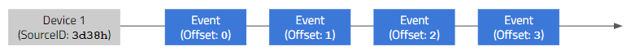
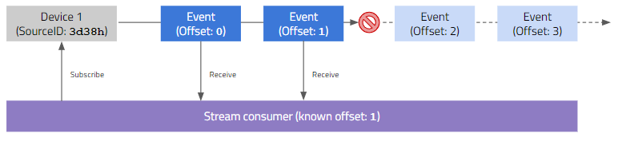

The Event Service allows you to publish, persist and consume events.

## Contents

- [Overview](#overview)
- [Basics](#basics)
    - [Events and streams](#events-and-streams)
    - [Offsets and partitions](#offsets-and-partitions)
    - [Event stream persistence](#event-stream-persistence)
- [Usage](#usage)
    - [Querying event streams](#querying-event-streams)
    - [Subscribing to event streams](#subscribing-to-event-streams)
    - [Publishing to event streams](#publishing-to-event-streams)
    - [Managing internal state with offsets](#managing-internal-state-with-offsets)

## Overview {#overview}

The Event Service is designed as a decentralized transaction log and has been engineered for availability, partition tolerance, and eventual consistency. It offers low latency and high throughput with a small footprint allowing for use on mobile and embedded devices.

Key capabilities:

- Publish and subscribe to streams of events
- Persist streams of events in a distributed fault-tolerant way
- Process streams of events as they occur in the system
- Synchronize events across devices in a peer-to-peer fashion

The Event Service is a core component of ActyxOS as it allows events published by apps to be streamed in real-time to other subscribed apps. Every subscribed app on any device will eventually receive published events (_at least once_ delivery).

Communication between the client and the Event Service is done with a simple, high-performance, language agnostic HTTP API or dedicated, language-specific SDKs.

## Basics {#basics}

### Events and streams {#events-and-streams}

The following image shows a simple event stream generated by a device running ActyxOS.



As can be seen, the device is uniquely identified by its _SourceId_. Each event generated by that device will contain that specific SourceID. Each event also has a specific and unique _offset_. The offset denotes at which point in the stream the specific event is located.

In ActyxOS, event streams are always defined by a three-tuple containing the following properties:

- **SourceId**, i.e. the device on which this stream is generated
- **Semantics**, i.e. the namespaced meaning of the stream
- **Name**, i.e. the name of the stream or stream generator

This information is encoded in an event envelope that wraps your user-defined payload. Here is an example:

```json
{
    "SourceId": "b24486fe-c68b-11e9-aa8c-2a2ae2dbcce4",
    "Semantics": "com.actyx.os.documentation.example",
    "Name": "Streaming Silvia",
    "Offset": 42,
    "Payload": {
        "foo": "bar",
        "foos": ["bar1", "bar2"],
        "bars": {
            "foo": "bar",
            "bar": "foo"
        }

    }
}
```

In the above example, the event
- was generated on a device with SourceId `b24486fe-c68b-11e9-aa8c-2a2ae2dbcce4`,
- has the semantincs `com.actyx.os.documentation.example`,
- is part of a stream called `Streaming Silvia`; and,
- finds itself at offset `42` of that stream.

### Offsets and partitions {#offsets-and-partitions}

_Offsets_ play a very important role in ActyxOS. As it is designed for high-availability, ActyxOS continues to work, even in the face of network partitions. This means, however, that events generated by a device in a different network partition, will arrive only once the partition has been _healed_.



Offsets allow you - as a client - to keep track of your progress in reading a stream as a subscriber. In order to know if new information may be available, you can simply compare the offset you know with the largest one of the stream.

### Event stream persistence {#event-stream-persistence}

As opposed to some streaming technologies, events published through the ActyxOS Event Service are not _ephemeral_. Quite the opposite in fact: published events are automatically persisted locally and in your entire ActyxOS swarm.

This means you can - at any time - access events you or others have published in the past. Combining this ability with some functionality to remember offsets, allows you to ensure you get all events ever emitted on a stream, even long after they were originally emitted.

> Note
>
> The Event Service API is designed with this very notion in mind. As you will see below, queries can be parameterized using _from-_ and _to-offsets_.

## Usage {#usage}

The Event Service is one of the tools ActyxOS offers you to build distributed, multi-device apps. Using the Event Service means publishing to and subscribing to event streams. This is done by interacting with the Event Service's HTTP API accessible at `http://localhost:4454/api/v1`.

> Important
>
> The API can only be accessed locally, i.e. at `localhost`. It is not meant for being accessed from other devices. The dissemination of events to other devices happens automatically in the background. To access events from other devices, simply add respective subscriptions.

### Querying event streams {#querying-event-streams}

The HTTP API allows you to query event streams by sending HTTP `POST` requests to the `http://localhost:4454/api/v1/events/query` endpoint. The request body must contain a JSON object specifying your subscription request.

Please check out the relevant [API reference](/os/docs/event-api.html#query-event-streams) for more information and examples.

### Subscribing to event streams {#subscribing-to-event-streams}

Instead of querying an existing set of events, you can also subscribe to event streams. This is done with HTTP `POST` requests to the `http://localhost:4454/api/v1/events/subscribe` endpoint and allows you to, potentially, retrieve events from the past and, especially, automatically receive new events as they are published.

Check out the [API reference](/os/docs/event-api.html#subscribe-to-event-streams) for more information and some common examples.

### Publishing to event streams {#publishing-to-event-streams}

Publishing is how new events are generated in your ActyxOS swarm. You can publish events by sending HTTP `POST` requests to the `http://localhost:4454/api/v1/events/publish` endpoint.

Please refer to the [API reference](/os/docs/event-api.html#publish-events) for more information and examples.

### Managing internal state with offsets {#managing-internal-state-with-offsets}

All event streams emitted from one edge device are merged into a single per-device stream that is managed by the Event Service.
Each event thus has its unique position within that stream, also called its _offset_, that is part of the event metadata.
When consuming event streams, these are always delivered in contiguously ascending offset order (strictly monotonic and gapless) for each device — the ordering of streams coming from different devices is governed by the ordering parameter given to the event query.

Therefore, the highest event offset seen from each device serves as a cursor for identifying the replay position within that device’s stream of events.
When an app is restarted, it may want to resume consuming event streams from the last known position in the same vein as for example [resuming a Kafka consumer](https://kafka.apache.org/0102/javadoc/org/apache/kafka/clients/consumer/KafkaConsumer.html#rebalancecallback).

In contrast to a Kafka stream, an ActyxOS event stream consists of multiple per-device streams, hence the single cursor needs to be replaced with one offset per device, the so-called _offset map_.

This map is passed into the event query and subscription endpoints, either as a starting point, declaring which parts of the stream we have already seen, or as a termination condition, saying up to which point we want the stream to be delivered.

> NOTE
>
> When persisting computed state in an event consumer, it is good practice to store the offset map in the same place, for example in the same database transaction, so that processing may later be resumed from exactly the right place. This yields effectively _exact-once_ delivery of events.
