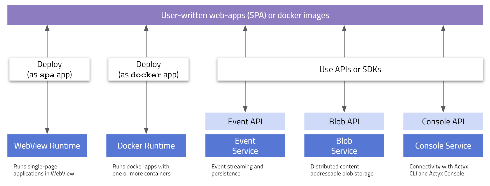

This page introduces the core **ActyxOS** architecture and components.

As depicted below, ActyxOS provides six core services and, where applicable, associated APIs or deployment tools. These services either provide stand-alone functionality or allow you to build your own apps.



Refer to the next sections to learn more about the different services:

- [WebView Runtime](#webview-runtime)
- [Docker Runtime](#docker-runtime)
- [Event Service](#event-service)
- [Blob Service](#blob-service)
- [Console Service](#console-service)

At the end of this chapter, you will also find a section about additional [Developer Tooling](#developer-tooling).

## WebView Runtime

The WebView Runtime allows you to run single-page web-applications on edge devices. As an example, consider the following code which you could save as `index.html` and run as an app on ActyxOS.

```html
<!DOCTYPE html>
<html>
    <body>
        <p>Click the button</p>
        <button onclick="myFunction()">Click me</button>
        <p id="target"></p>
        <script>
            function myFunction() {
                document.getElementById("target").innerHTML = "I was clicked!";
            }
        </script>
    </body>
</html>
```

Your app must be packaged as a single-page application, including associated JavaScript and CSS. We recommend building your app using one of the common frameworks, such as [React.js](https://reactjs.org), [AngularJS](https://angularjs.org) or [Vue.js](https://vuejs.org)

You can use the [Actyx CLI](/os/docs/actyx-cli.html) to deploy your app locally to a specific device, or use the [Actyx Console](/os/docs/actyx-console.html) to upload your app for production installations to one or more devices.

Please refer to the [WebView Runtime](/os/docs/webview-runtime.html) guide for more information about building or deploying web apps using ActyxOS.

## Docker Runtime

ActyxOS allows you to run arbitrary docker containers on edge devices. Once deployed, your container(s) will automatically be started and running whenever the device is up.

Consider the following exemplary [dockerfile](https://docs.docker.com/engine/reference/builder/):

```
FROM ubuntu:18.04
COPY . /app
RUN make /app
CMD python /app/app.py
```

Once built, you can easily deploy this container to any device running ActyxOS. For deploying use either the [Actyx CLI](/os/docs/actyx-cli.html) or the [Actyx Console](/os/docs/actyx-console.html).

> Note
>
> Under the hood, ActyxOS will automatically compose your container or containers with all other containers deployed to the device.

Please refer to the [Docker Runtime](/os/docs/docker-runtime.html) guide for more information about building or deploying docker containers using ActyxOS.

## Event Service

The Event Service allows you to create, publish to and subscribe to persistent event streams from your app. Events are automatically persisted for future access and distributed to all edge devices in your swarm.

You can access the Event Service using the base [HTTP](https://en.wikipedia.org/wiki/HTTP) API. As an example, consider an autonomous robot publishing events about its battery level:

```javascript
function publishEvent(event) {
  return fetch("http://localhost:4454/api/v1/events/publish", {
    method: "POST",
    body: JSON.stringify({ data: [{
        semantics: "com.robot-maker-ltd.batteryLevelChange",
        name: "robot1",
        payload: { levelChangedTo: 0.71 }
    }]}),
    headers: { "Content-Type": "application/json" }
  });
}
```

> Note
> 
> You always access the Event Service locally using `localhost`. ActyxOS automatically takes care of device discovery, event dissemination, and persistence.

Please refer to the [Event Service](/os/docs/event-service.html) guide for more information. If you haven't yet, also check out the page about [event streams](/os/docs/event-streams.html) in the _Main Concepts_ section, where you will find an introduction about how to use create, publish to and subscribe to persistent event streams.

## Blob Service

Sometimes you need to store data blobs for later access. To do this, the Blobs Service provides a distributed blob storage system, where all data is automatically distributed to all edge devices in your swarm.

Check out this example of an inspection camera distributing images it captures:

```js
var fs = require('fs');
var request = require('request');

function onNewInspectionPhoto(filepath) {
    request.post({
        url: 'http://localhost:4455/api/v1/blobs',
        formData: { // Building a multipart/form-data request
            blob: fs.createReadStream(filePath),
            metadata: JSON.stringify({
                'semantics': 'com.myapp.quality-inspection-photos',
                'retentionPolicy': {
                    'policy': 'keepUntilTime',
                    'until': 28499383002
                }
            })
        }
    })
}
```

Please refer to the [Blob Service](/os/docs/blob-service.html) guide for more information. If you haven't yet, also check out the page about [blob storage](/os/docs/blob-storage.html) in the _Main Concepts_ section, where you will find an introduction about how to use the Blob Service.

## Console Service

ActyxOS automatically phones home to the [Actyx Console](/os/docs/actyx-console.html) when an internet connection is available. This allows you to easily monitor the status, performance, and issues with your devices and apps. The Console Service performs this automatically in the background.

> What about local interactions using the Actyx CLI?
>
> The Console Service can also communicate locally when you run [Actyx CLI](/os/docs/actyx-cli.html) commands using the `--local` flag.

As a developer, you can use the Console Service for unstructured and structured (preferred) logging. Logged messages will automatically be pushed to the [Actyx Console](/os/docs/actyx-console.html) for you to review when an internet connection is available. 

The Console Service's logging functionality can be accessed using the local HTTP API. See, for instance, the following example:

```js
fetch('http://localhost:4457/api/v1/logs', {
    method: 'POST',
    body: JSON.stringify({
        "labels": {
            "ax.schemas.logging.level": 'info',
            "com.mycompany.event": "colorChange"
        }
        "logName": logName,
        "payload": {
            "message": logMessage,
        }
    }),
    headers: {'Content-Type': 'application/json'}
})
```

Please refer to the [Console Service](/os/docs/console-service.html) guide for more information. If you haven't yet, also check out the page about [logging](/os/docs/logging.html) in the _Main Concepts_ section, where you will find an introduction about how to publish and access logs from your app.

## Developer Tooling around ActyxOS {#developer-tooling}

To facilitate app development and deployment, we offer several developer tools, including:

- [Actyx Console](/os/docs/actyx-console.html) for web-based deployment and monitoring (public release in 2020)
- [Actyx CLI](/os/docs/actyx-cli.html) for terminal-based deployment and monitoring
- [Actyx Pond](/pond), a framework for building always-available ActyxOS apps using TypeScript
