The Actyx Node Manager is an app that lets you manage and interact with local and remote Actyx nodes through an easy-to-use graphical user interface.
This document describes the main navigation elements and the features of the Actyx Node Manager.

Actyx gathers anonymous aggregate user behavior analytics when you use the Node Manager.
Analytics allow us to prioritize fixes and features based on how, where, and when people use Actyx.
You can opt out of sending analytics data in the preferences section of the Node Manager.
Find out more in [this section](#anonymous-aggregate-user-behaviour-analytics) below.

## General UX

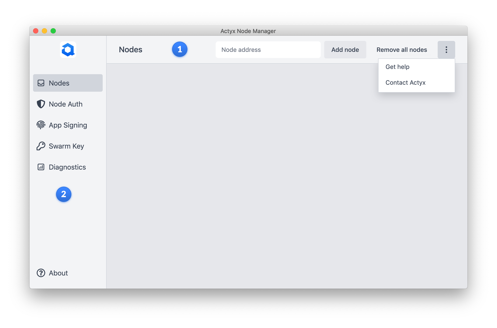

The main navigation elements of the application are the top bar including the node search and the left panel leading to the different features of the Actyx Node Manager.

### 1 Top Bar

The search bar lets you connect to your nodes by entering the IP address of the node you want to connect to into the search field.
Right next to the search bar, the selected nodes can be removed with the click of a button.
The dot menu to the very right provides contact and help links.

### 2 Left Panel

The left panel is the main entry point to the node overview and all features of the Node Manager.
The node overview displays all nodes that you are currently connected to and your favored nodes.
The features are:

- User key generation
- App manifest signing
- Swarm key generation
- Diagnostics

## Nodes Overview

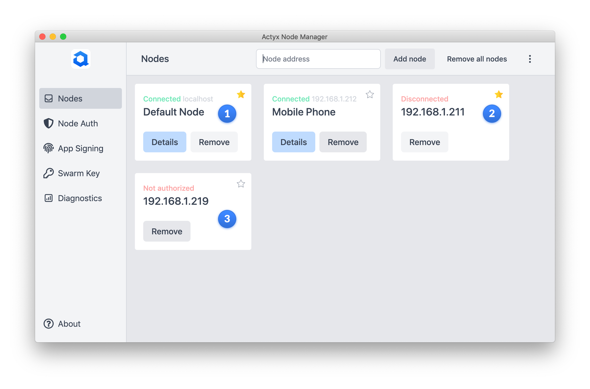

The Node Overview screen displays all nodes that were added since opening the app.

### 1 Connected node

Upon adding a note via the search bar, it appears in _Node Overview_.
For each node, the display name, the connection status, as well as the IP address is displayed.
Additionally, you can jump into the node details, remove the node or mark the node as a favorite using the start in the top right corner.

### 2 Disconnected node

Once a node is marked as a favorite, it can no longer be removed and will be saved across sessions.
This means that all favorite nodes are still there when you reopen the app, even if there is no connection.
Once the node establishes a connection, it will be reflected in the UI.

### 3 Unauthorized node

If a node is displayed as _Not authorized_, it means that the Node Manager could establish a connection to that node but your [public user key is not listed under that node's `authorizedUsers`](../how-to/user-auth/manage-authorized-users.mdx).

## Node Details

The _Node Details_ view provides additional information on the selected node.

### 1 Info

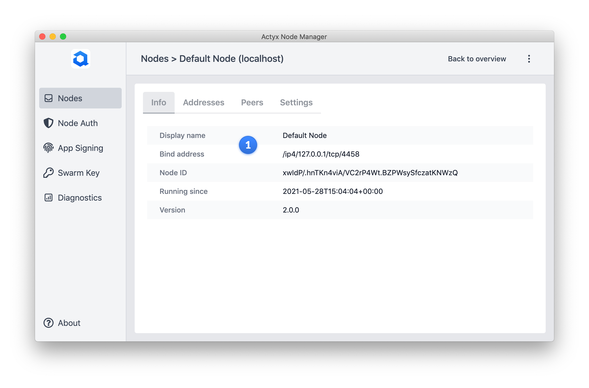

The _Info_ view displays meta info on the selected node.
It contains:

- Display name: The display name from the node settings
- Bind address: The IP address of the node that is used to connect to it
- Node ID: The node ID defined by Actyx
- Running since: Timestamp since node was started
- Version: Version number of Actyx installed on this node

### 2 Addresses

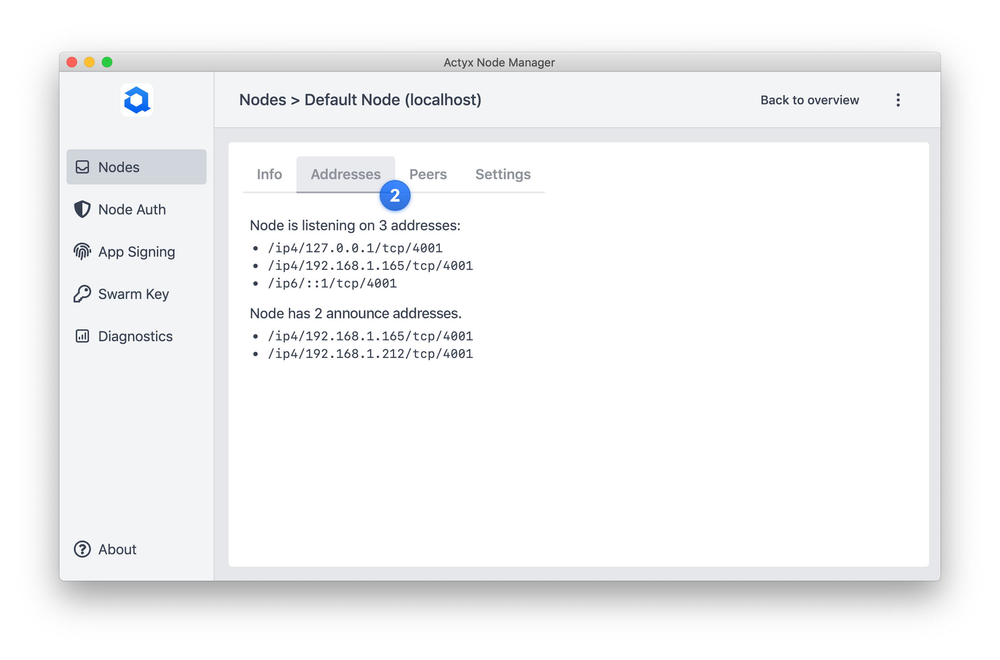

The _Addresses_ view provides network details of the node.

#### Listen Addresses

The listen addresses are all network interfaces on which port 4001 is bound.
Unless configured otherwise, the listen addresses contain all active network interfaces as Actyx binds to `0.0.0.0` by default.

#### Announce Addresses

The announce addresses display the addresses defined in the node settings.
For more information on `announceAddresses`, please refer to our [how-to guide](../how-to/swarms/configure-announced-addresses.mdx).

### 3 Peers

The _Peers_ view displays all peers of the selected node.

### 4 Offsets

The _Offsets_ tab shows all event streams known by the node as well as the current offsets:

<!-- TODO add screenshot -->

Additionally, the number of events the node knows it must get, but hasn't gotten yet is also shown where applicable.

### 5 Settings

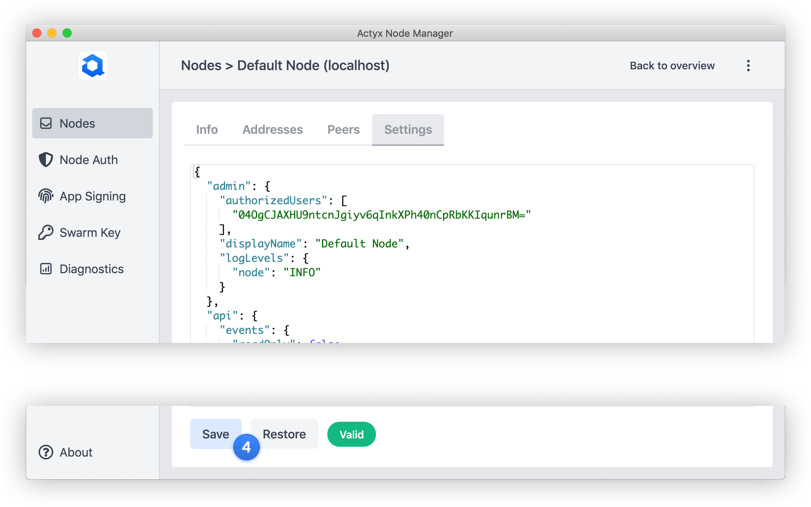

The _Settings_ view provides an editor where you can manage the node settings.
The settings are constantly validated against the node settings schema.
If you want to revert the changes you made since they were last saved, simply press the _Restore_ button.

## Setting up user keys

Actyx Node Manager lets you create user keys so that you can establish an authorized connection to the node.
For more information on user keys, please refer to our [how-to guide](../how-to/user-auth/set-up-user-keys.mdx).

### 1 No user keys found

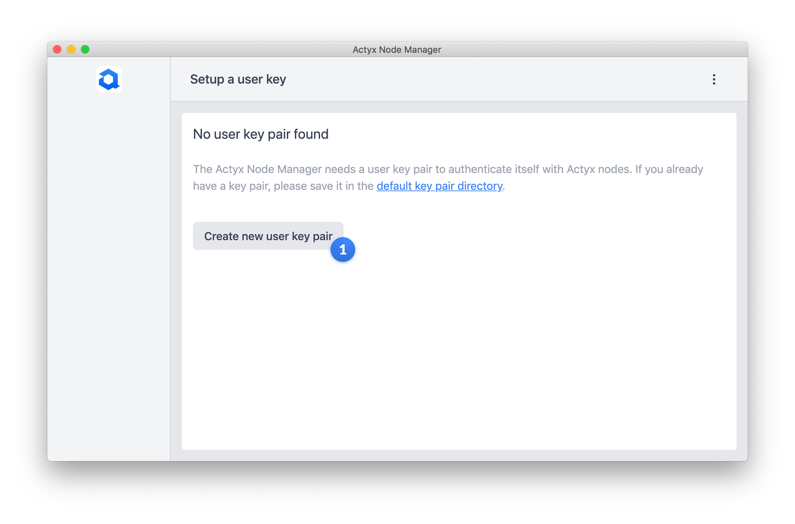

If you open the Node Manager and it cannot find user keys in the default location, it will ask you to create a pair of user keys.

### 2 User key pair created

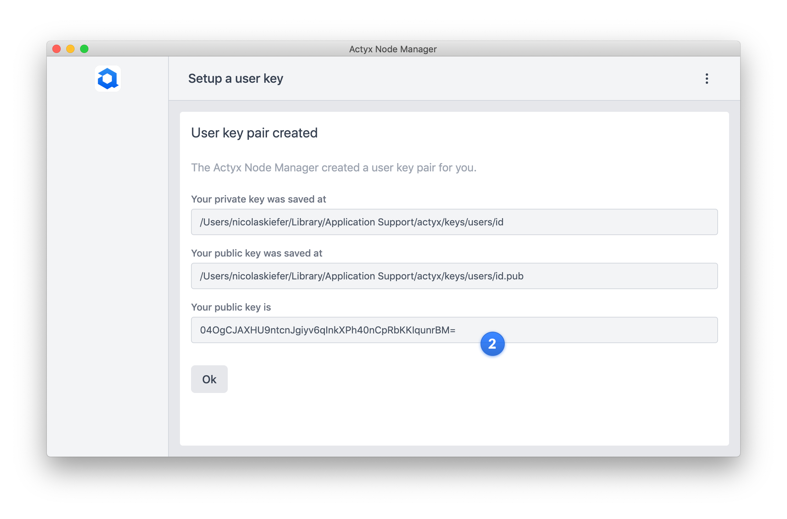

Once you have created the keys, Node Manager displays the location on your device where it saved the user keys as well as your public key.

### 3 Create additional keys

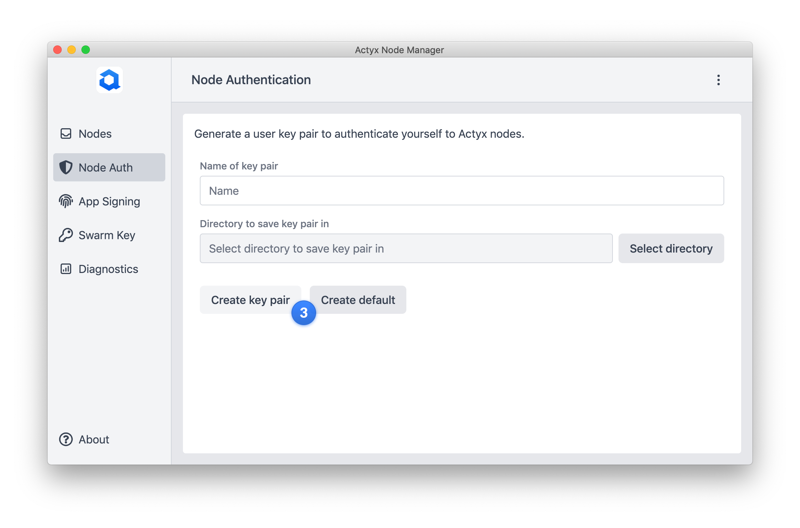

You can at any time create additional user keys by defining a name and a location where to save the key pair.
On button click, another key pair is generated.

## Signing an app manifest

Actyx Node Manager lets you sign app manifests so that you can authenticate your app with the node and access its APIs.
For more information on app signing, please refer to our [how-to guide](../how-to/app-auth/sign-app-manifest.mdx).

### 1 Selecting necessary files

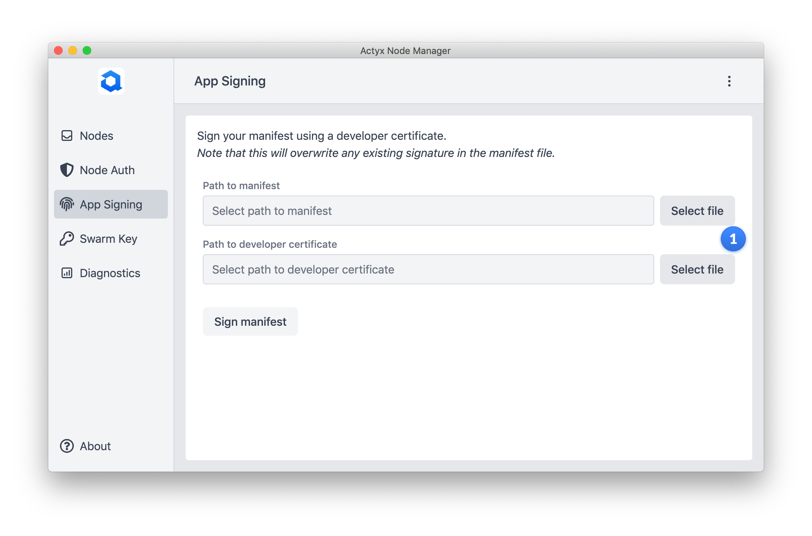

To sign an app manifest, you need to select two files from your disc.
The first one is the manifest you want to sign, the second one is your Actyx developer certificate.

### 2 Signing

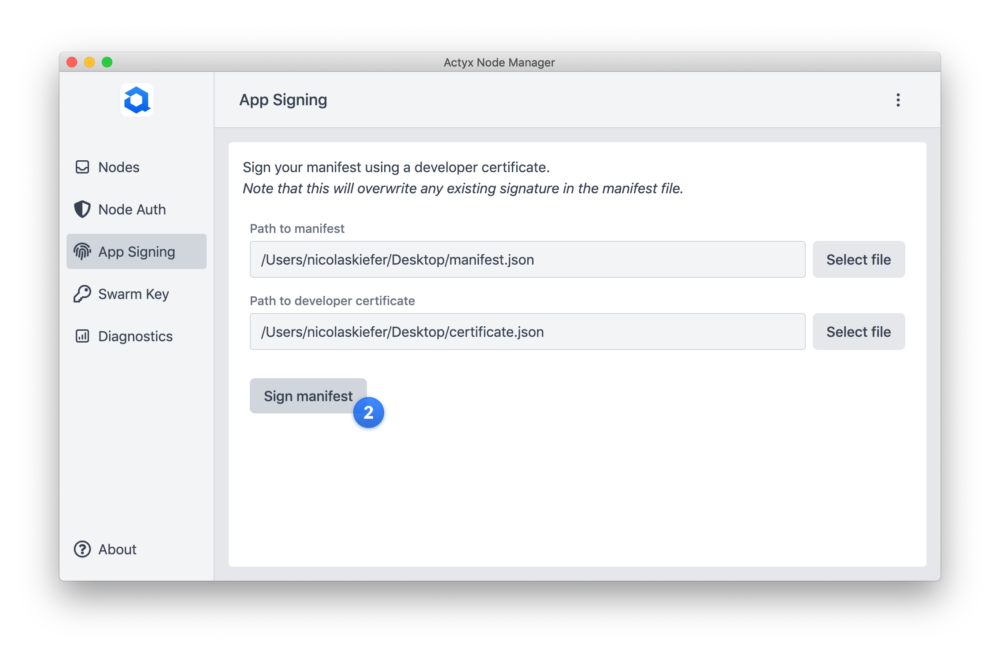

Signing your manifest updates the existing manifest file.
If it already contained a signature, signing the manifest again overrides the existing signature.
Note that the app ID in the manifest must use the namespace you used to obtain your developer certificate.

## Creating a swarm key

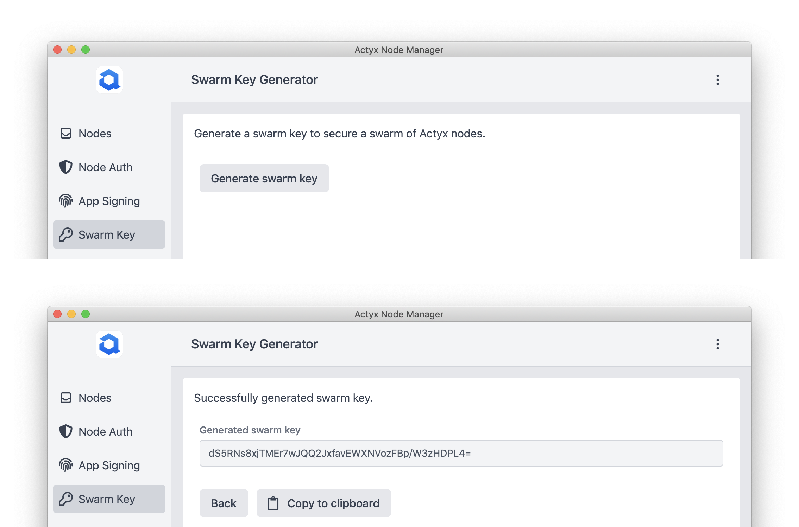

Actyx Node Manager lets you create swarm keys.
For more information on what a swarm is and what you need the swarm key for, please refer to our [how-to guide](../how-to/swarms/setup-swarm.mdx).

## Diagnostics

The _Diagnostics_ view gives insights into the swarm connectivity and provides additional data such as the app state, or the node settings schema.

### 1 Swarm Connectivity

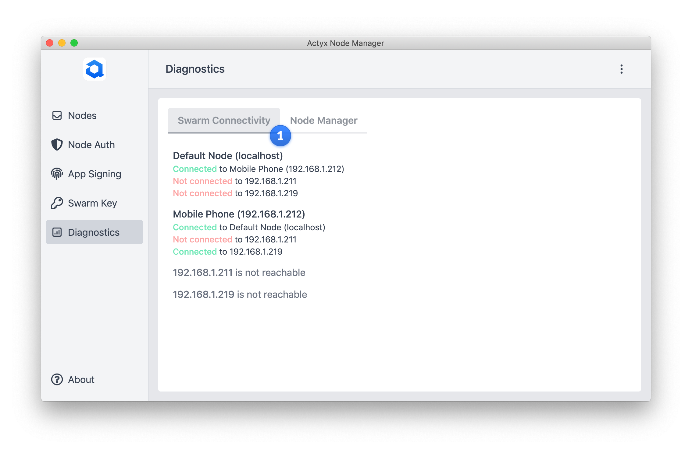

### 2 Offset Matrix

The _Offset Matrix_ tab shows a matrix of all nodes connected to the Node Manager:

<!-- TODO add screenshot -->

Each row of the matrix shows how many events a node holds from all other connected nodes.
The color of the cells reflects the level of synchronization.
A red cell would imply a large number of missing events, whereas a green cell means the node is completely up to date.

import Tabs from '@theme/Tabs'
import TabItem from '@theme/TabItem'

#### Examples

<Tabs
  defaultValue="npm"
  values={[
    { label: 'Example 1', value: '1', },
    { label: 'Example 2', value: '2', },
    { label: 'Example 3', value: '3', },
    { label: 'Example 4', value: '4', },
  ]
}>
<TabItem value="1">
In this example, the entire swarm is synchronized meaning every event from every node has arrived at every other node in the swarm.

</TabItem>
<TabItem value="2">
In this example, Node 1 and Node 2 are fully synchronized but Node 3 has not caught up with all events yet.

</TabItem>
<TabItem value="3">
</TabItem>
<TabItem value="4">
</TabItem>
</Tabs>

### 2 Node Manager

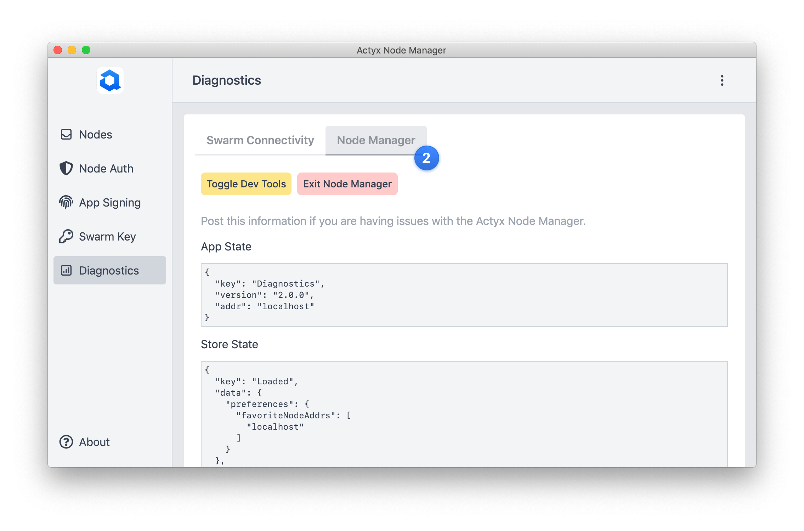

## Anonymous Aggregate User Behavior Analytics

Actyx gathers anonymous aggregate user behavior analytics using [Amplitude](https://amplitude.com/).
Analytics allow us to prioritize fixes and features based on how, where, and when people use the Node Manager.
For example, if an error appears frequently for you, analytics will enable us to prioritize accordingly and improve your experience.

For every event, the following information is shared:

- User ID: A randomly-generated UUID when you start the Node Manager for the first time
- Device ID: A randomly-generated UUID when you start the Node Manager for the first time
- Language: Language of your device
- Device: Your operating system (Windows, macOS or Linux)
- Version: The version of the Node Manager you are using
- Location: Country, region and city pulled using GeoIP
