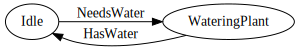

import { Tabs } from '../../../src/components'

:::note
This tutorial is aimed at begginers that have read the previous tutorials about
[publishing](./first-event) and [querying](./first-query) events!
:::

Our goal is to develop a simple machine for an imaginary client.
In this scenario, the client has a flower planted in a smart pot,
the smart pot keeps track of the water level and if it gets too low, emits a warning;
the client wants us to develop a robot that receives the warning and waters the plant.


Along the way, you'll get your feet wet with code that interacts with Actyx.

## Setup

:::caution Requirements
Before starting the tutorial, you will need to have NodeJS installed
(if it is not installed, you can take a look over the [installation guide](https://docs.npmjs.com/downloading-and-installing-node-js-and-npm)).
:::

Let's start by creating our project folder and adding its dependencies.

Start by initializing the NPM package, we'll use `-y` as the questions NPM asks are not
relevant to the current project.

```bash
$ npm init -y
```

We also need to install TypeScript as a development dependency.

```bash
$ npm install -D tsc
```

We're almost done with setup, we just need to add the Actyx packages now!

```bash
$ npm install @actyx/sdk @actyx/machine-runner
```

And, we're done with setup! 🎉

## The Robot

As stated at the start, we are tasked with developing a robot that waters a plant whenever needed.
The idea is as follows — the plant has a sensor that checks the soil humidity level,
if said level goes below a certain threshold, it sends the robot an event requesting water,
when the level is restored, the sensor sends an event signaling that it is enough.

<!--
digraph G {
    rankdir="LR";
    fontname="Comic Sans MS";

    Idle -> WateringPlant [label="NeedsWater"];
    WateringPlant -> Idle [label="HasWater"];
}
-->



:::info
To further simplify our example, we will not care about the amount of water we're providing to the plant.
Instead, we will focus on the interaction between the machine and events.
:::

We start by creating its respective source file (`robot.ts`),
you can do so on your favorite editor or using the following command:

<Tabs>

<Windows>

```bash
$ ni -Path '.\src\robot.ts' -ItemType File -Force
```

</Windows>

<Linux>

```bash
$ mkdir src && touch src/robot.ts
```

</Linux>

<Mac>

```bash
$ mkdir src && touch src/robot.ts
```

</Mac>

</Tabs>

### Creating the events

We start by creating the events for the robot to react to:

```ts
import { MachineEvent } from '@actyx/machine-runner'

export namespace Events {
  export const HasWater = MachineEvent.design('HasWater').withoutPayload()
  export const NeedsWater = MachineEvent.design('NeedsWater').withoutPayload()
  export const All = [HasWater, NeedsWater] as const
}
```

Let's break down what is happening:

1. We create a `namespace` for our events to keep everything together and easy to access

```ts
export namespace Events { ... }
```

2. We declare the events, exporting them so we can actually use them outside the namespace

```ts
export const HasWater = MachineEvent.design('HasWater').withoutPayload()
export const NeedsWater = MachineEvent.design('NeedsWater').withoutPayload()
```

[`MachineEvent.design`](https://github.com/Actyx/machines/blob/84feac646166ff102558c8c10d68b6832940ac97/machine-runner/src/design/event.ts#L64-L94)
creates an event with the name you pass it, however, since events may also carry payloads,
you finish it off by applying either `withPayload` or `withoutPayload`. For simplicity's sake, we will use `withoutPayload`.

3. Finally, we create an additional "event" — `All` — this will be useful when we need to register all events.
   You can also create other groups of events!

```ts
export const All = [HasWater, NeedsWater] as const
```

### Creating the robot

Our robot is a [state machine](https://en.wikipedia.org/wiki/Finite-state_machine), we've already created the events,
now we will create the states.

To create the states, we reach out to [`SwarmProtocol`](https://github.com/Actyx/machines/blob/84feac646166ff102558c8c10d68b6832940ac97/machine-runner/src/design/protocol.ts#L16-L73),
the built protocol will encompass our machine and its events.

```ts
import { SwarmProtocol } from '@actyx/machine-runner'

export const protocol = SwarmProtocol.make('wateringRobot', Events.All)
```

[`SwarmProtocol.make`](https://github.com/Actyx/machines/blob/84feac646166ff102558c8c10d68b6832940ac97/machine-runner/src/design/protocol.ts#L55-L72)
takes in the name of the protocol and all events that compose it (this is why `All` is useful!).

:::info Note on `SwarmProtocol`
Actyx is designed to support both a single or multiple machines.
When working with multiple machines, you have a swarm, all machines in the swarm must
"sync" in a way or another so they can cooperate instead of getting in each others' way,
that's where the `Swarm` in `SwarmProtocol` comes in.
:::

Now that we have the protocol, we can create the robot:

```ts
export const machine = protocol.makeMachine('robot')
```

And its states:

```ts
export const Idle = machine.designEmpty('Idle').finish()
export const WateringPlant = machine.designEmpty('WateringPlant').finish()
```

Just like the events, the states don't carry any data, thus they make use of [`designEmpty`](https://github.com/Actyx/machines/blob/84feac646166ff102558c8c10d68b6832940ac97/machine-runner/src/design/protocol.ts#L227-L230).

Finally, to tie everything together, we need to handle the events,
in other words, we need to make our robot react to them.

To do so, we need to describe what each event reacts to using [`react`](https://github.com/Actyx/machines/blob/84feac646166ff102558c8c10d68b6832940ac97/machine-runner/src/design/state.ts#L368-L386):

```ts
Idle.react([Events.NeedsWater], WateringPlant, (_) => WateringPlant.make())
WateringPlant.react([Events.HasWater], Idle, (_) => Idle.make())
```

`react` takes in three arguments:

1. A list of events it should react to (another place where grouping states is useful).
2. The next state.
3. A function that handles the state transition. This function receives the previous state as a parameter;
   in our case, since we're only handling a single state which has no data, there is no need to care for the parameter.

Our robot needs to be able to run, otherwise, it's a bit useless.
To do so, we need the classic `main` function:

```ts
import { Actyx } from '@actyx/sdk'
import { createMachineRunner } from '@actyx/machine-runner'

export const manifest = {
  appId: 'com.example.watering-robot',
  displayName: 'watering Robot',
  version: '1.0.0',
}

async function main() {
  const app = await Actyx.of(manifest)

  const tags = protocol.tagWithEntityId('robot-1')
  const machine = createMachineRunner(app, tags, Idle, undefined)

  for await (const state of machine) {
    console.log(state)
  }
}
```

It's a bit more code than before, but it's easier, let's see:

1. This is your application manifest, it tells Actyx about your application, it's version, etc.

```ts
export const manifest = {
  appId: 'com.example.watering-robot',
  displayName: 'watering Robot',
  version: '1.0.0',
}
```

2. This is your Actyx application instance, it will connect to Actyx and authenticate your app.

```ts
const app = await Actyx.of(manifest)
```

3. This is a `tag`, it is used to know who's who — e.g. if you have a bunch of robots that all have the same model name, you can tag them with their serial number.

```ts
const tags = protocol.tagWithEntityId('robot-1')
```

4. Create your robot's state machine, this step creates the runner that will listen and react to
   events with the tags defined in the previous step. Its parameters are:

- The application manifest.
- The machine's tags.
- The machine's initial state.
- The machine's initial payload, we declare it as `undefined` since our state does not carry data.

```ts
const machine = createMachineRunner(app, tags, Idle, undefined)
```

5. The main loop, where you get new states as they go through:

```ts
for await (const state of machine) {
  console.log(state)
}
```

<details>
<summary>Your full file should look something like this.</summary>

```ts
import { MachineEvent, SwarmProtocol, createMachineRunner } from '@actyx/machine-runner'
import { Actyx } from '@actyx/sdk'

export namespace Events {
  export const HasWater = MachineEvent.design('HasWater').withoutPayload()
  export const NeedsWater = MachineEvent.design('NeedsWater').withoutPayload()
  export const All = [HasWater, NeedsWater] as const
}

export const protocol = SwarmProtocol.make('wateringRobot', Events.All)

const machine = protocol.makeMachine('robot')

export const Idle = machine.designEmpty('Idle').finish()
export const WateringPlant = machine.designEmpty('WateringPlant').finish()

Idle.react([Events.NeedsWater], WateringPlant, (_) => WateringPlant.make())

WateringPlant.react([Events.HasWater], Idle, (_) => Idle.make())

export const manifest = {
  appId: 'com.example.watering-robot',
  displayName: 'Watering Robot',
  version: '1.0.0',
}

async function main() {
  const app = await Actyx.of(manifest)
  const tags = protocol.tagWithEntityId('robot-1')
  const machine = createMachineRunner(app, tags, Idle, undefined)

  for await (const state of machine) {
    console.log(state)
  }
}

main()
```

</details>

### Running the robot

To run your file we recommend adding the following script to your `package.json`:

```json
"scripts": {
  "start-robot": "tsc && node src/robot.js"
}
```

Which enables you to just run `npm run start-robot`.

:::caution Ensure Actyx is running!
If you don't know how to start Actyx, refer to the respective [how-to guide](../../how-to/local-development/install-actyx#starting-and-stopping-actyx).
:::

So, let's run it!

```bash
$ npm run start-robot

> tomato-robot@1.0.0 start-robot
> tsc && node src/index.js

{
  is: [Function: is],
  as: [Function: as],
  cast: [Function: cast],
  payload: undefined,
  type: 'Idle'
}
```

So yeah, nothing happens, and that is because there is no one publishing events!
Our mock sensor does not exist yet, so let's write it (I swear it's fast).

## The sensor

Just like before, we create a new file:

<Tabs>

<Windows>

```bash
$ ni -Path '.\src\sensor.ts' -ItemType File -Force
```

</Windows>

<Linux>

```bash
$ mkdir src && touch src/sensor.ts
```

</Linux>

<Mac>

```bash
$ mkdir src && touch src/sensor.ts
```

</Mac>

</Tabs>

And now we just need the `main`, we're just publishing events after all!

```ts
import { Actyx } from '@actyx/sdk'
import { Events, manifest, protocol } from '.'

async function main() {
  const app = await Actyx.of(manifest)
  const tags = protocol.tagWithEntityId('robot-1')

  await app.publish(tags.apply(Events.NeedsWater.make({})))
  await app.publish(tags.apply(Events.HasWater.make({})))

  app.dispose()
}
```

Once more, breaking it down:

1. We've gone over this for the robot, same rules apply here.

```ts
const app = await Actyx.of(manifest)
const tags = protocol.tagWithEntityId('robot-1')
```

2. Publish the events!

```ts
await app.publish(tags.apply(Events.NeedsWater.make({})))
await app.publish(tags.apply(Events.HasWater.make({})))
```

- First, we create a new event with `Events.NeedsWater.make({})`.
- Then, we apply the existing tags to it with `tags.apply`.
- Finally, we publish the event to the app with `app.publish`.

3. Since our demo does not run forever, we need to dispose of the app.

```ts
app.dispose()
```

<details>
<summary>In the end, your sensor code should look something like this.</summary>

```ts
import { Actyx } from '@actyx/sdk'
import { Events, manifest, protocol } from '.'

async function main() {
  const sdk = await Actyx.of(manifest)
  const where = protocol.tagWithEntityId('robot-1')

  await sdk.publish(where.apply(Events.NeedsWater.make({})))
  await sdk.publish(where.apply(Events.HasWater.make({})))

  sdk.dispose()
}

main()
```

</details>

As a final touch, just like we added an `npm` script for the robot, we should do the same for the sensor:

```json
"scripts": {
  "start-robot": "tsc && node src/robot.js",
  "start-sensor": "tsc && node src/sensor.js"
}
```

## Putting it all together

Now we have everything prepared!

1. Ensure Actyx is running.
2. Start the robot using `npm run start-robot`.
3. In another terminal, start the sensor using `npm run start-sensor`.

If we take a look into the robot terminal, we should observe the following:

```js
{
  is: [Function: is],
  as: [Function: as],
  cast: [Function: cast],
  payload: undefined,
  type: 'Idle'
}
{
  is: [Function: is],
  as: [Function: as],
  cast: [Function: cast],
  payload: undefined,
  type: 'WateringPlant'
}
{
  is: [Function: is],
  as: [Function: as],
  cast: [Function: cast],
  payload: undefined,
  type: 'Idle'
}
```

If you notice, the state changes from `Idle` to `WateringPlant` and back,
which means that the robot successfully watered the plant! 🌱

### In summary

In this tutorial we covered how to get up and running with the Actyx [Machine Runner](https://github.com/Actyx/machines).

We started by [creating a robot](#creating-the-robot) that listens for events pertaining a plant's water level,
when necessary, the robot will water the plant and stop when an acceptable water level is detected.

Afterwards, we [developed a mock sensor](#the-sensor) which publishes the events to Actyx, which consequently hands them to the robot,
so it can act on the plant's water needs.

All this runs on top of Actyx (which coordinates all underlying events between the participants),
the SDK (which we use to publish the events) and the Machine Runner (which allows us to write the state machine for the robot).
