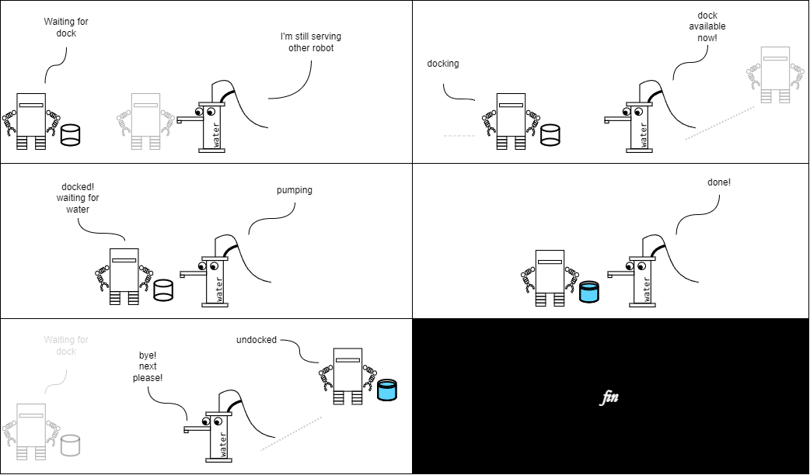

## The Thirsty Tomato Plant

Today is a hot day.
On a patch of a farming field, a tomato plants were dry and thirsty.
Now, this farm is fully automated.
A sensor sensed the tomato's distress.
It signaled a robot across the field for water.
Hearing that, the robot rushed to help.
There's a nearby water pump, but it was busy!
A long queue of other robots!
The robot had no choice but to join the queue.

That pump had to serve everyone.
it needs its workspace clean.
It can't have the robots colliding with each other, "not when I'm in charge!", it said.

The pump had a solution!
Each robot must dock securely.
Then, the pump will bring in the water.
After served, the robot must leave a safe distance.
Only after that, the next robot can come in.

But, a cooperation like this is hard, especially in a farming field where a central coordinator is absent.
Pumps and robots must agree on a sequence of tasks; who does what. what must not happen [before/after what](https://en.wikipedia.org/wiki/Race_condition).
In other words, it needs a protocol.
Fortunately, [`machine-runner`](https://www.npmjs.com/package/@actyx/machine-runner)-on-Actyx exists exactly to solve this problem.

We are going to help the pump write the protocol on it.



## Prerequisites

Several things needed before we start:

- Installation of [Actyx](/docs/how-to/local-development/install-actyx)
- Installation of [Actyx Node Manager](/docs/how-to/local-development/install-cli-node-manager)
- Installation of [Node JS](https://nodejs.org/en)
- [Brief introduction to Actyx](#what-is-Actyx)

## What is Actyx? {#what-is-Actyx}

Actyx is a platform for building highly resilient software systems distributed across a swarm of networked devices. Specifically you can:

1. Implement business logic as twins
1. Include your twins in apps running on devices
1. Forget about the network and data persistence

Actyx enables a completely decentralized architecture that allows you to **build apps that always runs**. Your apps always run because they run locally on the device and only interact with the locally running Actyx software.

import useBaseUrl from '@docusaurus/useBaseUrl'


Enough theory! Let's jump right in.

## Setting up the project {#setting-up}

1. Prepare a folder; open a command prompt on the folder.

  ```bash
  path/to/project> npm init
  ```

  This will prompts you several questions, in which you can fill in the details of your project.
  
2. Install these dependencies:

  ```bash
  path/to/project> npm i typescript @actyx/machine-runner @actyx/sdk uuid @types/uuid
  ```

  `uuid` and `@types/uuid` will be relevant at a later point in this article.

3. Now let us setup the compile-and-run script.
    
  In `package.json` > `scripts`, add these entries:

  ```json
  {
    "scripts": {
      "compile": "tsc",
      "start": "npm run compile && node dist/index.js"
    }
    // ...the rest of package.json
  }
  ```

  In `tsconfig.json` > `compilerOptions`, add this entry:

  ```json
  {
    "compilerOptions": {
      "outDir": "dist"
      // ...the rest of compilerOptions
    },
    "include": ["src/**/*.*"]
  }
  ```

4. Create a file in `src/index.ts`

  ```ts
  // src/index.ts
  
  console.log("hello world")
  ```

5. Finally, let's try running the project

  ```bash
  path/to/project> npm run start
  ```

## The Robot and The Pump {#robot-and-pump}

Imagine a day of robot's life! A robot stands by, listening for signals from sensors.
When a signal comes, the robot will start working.
First, the robot finds a nearby pump, draw water, and then runs to water the plant.
Let me illustrate that in TypeScript pseudo-code _(you don't have to type it in)_:

```typescript 
// A watering robot's life in a day

async function main() {
  while (true) {
    const taskFromSensor = await receiveSignalFromSensor();
    await waterPlant(taskFromSensor);
  }
}

async function waterPlant(taskFromSensor) {
  const pump = await findNearbyPump();
  await moveTo(pump)
  const dockingId = await requestDockingTo(pump);
  await dockAndDrawWater(dockingId); // <-- the protocol we are working on
  await waterPlant(taskFromSensor);
}
```

Now, let us have a look at a water pump's day.
At a time, a pump can have several robots needing water.
To prevent collision, the pump serve one request at a time.
To illustrate that:

(_again, you don't have to type it in_)

```typescript
// A water pump's life in a day

async function main() {
  while (true) {
    const dockingId = await receiveDockingRequestId();
    await dockAndSupplyWater(dockingId); // <-- the protocol we are working on
  }
}
```

The robot and the pump have `dockAndDrawWater` and `dockAndSupplyWater`, and those needs implementing.
Also, if you pay attention, you can see a variable `dockingId`.
`dockingId` identifies the pair of a robot and a pump.

## Building The Protocol

### 1. Designing the interaction - a high level overview {#interaction-design}

Let us first think how the dock-and-draw-water process happens.
The robot and the pump should work together sequentially as follows:

```text
1. robot waits & pump ensures the dock is clear
2. pump signals: "dock available"
3. robot docks & pump waits
4. robot signals: "docking successful"
5. robot waits & pump supplies water
6. pump signals: water supplied
7. robot undocks & pump waits
8. robot signals: undock successful
9. done
```

Notice that the steps above are interlaced `states` and `events`.

```text
States:
1. robot waits & pump ensures the dock is clear
3. robot docks & pump waits
5. robot waits & pump supplies water
7. robot undocks & pump waits
9. done

Events:
2. pump signals: "dock available"
4. robot signals: "docking successful"
6. pump signals: water supplied
8. robot signals: undock successful
```

This is great.
Separating the sequence into `states` and `events` is useful; 
`states` and `events` are the basic building blocks of `machine-runner`.

Now that we've figured out the sequence, we can formulate this in `machine-runner`.

### 2. Working with `machine-runner`

To write a sequence of happenings in `machine-runner` we need to:

1. list the events;
2. make a `swarm protocol`;
3. list the roles;
4. for each role, make a `machine protocol`, and then design the states and the transitions;
5. use the machine

Pardon the fancy words! Let me explain:

- `swarm protocol` is the high-level overview of the interaction.
- `role` is distinct party involved in the swarm. Which in this case are: `robot` and `pump`.
- `state` refers to the state of a role e.g. "robot waits".
- `transition` is how a change between one state to the other, due to the fact that `machine-runner` is a form of a [state machine](https://en.wikipedia.org/wiki/Finite-state_machine).

### 3. Listing Events, Making Swarm Protocol

Import the tools we need from `@actyx/machine-runner`.

```typescript
// src/machines/protocol.ts

import { MachineEvent, SwarmProtocol } from "@actyx/machine-runner";
```

Define the events we have identified; collect inside a namespace.

```typescript
// src/machines/protocol.ts

export namespace ProtocolEvents {
  
  // From the design: pump signals: "dock available"
  export const DockAvailable =
    MachineEvent.design("DockAvailable").withoutPayload();
  
  // From the design: robot signals: "docking successful"
  export const RobotIsDocked =
    MachineEvent.design("RobotIsDocked").withoutPayload();
  
  // From the design: pump signals: water supplied
  export const WaterSupplied =
    MachineEvent.design("WaterSupplied").withoutPayload();
  
  // From the design: robot signals: undock successful
  export const RobotIsUndocked =
    MachineEvent.design("RobotIsUndocked").withoutPayload();
  
  // Collect all events in one array
  // Use `as const` to make it a readonly tuple
  export const All = [
    DockAvailable,
    RobotIsDocked,
    WaterSupplied,
    RobotIsUndocked,
  ] as const;
}
```

Create the swarm protocol; name it `water-drawing-exchange`.

```typescript
// src/machines/protocol.ts

export const protocol = SwarmProtocol.make(
  "water-drawing-exchange",
  ProtocolEvents.All
);
```

`events` and `protocol` will later be used to write the states.

:::note What is "without payload"?

The method is called when creating an event.
This indicates an alternative exists: `.withPayload()`.
It allows you to embed additional data onto events aka. the payload.

But now we don't need to worry about it.
:::

### 4. Machine Protocol for The Pump

In the [interaction design](#interaction-design), we have identified the states.
Now let us define the state for the water pump.

We will write this in a new file: `src/machines/water-pump.ts`.

First, import the protocol. Then, make a `machine protocol`: `WaterPump`.

```typescript
// src/machines/water-pump.ts

import { ProtocolEvents, protocol } from "./protocol";

export const machine = protocol.makeMachine("WaterPump");
```

The states a robot goes through the interaction, defined this way:

```typescript
// src/machines/water-pump.ts

// From the design: robot waits & pump ensures the dock is clear
export const _1_Initial = machine
  .designEmpty("Initial")
  .command("dockAvailable", [ProtocolEvents.DockAvailable], () => [{}])
  .finish();

// From the design: robot docks & pump waits
export const _2_DockAvailable = machine
  .designEmpty("DockAvailable")
  .finish();

// From the design: robot waits & pump supplies water
export const _3_Pumping = machine
  .designEmpty("Pumping")
  .command("waterSupplied", [ProtocolEvents.WaterSupplied], () => [{}])
  .finish();

// From the design: robot undocks & pump waits
export const _4_Pumped = machine
  .designEmpty("Pumped")
  .finish();

// From the design: done
export const _5_DockCleared = machine
  .designEmpty("DockCleared")
  .finish();

// Note: 
//  I prefixed the states with numbers
//  Easier to walk through the sequence this way
```

Note that some states calls `command()`, namely, the `Initial` and `Pumping` states.
Calling the method attach a `command` to the state, allowing the `command` to be invoked when a machine is in that state.
So, the effect of the code would be:

- `WaterPump` in `Initial` state can emit `DockAvailable`
- `WaterPump` in `Pumping` state can emit `WaterSupplied`

This maps directly to the [interaction design](#interaction-design).

```text
1. robot waits & pump ensures the dock is clear <---- This state
2. pump signals: "dock available"               <---- Allows this command
3. robot docks & pump waits
4. robot signals: "docking successful"
5. robot waits & pump supplies water            <---- This state
6. pump signals: water supplied                 <---- Allows this command
7. robot undocks & pump waits
8. robot signals: undock successful
9. done
```

Moving on.
Last, we need to define the transitions.
To define a transition, we call a method in a state: `react()`

```typescript
// src/machines/water-pump.ts

_1_Initial.react(
  [ProtocolEvents.DockAvailable],
  _2_DockAvailable,
  () => undefined
);
```

The code above means: __A machine in `_1_Initial` state, when receiving `[ProtocolEvents.DockAvailable]` events sequence, will transition to `_2_DockAvailable` by calling the transformation function: `() => undefined`.__

`react()` method accepts 3 parameters:

- Triggering event sequence
- Next state
- Transformation (this will be explained, but we don't need to worry about it in the moment)

For now, let us define the rest of the transitions.

```typescript
// src/machines/water-pump.ts

_2_DockAvailable.react(
  [ProtocolEvents.RobotIsDocked],
  _3_Pumping,
  () => undefined
);

_3_Pumping.react([ProtocolEvents.WaterSupplied], _4_Pumped, () => undefined);

_4_Pumped.react(
  [ProtocolEvents.RobotIsUndocked],
  _5_DockCleared,
  () => undefined
);
```

:::note Payload and Transformation

Similar to events, states can have an optional payload. This is done by calling `.designState(name).withPayload<PayloadType>()` in place of `.designEmpty(name)`.

With payloads, state transformation is more complex. This is where the transformation function plays its role. The transformation function's signature is:

```typescript
(PreviousStateContext, Event1, Event2, ...) => NextStatePayload
```

This allows complex calculation on transitions, such as:

```typescript
(ctx, incomingEvent1, incomingEvent2) => {
  const previousPayload = ctx.self;
  const nextPayload = someComplexOperation(previousPayload, incomingEvent1.payload, incomingEvent.payload);
  return nextPayload;
}
```

In our case, the states and the events don't have payload. Therefore we access nothing from the current state and the incoming events, and return `undefined`. Hence `() => undefined`.

:::

### 5. Machine Protocol for The Robot

For the robot, we will need another file. Let's make another at: `src/machine/watering-robot.ts`.
The process is similar to The Pump's `machine protocol`.

```typescript
// src/machine/watering-robot.ts

import { ProtocolEvents, protocol } from "./protocol";

export const machine = protocol.makeMachine("WateringRobot");

export const _1_WaitingForDock = machine.designEmpty("WaitingForDock").finish();

export const _2_Docking = machine
  .designEmpty("Docking")
  .command("docked", [ProtocolEvents.RobotIsDocked], () => [{}])
  .finish();

export const _3_DockedAndWaitingForWater = machine
  .designEmpty("DockedAndWaitingForWater")
  .finish();

export const _4_WaterPumped = machine
  .designEmpty("WaterPumped")
  .command("undocked", [ProtocolEvents.RobotIsUndocked], () => [{}])
  .finish();

export const _5_DeliveringWaterToPlant = machine
  .designEmpty("DeliveringWaterToPlant")
  .finish();

_1_WaitingForDock.react(
  [ProtocolEvents.DockAvailable],
  _2_Docking,
  () => undefined
);

_2_Docking.react([ProtocolEvents.RobotIsDocked], _3_DockedAndWaitingForWater, () => undefined);

_3_DockedAndWaitingForWater.react(
  [ProtocolEvents.WaterSupplied],
  _4_WaterPumped,
  () => undefined
);

_4_WaterPumped.react(
  [ProtocolEvents.RobotIsUndocked],
  _5_DeliveringWaterToPlant,
  () => undefined
);
```

### 6 Wrapping Up The Protocol

For convenience, put all `events`, `swarm protocol`, `machine protocol`, and `states` into one file.

In `src/machines/index.ts`, write this:

```typescript
// src/machines/index.ts

export * as WaterPump from "./water-pump";
export * as WateringRobot from "./watering-robot";
export * as protocol from "./protocol";
```

## Using The Machine Protocol

Recall the pseudo-code in [The Robot And The Pump](#robot-and-pump) section.
Robot and Pump have `dockAndDrawWater` and `dockAndSupplyWater`.
We will implement those.

Make two files for each role: 

- `src/consumers/water-pump.ts`
- `src/consumers/watering-robot.ts`

### The Pump's Routine

```typescript
export const dockAndSupplyWater = async (dockingId: string) => {
  // now what?
};
```

One moment, `machine-runner` needs something from `@actyx/sdk` to work.
Import that, alongside `machine-runner` and the protocol we wrote. 

```typescript
// src/consumers/water-pump.ts

import { createMachineRunner } from "@actyx/machine-runner";
import { Actyx } from "@actyx/sdk";
import { WaterPump, protocol } from "../machines";

export const dockAndSupplyWater = async (actyx: Actyx, dockingId: string) => {
  // now what?
}
```

Next we need The Pump to start communicating with a robot.
For this we utilize `machine-runner`, the protocol, and `dockingId`.

```typescript
// src/consumers/water-pump.ts

export const dockAndSupplyWater = async (actyx: Actyx, dockingId: string) => {
  const tag = protocol.protocol.tagWithEntityId(dockingId);
  const machine = createMachineRunner(actyx, tag, WaterPump._1_Initial, undefined);

  // ...
}
```

A `MachineRunner` is running now.
It is "connected in an exclusive channel", marked by the swarm protocol `water-drawing-exchange` and `dockingId`.
At the other side, a robot will be connected to the same channel.
And so, the robot and the pump is connected.

Let us begin writing the interaction.
Let's refer to the [interaction design](#interaction-design)
First, the pump is in the initial state;
then it signals the robot that the dock is available.

With the `MachineRunner`, it is written like this:

```typescript
// src/consumers/water-pump.ts

export const dockAndSupplyWater = async (actyx: Actyx, dockingId: string) => {
  const tag = protocol.protocol.tagWithEntityId(dockingId);
  const machine = createMachineRunner(actyx, tag, WaterPump._1_Initial, undefined);

  for await (const state of machine) {
    const whenInitial = state.as(WaterPump._1_Initial);
    if (whenInitial) {
      // In reality, there will be more code here
      // Notice this command call;
      //  it maps directly to the state design phase
      // .command("dockAvailable", ....)
      await whenInitial.commands?.dockAvailable();
    }
  }
};
```

Complete the code for the rest of the states;
add logging so that we can see how it behaves;
this will be the final form of the function:

```typescript
// src/consumers/water-pump.ts

export const dockAndSupplyWater = async (actyx: Actyx, dockingId: string) => {
  console.log("pump starts task:", dockingId)

  const tag = protocol.protocol.tagWithEntityId(dockingId);
  const machine = createMachineRunner(actyx, tag, WaterPump._1_Initial, undefined);

  for await (const state of machine) {
    console.log("pump is:", state.type)

    const whenInitial = state.as(WaterPump._1_Initial);
    if (whenInitial) {
      await whenInitial.commands?.dockAvailable();
    }

    const whenPumping = state.as(WaterPump._3_Pumping);
    if (whenPumping) {
      await whenPumping.commands?.waterSupplied();
    }

    const whenCleared = state.as(WaterPump._5_DockCleared);
    if (whenCleared) {
      break;
    }
  }

  console.log("pump finishes task:", dockingId)
};
```

The `for-await` block loops whenever a transition happens.
With the `command` calls, The Pump sends signal to the "exclusive channel" at the right moment.
When `break` is reached, the loop stops, the machine is destroyed, the communication with the "exclusive channel" ends.

This concludes The Pump's part of the bargain.

:::tip

Local tasks can take place before a `command`.
All connected machine runners will wait for these local tasks before transitioning to the next state.
Useful in scenarios such as:

- watering robot needs to move to dock before water pump opens the valve
- water pump needs to actually provide water before the watering robot moves on to its next task

```typescript
const whenPumping = state.as(WaterPump._3_Pumping);
if (whenPumping) {
  // open the valve, let water out, close after `amountOfWater`
  await openValveFor(amountOfWater);
  // after the local task is done, let the robot know
  await whenPumping.commands?.waterSupplied();
}
```

:::

### The Robot's Routine

The Robot's part will be similar to the Pump's.
It differs only in the `machine protocol` it uses.

```typescript
// src/consumers/watering-robot.ts

import { createMachineRunner } from "@actyx/machine-runner";
import { Actyx } from "@actyx/sdk";
import { WateringRobot, protocol } from "../machines"; // WateringRobot is used instead of WaterPump

export const dockAndDrawWater = async (actyx: Actyx, dockingId: string) => {
  const tag = protocol.protocol.tagWithEntityId(dockingId);
  const machine = createMachineRunner(actyx, tag, WateringRobot._1_WaitingForDock, undefined);
}
```

With all states covered and logging code added, we arrive at this:

```typescript
// src/consumers/watering-robot.ts

import { createMachineRunner } from "@actyx/machine-runner";
import { WateringRobot, protocol } from "../machines";
import { Actyx } from "@actyx/sdk";

export const dockAndDrawWater = async (actyx: Actyx, dockingId: string) => {
  console.log("robot starts task:", dockingId)

  const tag = protocol.protocol.tagWithEntityId(dockingId);
  const machine = createMachineRunner(actyx, tag, WateringRobot._1_WaitingForDock, undefined);

  for await (const state of machine) {
    console.log("robot is:", state.type)

    const whenDocking = state.as(WateringRobot._2_Docking);
    if (whenDocking) {
      await whenDocking.commands?.docked();
    }

    const whenWaterPumped = state.as(WateringRobot._4_WaterPumped);
    if (whenWaterPumped) {
      await whenWaterPumped.commands?.undocked();
    }

    const whenDone = state.as(WateringRobot._5_DeliveringWaterToPlant);
    if (whenDone) {
      break;
    }
  }

  console.log("robot finishes task:", dockingId)
};
```

The `for-await` block loops whenever a transition happens.
With the `command` calls, The Robot sends signal to the "exclusive channel" at the right moment.
When `break` is reached, the loop stops, the machine is destroyed, the communication with the "exclusive channel" ends.

This concludes The Robot's part of the bargain.

:::tip

Local tasks can take place before a `command`.
All connected machine runners will wait for these local tasks before transitioning to the next state.
Useful in scenarios such as:

- watering robot needs to move to dock before water pump opens the valve
- water pump needs to actually provide water before the watering robot moves on to its next task

```typescript
const whenDocking = state.as(WateringRobot._2_Docking);
if (whenDocking) {
  await moveToDock();
  await prepareBucketForWater();
  await whenDocking.commands?.docked();
}

const whenWaterPumped = state.as(WateringRobot._4_WaterPumped);
if (whenWaterPumped) {
  await moveAwayFromDock();
  await whenWaterPumped.commands?.undocked();
}
```

:::

## Simulating The Cooperative Interaction

We are going to prove that the above code works by running both roles concurrently.

### The simulation code

First, start with a new file `src/index.ts` and import everything we need

```typescript
// src/index.ts

import { Actyx } from "@actyx/sdk";
import * as uuid from "uuid";
import { dockAndSupplyWater } from "./consumers/water-pump";
import { dockAndDrawWater } from "./consumers/watering-robot";

async function main() {
  // code goes here
}

main();
```

We will need `Actyx` object and `dockingId` string.
We will use pretend manifest, two pretend `Actyx` objects, and and a pretend `dockingId`.

```typescript
// src/index.ts

async function main() {
  const APP_MANIFEST = {
    appId: "com.example.tomato-robot",
    displayName: "Tomato Robot",
    version: "1.0.0",
  }

  const sdk1 = await Actyx.of(APP_MANIFEST);
  const sdk2 = await Actyx.of(APP_MANIFEST);
  const taskId = uuid.v4();
}
```

Next run the simulation and wait until both are finished.

```typescript
// src/index.ts

async function main() {
  // ...
  const simulatedPumpPart = dockAndSupplyWater(sdk1, taskId)
  const simulatedRobotPart = dockAndDrawWater(sdk2, taskId)

  await Promise.all([simulatedPumpPart, simulatedRobotPart]);
}
```

Finally, call `dispose` to the `sdks`.
This prevents all hanging Actyx connections, ending the process.
At this point, the final code looks like this:

```typescript
// src/index.ts

import { Actyx } from "@actyx/sdk";
import * as uuid from "uuid";
import { dockAndSupplyWater } from "./consumers/water-pump";
import { dockAndDrawWater } from "./consumers/watering-robot";

async function main() {

  const APP_MANIFEST = {
    appId: "com.example.tomato-robot",
    displayName: "Tomato Robot",
    version: "1.0.0",
  }

  const sdk1 = await Actyx.of(APP_MANIFEST);
  const sdk2 = await Actyx.of(APP_MANIFEST);
  const taskId = uuid.v4();

  // promises
  const simulatedPumpPart = dockAndSupplyWater(sdk1, taskId)
  const simulatedRobotPart = dockAndDrawWater(sdk2, taskId)

  // wait until both processes ends
  await Promise.all([simulatedPumpPart, simulatedRobotPart]);

  sdk1.dispose();
  sdk2.dispose()
}

main()
```

### Running the simulation

Before running the simulation:

- make sure [Actyx is running](/docs/how-to/local-development/install-actyx)
- make sure [project setup](#setting-up) is done.

First, [run Actyx](/docs/how-to/local-development/install-actyx) and make sure [project setup](#setting-up) is done.
Then, simply run:

```bash
path/to/project> npm run start
```

After done, the following log will appear; a result of `console.log` calls we have written.

```txt
pump starts task: a7df8979-cf2b-44a9-996e-1bd93a6fe1ab
robot starts task: a7df8979-cf2b-44a9-996e-1bd93a6fe1ab
pump is: Initial
robot is: WaitingForDock
pump is: DockAvailable
robot is: Docking
pump is: Pumping
robot is: DockedAndWaitingForWater
pump is: Pumped
robot is: WaterPumped
pump is: DockCleared
pump finishes task: a7df8979-cf2b-44a9-996e-1bd93a6fe1ab
robot is: DeliveringWaterToPlant
robot finishes task: a7df8979-cf2b-44a9-996e-1bd93a6fe1ab
```

Here, you can see pairs of equivalent states between the roles, such as `Initial&WaitingForDock`, `DockAvailable&Docking`.
Actyx and `machine-runner` ensure that all connected machine runners are at the equivalent state.
A pump cannot be in `Initial` state while a connected robot is in `WaterPumped` state at the same time.

## The code

The code can be found in [// TODO: add link to sample code]
