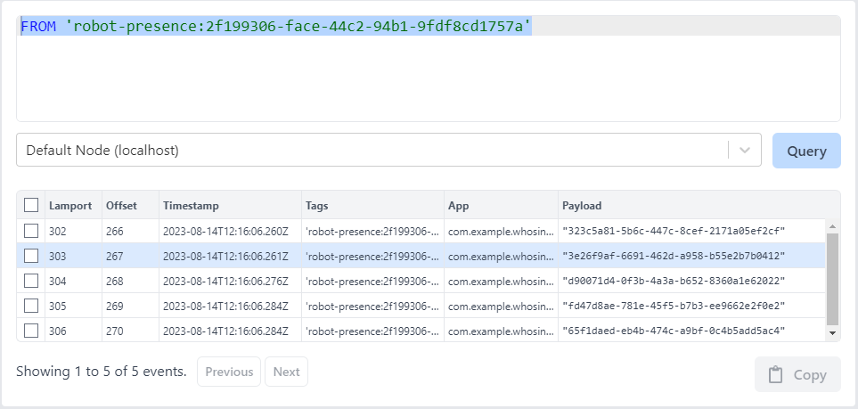

### Who's in the room?

Several robots are put in a room, and they need to know who is in the room!
But, they have no eyes, no ears.
How are they supposed to know?
Fortunately, every one of them runs Actyx, and they are interconnected.
If someone would just write their ID in Actyx, the others would be able to see them.

Let's implement a simple mechanism so that every robot knows who is in the room using a publish and query APIs provided by [Actyx JS SDK](https://www.npmjs.com/package/@actyx/sdk)

## Prerequisites

Several things needed before we start:

- Installation of [Actyx](/docs/how-to/local-development/install-actyx)
- Installation of [Actyx Node Manager](/docs/how-to/local-development/install-cli-node-manager)
- Installation of [Node JS](https://nodejs.org/en)
- [Brief introduction to Actyx](/docs/conceptual/overview)

## Setting up the project {#setting-up}

1. Prepare a folder; open a terminal on the folder.

  ```bash
  $ npm init
  ```

  This will prompts you several questions, in which you can fill in the details of your project.
  
2. Install these dependencies:

  ```bash
  $ npm i typescript @actyx/sdk uuid @types/uuid
  ```

  `uuid` and `@types/uuid` will be relevant at a later point in this article.

3. Modify `package.json` and `tsconfig.json` with these values:
    
  ```json title="package.json"
  {
    "scripts": {
      "compile": "tsc",
      "start": "npm run compile && node dist/index.js"
    }
    // ...the rest of package.json
  }
  ```

  ```json title="tsconfig.json"
  {
    "compilerOptions": {
      "outDir": "dist"
      // ...the rest of compilerOptions
    },
    "include": ["src/**/*.*"]
  }
  ```

4. Create a file in `src/index.ts`

  ```ts title="src/index.ts"
  console.log("hello world")
  ```

5. Finally, now we should be able to run the project with:

  ```bash
  $ npm run start
  ```

## Robot code

Let us make an async function to represent the robot's runtime.
We will begin with the setup code needed to interact with Actyx.

```typescript title="src/index.ts"
import { Actyx, AqlEventMessage, Tag } from "@actyx/sdk";

const APP_MANIFEST = {
  appId: "com.example.whosintheroom",
  displayName: "Who is in the room?",
  version: "1.0.0",
}

async function robot(roomId: string) {
  const selfId = uuid.v4();

  const sdk = await Actyx.of(APP_MANIFEST);
}
```

A quick explanation:

- `roomId` is the room the robot is in at the moment.
- `selfId` is the id of the robot.
- `APP_MANIFEST` tells `Actyx` the detail of this application. Read more [here](/docs/how-to/app-auth/authenticate-with-app-manifest).
- `Actyx.of` does the heavy lifting to authenticate the application. The promise it returns will resolve into an `sdk`, a connected  `Actyx` object which the application can interact with.

Now that local Actyx is connected, we can go over the API of Actyx's SDK.

## Operating the SDK

We only need to publish a string (the robot's ID) and querying.
Actyx has two APIs that fit our case:

```typescript
// publish
sdk.publish(taggedData)

// query
sdk.queryAql(aql)
```

Let us go over those APIs.

### `sdk.publish`

`sdk.publish` receives a [`TaggedEvent`](https://developer.actyx.com/docs/conceptual/tags).
To briefly describe the concept of tags, events going into Actyx are labeled with a tag;
the same events can later be queried with that same tag.
A tag is a non-empty unicode string.

We will use `sdk.publish` to signal presence.
Events signaling presence in a room is tagged with `robot-presence:[room_id]`.
In TypeScript, this will be a function: 

```typescript title="src/index.ts"
const presenceTagString = (roomId: string) => `robot-presence:${roomId}`
```

`TaggedEvent` is data that is tagged. Data can be tagged using this function:

```typescript title="src/index.ts"
const taggedData = Tag(tagString).apply(data)
```

Now we can send a signal of a robot's presence.
The robot's ID will be sent as the event's payload---the item that will be tagged.
The above statements results in the following code:

```typescript title="src/index.ts"
const presenceTagString = (roomId: string) => `robot-presence:${roomId}`

const publishPresence = (sdk: Actyx, roomId: string, robotId: string) => {
  const tagString = presenceTagString(roomId)
  const tagged = Tag(tagString).apply(robotId)
  return sdk.publish(tagged)
}
```

It is important to note that `sdk.publish` returns a promise.
This promise will be resolved when Actyx confirms the publication of the events.
Now we are done with publishing.
Let's move on to the query

### `sdk.queryAql`

`sdk.queryAql` receives an AQL string.
[AQL](/docs/tutorials/aql) is a query language specific to Actyx.
AQL has a [complex set of features](https://developer.actyx.com/docs/reference/aql), but for now we will use it for only a simple feature.
To query, we need the tag string we've defined before and use it in the AQL.

```text
FROM 'thetagstringwearelookingfor'
```

So, to query the events, this is our code:

```typescript title="src/index.ts"
const queryPresence = async (sdk: Actyx, roomId: string) => {
  const tagString = presenceTagString(roomId)
  const aql = `FROM '${tagString}'`
  const result = await sdk.queryAql(aql)
  // ...
}
```

The variable `result` above will be `AqlResponse[]`. 
An `AqlResponse` is of a [union](https://www.typescriptlang.org/docs/handbook/2/everyday-types.html#union-types) type.
One subtype of `AqlResponse` is `AqlEventMessage`, which contains an event published in Actyx;
it is the data we're looking for.
And so, to retrieve the events, we need to filter the result.

```typescript title="src/index.ts"
const queryPresence = async (sdk: Actyx, roomId: string) => {
  // ...
  return result
    .filter((ev): ev is AqlEventMessage => ev.type === "event") // filter for AqlEventMessage by comparing the .type
    .map(ev => ev.payload as string) // grab the payload---the `robotId` that we applied the Tag to
}
```

## Completing the robot's code

Publishing and querying functions are there.
Those will be the building blocks to the robot code.
Now let us write the robot.

We want the robot to periodically check for presence in the room and log them.

```typescript title="src/index.ts"
// within async function robot
while (true) {
  const presentRobotIds = await queryPresence(sdk, roomId);
  console.log(`robot/${selfId}: see neighbors`)
  console.log(formatPresence(selfId, presentRobotIds))
  
  // more code goes here...

  await sleep(1000)
}
```

Implement `sleep` and `formatPresence` as follow:

```typescript title="src/index.ts"
// pause an async function
const sleep = (duration: number) => new Promise(res => setTimeout(res, duration))

// format the presence of neighboring robots
const formatPresence = (selfId: string, presentRobotIds: string[]) => {
  const neighboringRobots = presentRobotIds.filter(id => id !== selfId)
  if (neighboringRobots.length === 0) {
    return "- (none)"
  }
  const neighboringRobotsAsListString = neighboringRobots.map(id => ` - robot/${id}`).join("\n")
  return neighboringRobotsAsListString
}
```

If the robot is not listed in the presence, publish its presence.

```typescript title="src/index.ts"
if (!presentRobotIds.includes(selfId)) {
  await publishPresence(sdk, roomId, selfId)
  console.log(`robot/${selfId}: sends presence`)
}
```

Add a little bit of logging code and behold, the robot's code!

```typescript title="src/index.ts"
const APP_MANIFEST = {
  appId: "com.example.whosintheroom",
  displayName: "Who is in the room?",
  version: "1.0.0",
}

async function robot(roomId: string) {
  const selfId = uuid.v4();
  console.log(`robot/${selfId}: spawned`)

  const sdk = await Actyx.of(APP_MANIFEST);

  while (true) {
    const presentRobotIds = await queryPresence(sdk, roomId);
    console.log(`robot/${selfId}: see neighbors`)
    console.log(formatPresence(selfId, presentRobotIds))
    if (!presentRobotIds.includes(selfId)) {
      await publishPresence(sdk, roomId, selfId)
      console.log(`robot/${selfId}: sends presence`)
    }
    await sleep(1000)
  }
}

// Actyx calls
const presenceTagString = (roomId: string) => `robot-presence:${roomId}`

const publishPresence = (sdk: Actyx, roomId: string, robotId: string) => {
  const tagString = presenceTagString(roomId)
  const tagged = Tag(tagString).apply(robotId)
  return sdk.publish(tagged)
}

const queryPresence = async (sdk: Actyx, roomId: string) => {
  const tagString = presenceTagString(roomId)
  const aql = `FROM '${tagString}'`
  const result = await sdk.queryAql(aql)
  return result.filter((ev): ev is AqlEventMessage => ev.type === "event").map(ev => ev.payload as string)
}

// utilities

const sleep = (duration: number) => new Promise(res => setTimeout(res, duration))

const formatPresence = (selfId: string, presentRobotIds: string[]) => {
  const neighboringRobots = presentRobotIds.filter(id => id !== selfId)
  if (neighboringRobots.length === 0) {
    return "- (none)"
  }
  const neighboringRobotsAsListString = neighboringRobots.map(id => ` - robot/${id}`).join("\n")
  return neighboringRobotsAsListString
}
```

## Simulating the room

Let us simulate the robots by running several concurrent instances.
Here is the code:

```typescript title="src/index.ts"
async function main() {
  // Make sure every run is unique
  const roomId = uuid.v4()
  // Log the roomId
  console.log(`room/${roomId}`)
  // Spawn robots. Each is a promise that runs concurrently
  const robots = [
    robot(roomId),
    robot(roomId),
    robot(roomId),
    robot(roomId),
    robot(roomId),
  ]

  await Promise.all(robots)
}

main()
```

Running the code above, we will get log similar to this:

```text
room/2f199306-face-44c2-94b1-9fdf8cd1757a
robot/3e26f9af-6691-462d-a958-b55e2b7b0412: spawned
robot/323c5a81-5b6c-447c-8cef-2171a05ef2cf: spawned
robot/65f1daed-eb4b-474c-a9bf-0c4b5add5ac4: spawned
robot/d90071d4-0f3b-4a3a-b652-8360a1e62022: spawned
robot/fd47d8ae-781e-45f5-b7b3-ee9662e2f0e2: spawned
robot/323c5a81-5b6c-447c-8cef-2171a05ef2cf: see neighbors
- (none)
robot/3e26f9af-6691-462d-a958-b55e2b7b0412: see neighbors
- (none)
robot/d90071d4-0f3b-4a3a-b652-8360a1e62022: see neighbors
- (none)
robot/fd47d8ae-781e-45f5-b7b3-ee9662e2f0e2: see neighbors
- (none)
robot/65f1daed-eb4b-474c-a9bf-0c4b5add5ac4: see neighbors
- (none)
robot/323c5a81-5b6c-447c-8cef-2171a05ef2cf: sends presence
robot/3e26f9af-6691-462d-a958-b55e2b7b0412: sends presence
robot/d90071d4-0f3b-4a3a-b652-8360a1e62022: sends presence
robot/fd47d8ae-781e-45f5-b7b3-ee9662e2f0e2: sends presence
robot/65f1daed-eb4b-474c-a9bf-0c4b5add5ac4: sends presence
robot/323c5a81-5b6c-447c-8cef-2171a05ef2cf: see neighbors
 - robot/3e26f9af-6691-462d-a958-b55e2b7b0412
 - robot/d90071d4-0f3b-4a3a-b652-8360a1e62022
 - robot/fd47d8ae-781e-45f5-b7b3-ee9662e2f0e2
 - robot/65f1daed-eb4b-474c-a9bf-0c4b5add5ac4
robot/3e26f9af-6691-462d-a958-b55e2b7b0412: see neighbors
 - robot/323c5a81-5b6c-447c-8cef-2171a05ef2cf
 - robot/d90071d4-0f3b-4a3a-b652-8360a1e62022
 - robot/fd47d8ae-781e-45f5-b7b3-ee9662e2f0e2
 - robot/65f1daed-eb4b-474c-a9bf-0c4b5add5ac4
robot/d90071d4-0f3b-4a3a-b652-8360a1e62022: see neighbors
 - robot/323c5a81-5b6c-447c-8cef-2171a05ef2cf
 - robot/3e26f9af-6691-462d-a958-b55e2b7b0412
 - robot/fd47d8ae-781e-45f5-b7b3-ee9662e2f0e2
 - robot/65f1daed-eb4b-474c-a9bf-0c4b5add5ac4
robot/fd47d8ae-781e-45f5-b7b3-ee9662e2f0e2: see neighbors
 - robot/323c5a81-5b6c-447c-8cef-2171a05ef2cf
 - robot/3e26f9af-6691-462d-a958-b55e2b7b0412
 - robot/d90071d4-0f3b-4a3a-b652-8360a1e62022
 - robot/65f1daed-eb4b-474c-a9bf-0c4b5add5ac4
robot/65f1daed-eb4b-474c-a9bf-0c4b5add5ac4: see neighbors
 - robot/323c5a81-5b6c-447c-8cef-2171a05ef2cf
 - robot/3e26f9af-6691-462d-a958-b55e2b7b0412
 - robot/d90071d4-0f3b-4a3a-b652-8360a1e62022
 - robot/fd47d8ae-781e-45f5-b7b3-ee9662e2f0e2
```

Those are logs coming from all robots.
Let us pick one robots and see what happens: `3e26f9af-6691-462d-a958-b55e2b7b0412`.

```text
robot/3e26f9af-6691-462d-a958-b55e2b7b0412: spawned
robot/323c5a81-5b6c-447c-8cef-2171a05ef2cf: see neighbors
- (none)
robot/323c5a81-5b6c-447c-8cef-2171a05ef2cf: sends presence
robot/323c5a81-5b6c-447c-8cef-2171a05ef2cf: see neighbors
 - robot/3e26f9af-6691-462d-a958-b55e2b7b0412
 - robot/d90071d4-0f3b-4a3a-b652-8360a1e62022
 - robot/fd47d8ae-781e-45f5-b7b3-ee9662e2f0e2
 - robot/65f1daed-eb4b-474c-a9bf-0c4b5add5ac4
```

As programmed, the robot logs the first time it is spawned and then goes through a cycle.
On each cycle, the robot queries for presence of robots in the room.
If it doesn't find its own presence, it will publish a presence.
On the first cycle, it does not find any neighbors because they haven't published presence either.
Then, on the next cycle, all the neighbors are visible.
This robot's ID is also visible from the other robots' log.

Now all robots can see who is in the room with this simple mechanism.

### Inspecting the events

To see how the mechanism works, we will what is happening under the hood with Actyx Node Manager.
Follow the steps below:

1. Install and Run [Actyx Node Manager](/docs/how-to/local-development/install-cli-node-manager), if you haven't.
2. [Connect](/docs/reference/node-manager#nodes-overview) to your node—the default should be `localhost`.
3. On the left sidebar, go to the `query` menu
4. On the query text field, write `FROM 'the-tag'`. replace `the-tag` with the string produced by the `presenceTagString` function. In this tutorial's case, the query will be `FROM 'robot-presence:2f199306-face-44c2-94b1-9fdf8cd1757a'`. If you are running the code by yourself, replace the ID after `robot-presence:` with the `roomId` that's logged at the beginning of the main function.
5. Below the query text field, select the node you're using (which should be the default).
6. Press the `query` button.

After pressing the `query` button, you will see these events:



These are the presence events the robot sends.
Also, these are the same events seen by the robots, since the robots queried the same tag.
As we can see, the structure of the event we have designed can be seen here:

- A presence event has the tag `robot-presence:[room_id]`
- The `payload` of a presence event is a string of the robot ids.
- A presence are published once per robot, as programmed.

At this point we have covered:

- How to use [Actyx JS SDK](https://www.npmjs.com/package/@actyx/sdk) to publish and query events
- Brief view of the structure of an Actyx event

That concludes the tutorial.

## Download The Code 

The code can be found in [// TODO: add link to sample code]
